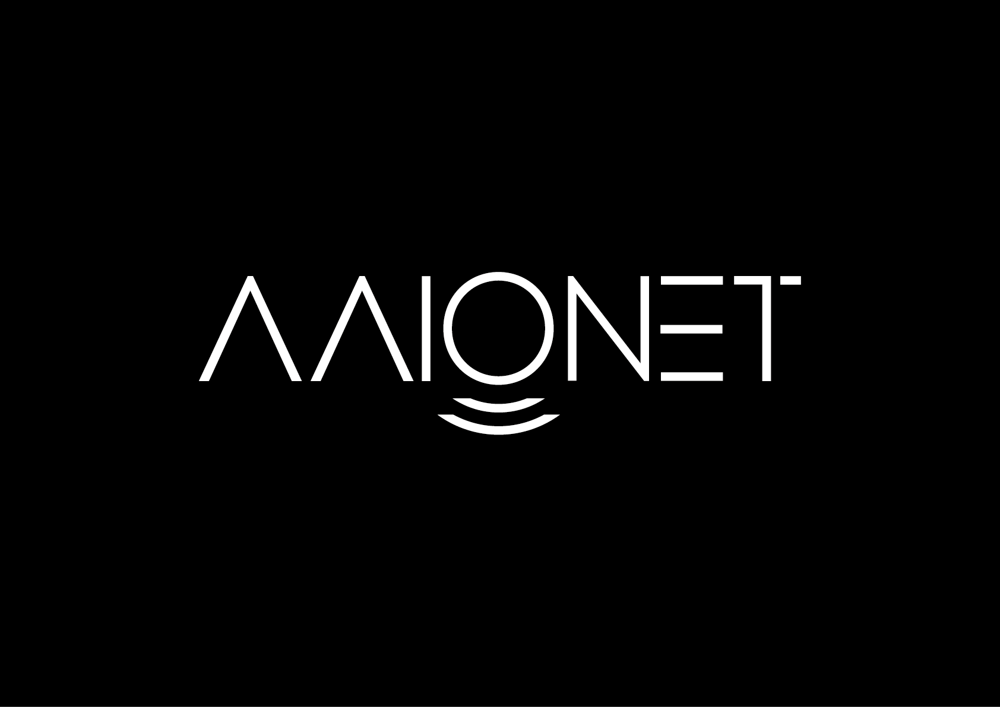
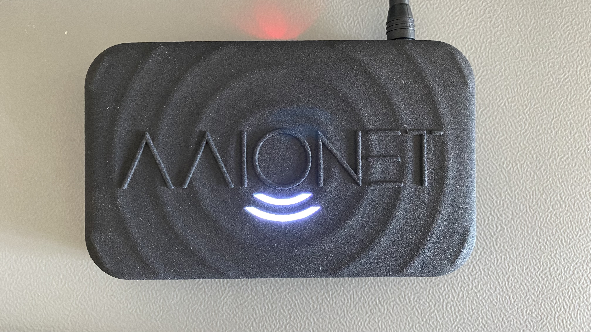
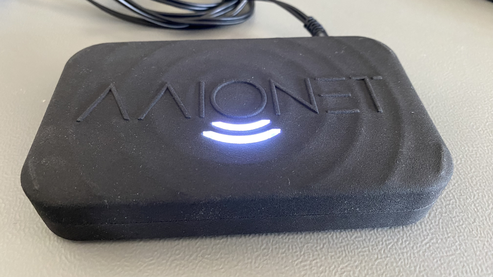
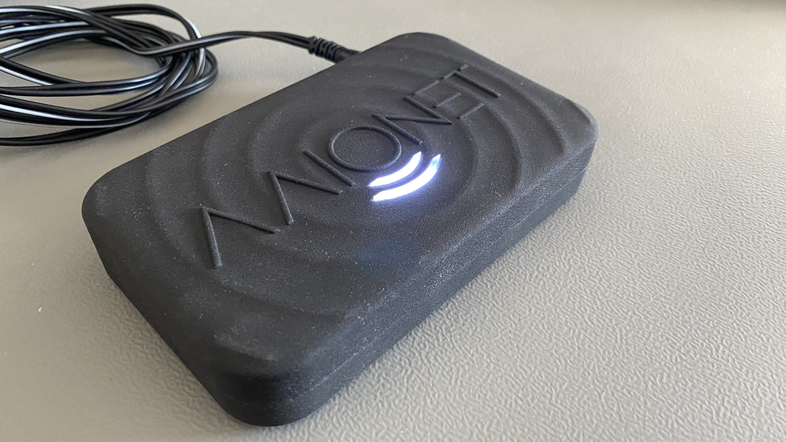

## AAIONET Connectivity GmbH

 

## Summary:

In the ongoing digitalization, the topic of IoT is playing an increasingly important role. Likewise, the guarantee of high-performance networks plays a huge part. The founders of AAIONET Connectivity GmbH have been dealing with the topic of blockchain and cryptocurrencies for a while. During our research, we came across the Helium Token in February 2021. The technology to intelligently link IoT devices through energy-efficient miners that contribute to a decentralized network and the aspect that basically every person can become part of this network to provide a stable basis for the most diverse application examples has led to the decision to pursue another important aspect. AAIONET Connectivity GmbH would like to compensate the CO2 emissions of the production and therefore contribute to making the Helium Blockchain even more sustainable and attractive for various future projects through the sustainable production of a German-made Miner. AAIONET Connectivity GmbH sees the incredible potential and power of Helium Blockchain and wants to be a reliable partner and representative of this message to change the global industry.

## Company Information

The company AAIONET Connectivity GmbH is a Berlin-based start-up founded in 2021 and works with a German partner who has been successfully developing and building devices in the field of IoT for 7 years now.

The AAIONET AA1 will be the first product of AAIONET Connectivity GmbH 

## Product Information

* Will this product be sold under the company name, or a different brand name?

Company Name — AAIONET Connectivity GmbH

* What is this product's model name?

AAIONET AA1 — Retail Price TBD

* Is this is a Light Hotspot or a 5G Hotspot?

Light Hotspot

* Is this model for indoor, outdoor, or both?

Model for indoor application

* Provide a brief description of the product:

The AAIONET AA1 is a miner developed and produced in Germany. The CO2 footprint of the production of the AAIONET AA1 is completely compensated. The AAIONET AA1 should not only be sustainable and offer a strong performance, but also convince with its perfect design.

* What is your approximate price point? 

350 €

* What is your expected production and delivery timeline? 

* Hardware prototype: 09/2022
* Software development: 05/2022
* Radio Frequency certification: 10/2022
* Helium Certification: 10/2022
* Presale — After helium has approved the third party manufacturer audit / expected Q4 2022
* First batch production: Q1 2022
* First batch deliverey: Q1 2022

## Previous shipments (required)

* Have you shipped anything in the past? 

None

* If you are a startup, are you partnering with another company? What experience does your team have?

We're currently partnering with IOX GmbH (https://www.ioxlab.de) for development.

PCB Prodution & Assembly — the following electronics manufacturing services are currently on our shortlist for production:
ES&S Solutions GmbH - 41751 Viersen, Gewerbering 2 // https://www.esskabel.de
Innosent - 97499 Donnersdorf, Am Rödertor 30 // https://www.innosent.de

Decicion on a final fullfillment Partner is still open.

## Which countries do you plan to ship to and get regulatory certifications for?

In the first step, the device will be certified for the European (CE) and US (FCC) market.
Certifications for Asia market are intended at a later stage.

## Customer Support

Our customers can contact our support via email. In the next step, the realization of a live chat is in prospect.

The companies customers will be informed of any concerns regarding updates & functionality via a newsletter. In general, our support will be available for the customer at any time for the most diverse questions.

* How long will the company provide customer support? 

AAIONET Connectivity GmbH products are all enjoying two year warranty if there are product defects, under german law on the sale of goods.

* How are you planning to handle repairs and replacements?

AAIONET Connectivity GmbH products are all enjoying two year warranty. Customers could apply for repairs and replacements when a product defect has been detected.

## Hardware Security Element (required)

* Are you using an ECC608. Yes or No?

Yes — ECC608-TNGHNT

* Encrypted/locked-down firmware. Yes or No? 

Not in Prototype, will be achieved in series production

* Encrypted storage of the miner swarm_key, either via disk encryption or hardware measures. Yes or No?

Not applicable for Light Hotspot

* Encrypted buses, potting and other anti-tampering measures. Yes or No? (Please note, the final design will be audited against this statement. Do not answer 'yes' unless the design will have these features and a description of where they are implemented can be provided.)

Not in Prototype, will be achieved in series production

* Willingness to submit a prototype for audit, and sharing those audit results publicly (pass or fail) Yes or No?

Yes

## Hardware Information (required) Please provide detailed hardware designs, including relevant parts.
Evidence of a functioning prototype - photos/videos. Renderings are OK but physical prototypes are much, much better. 

 
 
 

* What are your plans for software setup and configuration for the devices?
This would includes remote updates and the ability for hosts to change wifi settings, via Helium's official app or otherwise. 

Onboarding & Updating via Hotspotty

* Which security implementation (ECC608, TPM, TrustZone, other) are you using? 

ECC608-TNGHNT

* Which LoRa chipset are you planning to use in your gateway? (We recommend you don't use the SX1301 in new designs.) 

SX1302

* What is the CPU?

580MHz MIPS CPU, Onion Omega 2S+

## Manufacturing Information (required)

AAIONET Connectivity GmbH is a startup thats new to the market of radio hardware devices.
We’re currently partnering with IOX GmbH (www.ioxlab.de).

Our Partner IOX has been successfully developing and building devices in the field of IoT for 7 years now

* If you have not built gateways before, are you using a third party manufacturer or working with a partner? This is the single largest risk with most hardware ventures. If possible please provide information about your manufacturing partners and supply chain.

Following electronics manufacturing services are currently on our shortlist for production:
Innosent - 97499 Donnersdorf, Am Rödertor 30
ES&S Solutions GmbH - 41751 Viersen, Gewerbering 2

* Where are you sourcing your components from? 

Main source will be the respective EMS Partner
Additionally, we’re building a compoments sourcing network at the moment.

* How many radio modules/ concentrators can you procure? 

up to 10.000 / month

## Proof of Identity

We are prepared to share proof of owners identity. 

## Budget & Capital (required)
* How many Hotspots are you planning to manufacture and sell within the first six months of sales? 

2.000 — 10.000 per month

* How much money will be required up-front? How much money do you have on-hand, and how much do you have access to? 

100% equity

* What is your plan for additional financing if required? (This is the second biggest risk in new hardware ventures, getting almost over the line and then running out of cash.) 

Equity or Investors

## Risks & Challenges (required)

Availability of critical components.

Who will develop the Hotspot onboarding and management app? Will it be an internal team or external company?

We're working with Hotspotty

## Payment methods available (required):

Most most commonly used payment services: credit cards, including Visa, Mastercard, AMEX; Apple Pay, PayPal, and bank transfer.

## Contact Information 

* Contact Email - am@aaionet.com
* Company Website - https://www.aaionet.com
