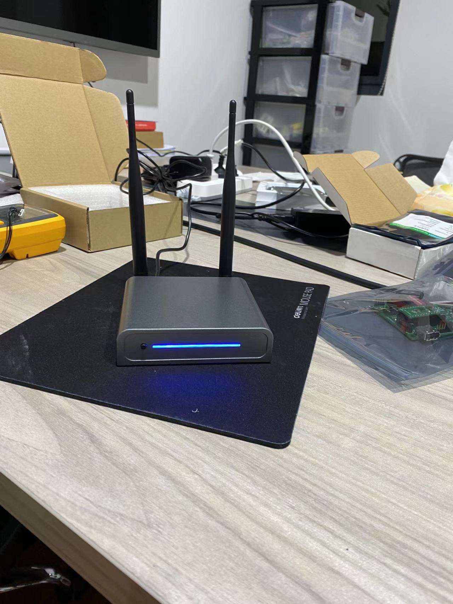
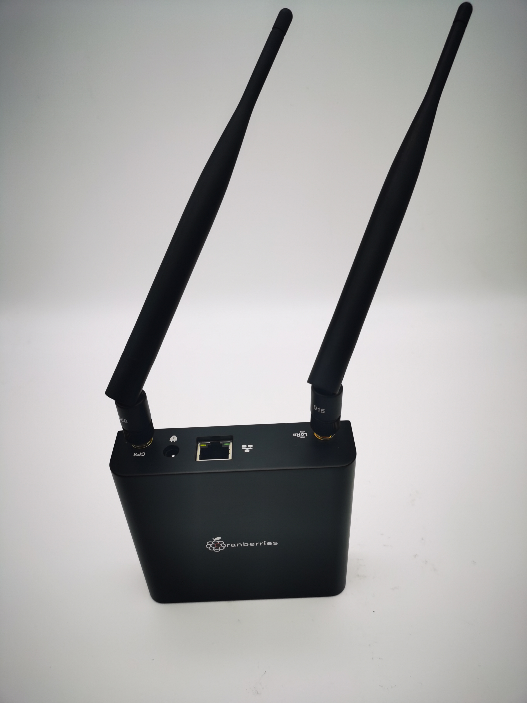

## The Cranberries Technology-Light Hotspot C1
Application to become an approved third party manufacturer as per HIP19. 

## Summary
The Cranberries Technology are very much in agreement with the idea of the helium network——"The People's Network". Therefore, we are delighted to become a third-party manufacturer and build a high-efficiency hotspot. We hope to become a major Helium hotspot provider and promoter, and will keep investing on and contributing to Helium network.

## Company Information (required)

The Cranberries Technology Co. LTD., a start-up for helium, was founded in Shanghai in 2021.

Since 2019, our leaders have been promoting helium in communities and crypto forums. So far, we have the largest helium community in China.

We know very well about the Helium gateways. Our team is one of the first to deploy gateways in China, and since March 2021, we have helped the bobcat give roadshows about their helium hotspots. In this process, we have accumulated a lot of experience and resources. 

Additionally, our CTO is from [EDA Technology](https://edatec.cn). EDATEC is one of [Raspberry Pi's Global Design Partners](https://www.raspberrypi.org/for-industry/design-partners/) that is serving global customers with standard hardware products, custom design, and manufacturing services based on Raspberry Pi Technology platform in IoT, Industrial Control, Automation & Artificial Intelligence applications. EDATEC has been working on IoT for years and has several mature IoT Gateway solutions for LoRaWAN and Bluetooth Mesh networks. They launched the LoRa IoT Gateway solution in 2018, which is based on Semtech SX1301 and Raspberry Pi Computer Module 3+. Our CTO leads his team to offer solutions for IoT, Industrial Control, Automation, Computing & Artificial Intelligence solutions based on the Raspberry Pi Technology platform. We currently have over a dozen developers with an average of 4 years of experience in developing the IoT market, intensive embedded hardware and software design. We've been planning for a helium light hotspot for a long time, and have already made the prototype of the machine. 
  

We appreciate the value of Helium and the idea of the people's network. We regard Helium as not just an IoT project, but also the infrastructure of Web3. Now, with an understanding of the hotspot and a commitment to the concept, we plan to promote the people's network and work towards the global realization of UBI (Universal basic income).

## Product Information (required)
**Product Name:** The Cranberries-Light Hotspot C1

**Product Type:** Light Hotspot，indoor

**Approximate Price Point:** 299 USD

**Expected Production and Delivery Timeline:**
After Helium's official certification, we can deliver the goods within 30 days after customers’ order.

**Features**
* Concentrator based on the Semtech SX1302
* Support EU868 and US915 LoRaWAN frequencies
* 580MHz MIPS processor
* 128MB DDR
* 16MB Flash
* Fast Ethernet and 2.4G Wi-Fi networks
* Bluetooth 4.1 for Gateway configuration with Andorid / iOS App
* Built-in ATECC608 security chip
* OTA support
* 12V DC Power in
* Dimension: 110mm(L) x 90mm(W) * 25mm(H)

.jpeg)

## Previous shipments (required)
Have you shipped anything in the past?
* Yes

What types of products have you shipped?
* Hardware Server

Which countries have you previously shipped regulatory approved products?
* US and EU

If you are a startup, are you partnering with another company? What experience does your team have?
* The Cranberries is a start-up, now we are partnering with [EDA Technology](https://edatec.cn) . EDA Technology is also our technology and material provider, one of the designer partners of the [Raspberry Pi's Global Design Partners](https://www.raspberrypi.org/for-industry/design-partners/). The products they designed, including IoT gateways, are sold all over the world. They shipped more than 100Kpcs Raspberry Pi based solutions in 2021.

## Which countries do you plan to ship to and get regulatory certifications for? (required)
CE/FCC/UKCA/RCM/ISED(pending)

## Customer Support (required)
How will your customers be able to contact you for support for your products?
* We provide OTA based software, which can automatically push and install the latest software code into the hotspots.
* We provide online documents for user guide and trouble shooting.
* We can also provide email support in 24/7.
* Customers can contact our local distributor for support as well.
* Customers can also contact us from twitter / discord / Github / Wechat

How long will the company provide customer support?
* Our products come with 1 year warranty.

How are you planning to handle repairs and replacements?
* We plan to sell the hotspots through our distributor network, the customers can ship the defective units to our local distributors or directly to us. We will repair or replace those defective units within one week.

## Hardware Security Element (required)
Are you using an ECC608?
* Yes

Encrypted/locked-down firmware. Yes or No?
* Yes

Encrypted storage of the miner swarm_key, either via disk encryption or hardware measures. Yes or No?
* Yes

Encrypted buses, potting and other anti-tampering measures. Yes or No? 
* Yes

Willingness to submit a prototype for audit, and sharing those audit results publicly (pass or fail) Yes or No?
* Yes

## Hardware Information (required). Please provide detailed hardware designs, including relevant parts.
What are your plans for software setup and configuration for the devices?
* We have our own server and app, which can automatically push the miner program remotely.

Which security implementation (ECC608, TPM, TrustZone, other) are you using?
* ATECC608

Which LoRa chipset are you planning to use in your gateway? (We recommend you don't use the SX1301 in new designs.)
* SX1302

What is the CPU?
* 580MHz MIPS processor

Other Hardware Specifications:
* Concentrator based on the Semtech SX1302
* Support EU868 and US915 LoRaWAN frequencies
* 128MB DDR
* 16MB Flash
* Fast Ethernet and 2.4G Wi-Fi networks
* Bluetooth 4.1 for Gateway configuration with Andorid / iOS App
* Built-in ATECC608 security chip
* OTA support
* 12V DC Power in
* Dimension: 110mm(L) x 90mm(W) * 25mm(H)

## Manufacturing Information (required)
Have you built and delivered radio hardware products before?
* Yes, our CTO and team members has built and delivered radio hardware products.

Have you built gateways before?
* No.

If you have not built gateways before, are you using a third party manufacturer or working with a partner? 
* We are partnering with EDA Technology, who is our tech and material provider. EDA has strong hardware design and manufacturing capabilities, and has a solid supply chain to supply LoraWan modules and Raspberry Pi. We have purchased 10,000 pieces of the RaspberryPi zero2w and 10,000 pieces of the LoraWan modules.

Where are you sourcing your components from?
* We sourced the components from authorized component distributors like Arrow, Future Electronics and local manufacturers.

How many radio modules/ concentrators can you procure?
* 100k+ every year

## Proof of Identity
We have submited the information to DeWi.

## Budget & Capital (required)
How many hotspots are you planning to manufacture and sell within the first six months of sales?
* We expect to produce 10k+ gateways per month，so we planning to manufacture and sell 60k+ within the first six months of sales.

How much money will be required up-front? 
* We reserved US$2M cash to launch products and run the business.

How much money do you have on-hand, and how much do you have access to?
* We prepared US$2M to support this project initially. We have around US$2M cash and can access up to US$3M.

What is your plan for additional financing if required? 
* When we sell 1,000 machines, we will obtain positive cash flow. Additionally,  the shareholders could invest US$3M fund to support this project.

## Risks & Challenges (required)
The current challenge is the component supply, we are working with our supplier partners to ensure constant supply.

## Contact Info 
* Contact Email (required) - support@cranberriesiot.com
* Website (required) - www.cranberriesiot.com(under construction)
* Twitter profile - https://twitter.com/cranberriesiot

## Payment methods available (required):
* We support Coinpayment platform for order placement; Supported tokens: ERC20-USDC, BSC-BUSD, ERC20-USDT and TRC20-USDT.

