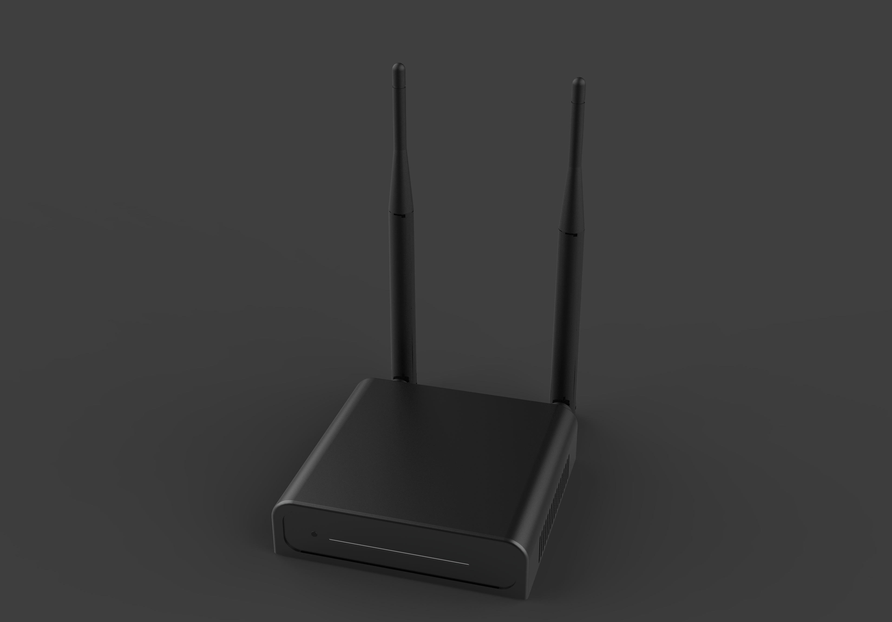
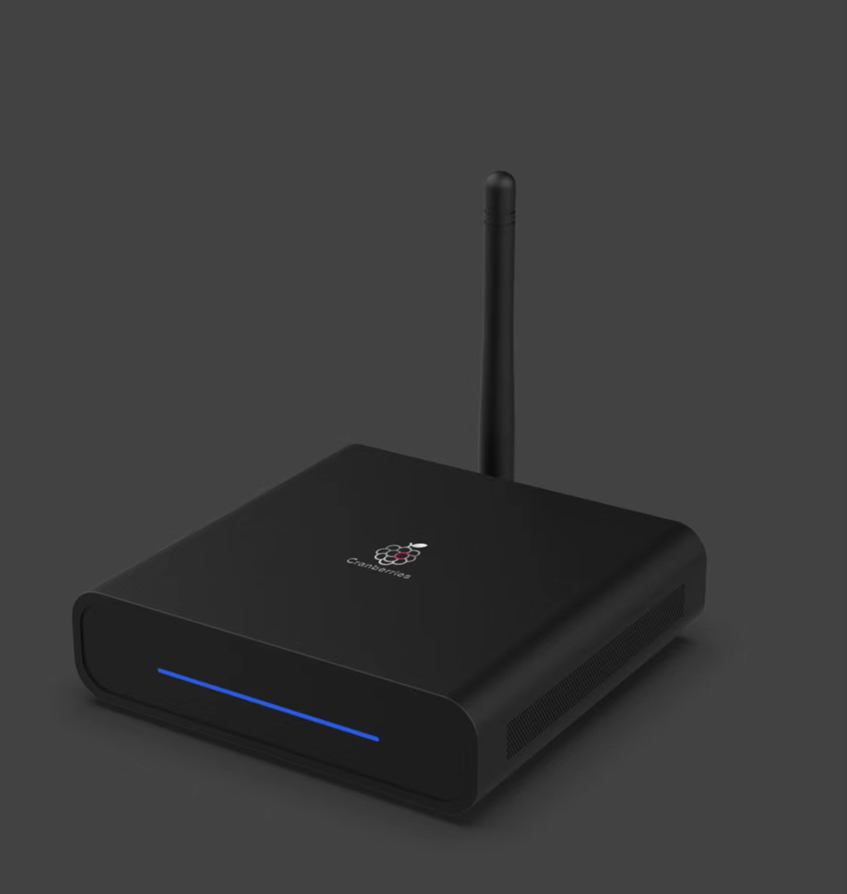
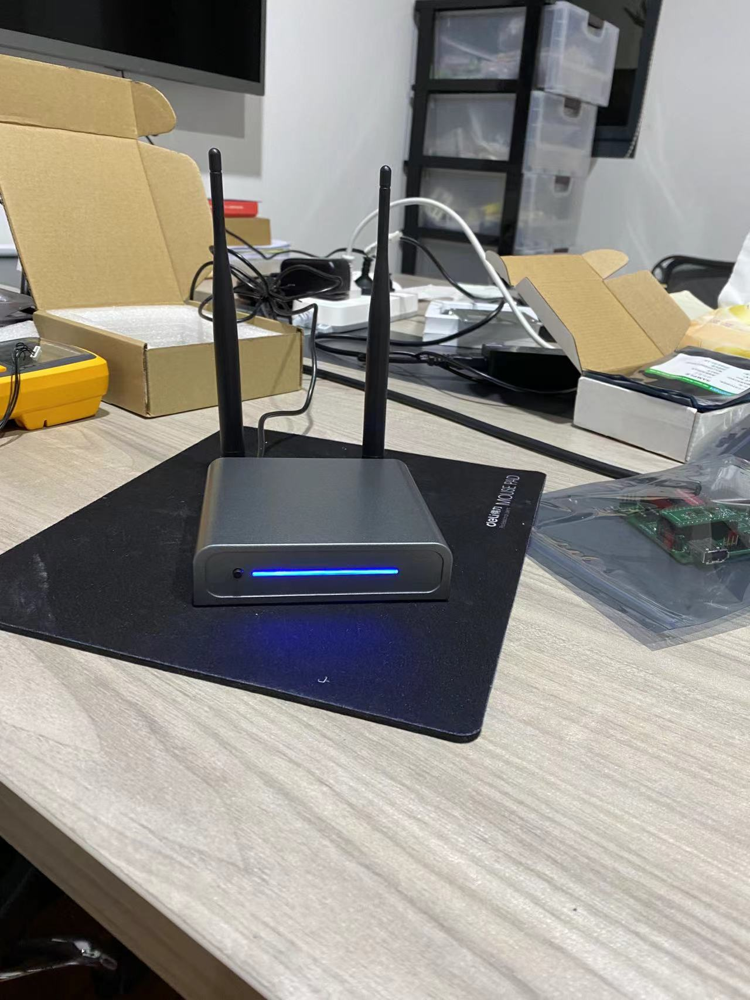
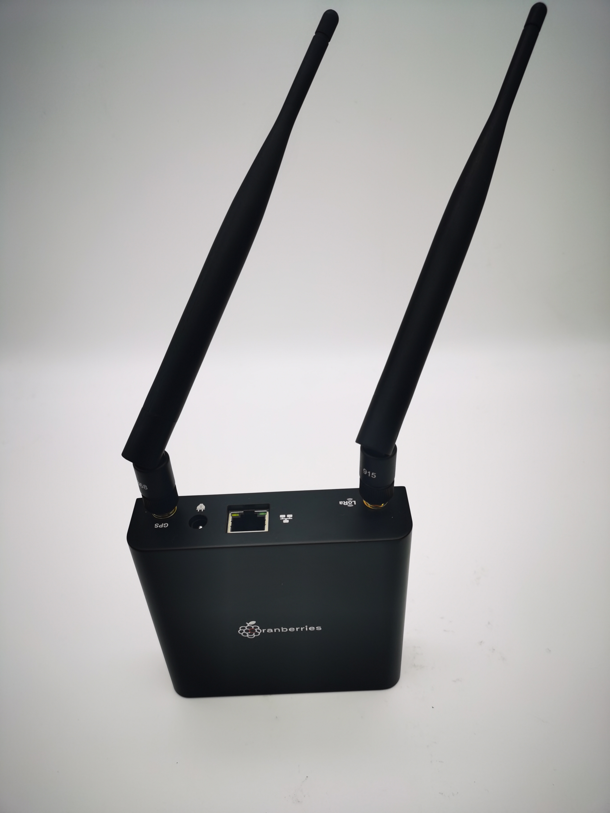

## Cranberries（EDATECH）

Application to become an approved third party manufacturer as per HIP19. 
## Summary
The Cranberries Technology are very much in agreement with the idea of the helium network——"The People's Network". Therefore, we are delighted to become a third-party manufacturer and build a high-efficiency hotspot. We hope to become a major Helium hotspot provider and promoter, and will keep investing on and contributing to Helium network.

## Company Information (required)
The Cranberries Technology Co. LTD. founded in 2021, is a startup intelligent manufacturing company based in Shanghai. As one of the very first teams to understand and promote HELIUM in China, we appreciate the value of HELIUM and the idea of "The People's Network" . Now, we focused on cryptocurrencies and IoT, and the Cranberries series hotspots are our competitive products in the domain of IoT in the future decades.

The engineering team at the Cranberries consists of experts in the fields of wireless communication, IoT and blockchain, with more than 10 years in average of successful professional career and entrepreneurial experience. Although we are a start-up company, our materials and basic data are supported by EDATECH. Additionally, perhaps you don't know, our community was the first to promote HELIUM in China, and our team has a lot of influence on cryptocurrencies and blockchains.

We hope to become a major Helium hotspot provider and promoter, and will keep investing on and contributing to Helium network.

## Product Information (required)
The Cranberries series are co-branded with EDATECH.

The Cranberries-C3 series are designed as Helium light-node hotspot for global market, support both indoor and outdoor deployment. 

Model Name: Cranberries-C3 470/C3 915/C3 868

* Concentrator based on the Semtech SX1302
* Support EU868 and US915 LoRaWAN frequencies
* 580MHz MIPS processor
* 128MB DDR
* 16MB Flash
* Fast Ethernet and 2.4G Wi-Fi networks
* Bluetooth 4.1 for Gateway configuration with Andorid / iOS App
* Built-in ATECC608 security chip
* OTA support
* 12V DC Power in
* Dimension: 110mm(L) x 90mm(W) * 25mm(H)

## Production and delivery timeline
After Helium's official certification, we can deliver the goods within 30 days after customers’ order.

## Previous shipments (required)
We have experiences in shipping wireless products worldwide. Our tech and material provider is EDATECH, one of the designer partners of the Raspberry Pi Foundation. The products they designed, including IoT gateways, are sold all over the world,.
 

## Which countries do you plan to ship to and get regulatory certifications for? (required)
* CE/FCC/UKCA/RCM/ISED(pending)
* Global Market except China Mainland

## Customer Support (required)
* Online website for production introduction and installation guide
* Discord Channel
* Email response in 48 hours
* Telegram technical support
* Hardware 1 year warranty
* Repair the defective products within one week

## Hardware Security Element (required)
* We use ATECC608A/B
* We use SX1302
* We source from the two major LoRaWan module vendors in China
* we have solid supply chain and can procure more than 100K concentrators per year
* Are you using an ECC608? Yes
* Willingness to submit a prototype for audit, and sharing those audit results publicly (pass or fail)? Yes

## Hardware Information (required). Please provide detailed hardware designs, including relevant parts.
* We use ATECC608A/B
* We use SX1302
* We source from the two major LoRaWan module vendors in China
* we have solid supply chain and can procure more than 100K concentrators per year

## Manufacturing Information (required)
We have secured sufficient amount of materials for the forecast of 1 year. And with the good relations with two major LoRa module vendors in Eastern China, we can ensure the supply chain in long term.

## Proof of Identity
We have submited the information to DeWi.

## Budget & Capital (required)
* We have secured materials for 2K gateways，including LoRaWan and the Raspberry Pi.
* We reserved 1 millions USD cash to launch products and run the business. 
* We expect to produce 10,000 gateways per month.
* When we sell 1,000 machines, we will obtain positive cash flow.

## Risks & Challenges (required)
The short-term risk is the shortage of chips currently happening around the world. We are also working on new hardware design and manufacture to avoid relying on single source of key components.

## Other information if you do not provide contact information we cannot review your proposal
## Contact Info 
* Contact Email (required) - support@cranberriesiot.com
* Website (required) - www.cranberriesiot.com(under construction)
* Twitter profile - https://twitter.com/cranberriesiot

## Payment methods available (required):
* We support Coinpayment platform for order placement; Supported tokens: ERC20-USDC, BSC-BUSD, ERC20-USDT and TRC20-USDT.

