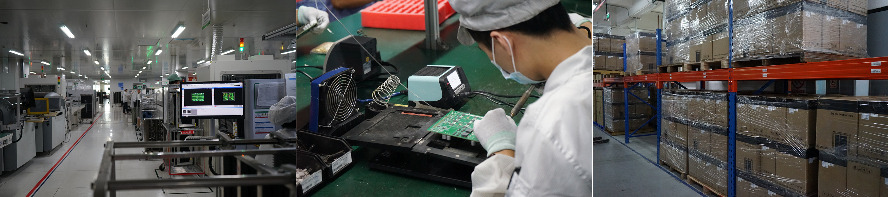
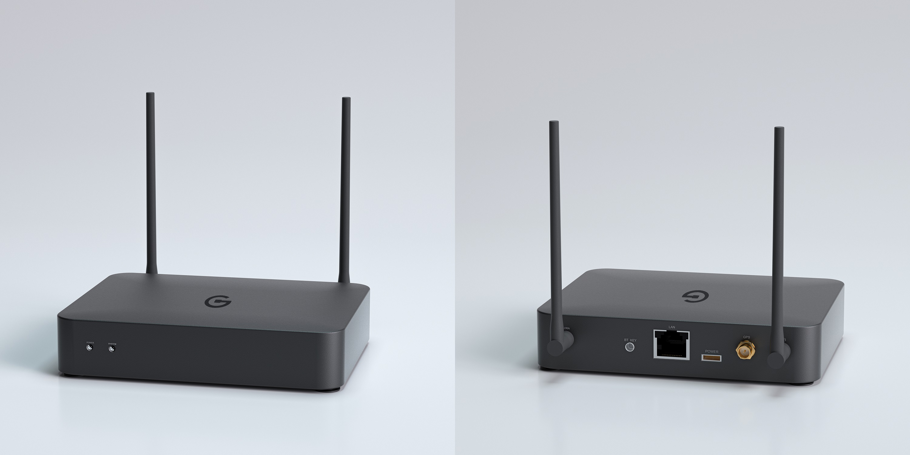
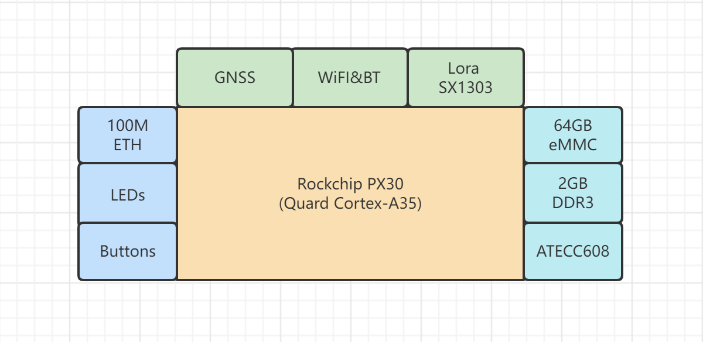

## Goldshell Halo Pro
Application to become an approved third party manufacturer as per HIP19

## Summary

As a miner manufacturer, Goldshell have been serving the blockchain industry for years. Launched lots of  popular products, especially in the development of quiet-miner for home. Our R&D team noticed the Helium project and was so impressed with the concept-"People's Network", therefore we are dedicated to become a third party manufacturer of the Helium Hotspot

## Company Information: (required)
 Goldshell are focusing on high-performance miners and application fields. In the past few years, Goldshell Miner has successfully completed the R&D, mass production and sales of multiple miners in LTC, CKB, HNS, Sia, Kadena and other cryptocurrencies. Based on status of Goldshell official website, we have served more than 20,000 registered customers and the overview of website engagement has reached 521K until December 2021. More than 100k miners are distributed in 160+ countries around the world.
  

## Product Information (required)
**Goldshell Halo Pro** are designed as Helium full-node hotspot for global market, support  indoor deployment.
  
Hardware freature:
    
* Powerd by ARM based quard cortex-A35 at 1.5GHz
* WiFi IEEE802.11a/b/g/n & Bluetooth connectivity
* 2GB DDR3
* 64GB eMMC storage system
* Security with ATECC608
* Use Lora chipset SX1303 & SX1250s
* 100Mb Ethernet connection 
* GNSS

Effect picture:

## What is your approximate price point?  
 Price range is between $399-$499 according to the market situation
## What is your expected production and delivery timeline?
 * Mar 2022，submit HIP19 & prototype development 
 * Apr 2022, CE/FCC certification & pilot production
 * May 2022, pre-orders
 * June 2022, Mass production & delivery

## Previous shipments (required)
Startups welcomed!
* Have you shipped anything in the past? What types of products have you shipped?
  
    Yes. We've already shiped almost 100k miners to 160+ countries

* Which countries have you previously shipped regulatory FCC or CE approved products?
  
  US, Canada, France, Italy, Germany, Netherlands, UK
## Which countries do you plan to ship to and get regulatory certifications for? (required)
 US, Canada and Europe
## Customer Support (required)
* Email response in 48 hours
* Online Support Ticket
* Offical telegram support
* 1 year warranty

## Hardware Security Element (required)
* The community is concerned about devices that can be easily hacked, specifically by copying their swarm_key files. Applications should include plan for how the devices will be secured. The approved security element is an ECC608. If you would like to use an alternative security element your HIP19 will require additional review, please email Dewi (christina@dewi.org).
* Are you using an ECC608. Yes or No?
  
  Yes
* Encrypted/locked-down firmware. Yes or No?

    Yes
* Encrypted storage of the miner swarm_key, either via disk encryption or hardware measures. Yes or No?

    Yes, we use Microchip ATECC608
* Encrypted buses, potting and other anti-tampering measures. Yes or No?   
   
    Yes, Security boot and  firmware signature. 
* Willingness to submit a prototype for audit, and sharing those audit results publicly (pass or fail) Yes or No?

    Yes

## Hardware Information (required). Please provide detailed hardware designs, including relevant parts.

**Hardware designs:**

Goldshell always focus on the user experience of our apps and we plan to develop our own apps based on the Helium official one. The main functions will include hotspot setup, information query, remote control and so on.

## Manufacturing Information (required)
* Have you built and delivered radio hardware products before?
  
  We delivered miners with WiFi modules.
* Have you built gateways before?
  
  Not yet
* How many gateways did you make?
  
  Not yet
* If you have not built gateways before, are you using a third party manufacturer? This is the single largest risk with most hardware ventures. If possible please provide information about your manufacturing partners and supply chain.

  Yes, We plan to use a third party manufacturer, and our long-term cooperative OEM has rich experience in gateway and router production.
* Where are you sourcing your components from?
  
  We have a well-established supply chain, and have ordered the core chipsets form original factory and agent.

* How many radio modules/ concentrators can you procure?
  
    150k modules.

## Budget & Capital (required) 
   We aim to produce 2K in June 2022, then increse to 15K/month after mass production.We have already spent $5 million on project development and material preparation, and will continue to invest in the future according to the progress of the project

## Risks & Challenges (required)

* The core chipsets are shortage in global market
* Unpredictable pandemic may affect mass production and shipments

## Contact Info
* Contact Email (required) - product@goldshell.com
* Website (required) - https://www.goldshell.com
* Twitter profile - https://twitter.com/goldshellminer
* Other social profiles - https://www.youtube.com/channel/UCv34dL9uZNcd8eg7Xs5sSRw

## Payment methods available (required):
Crypto，Wire