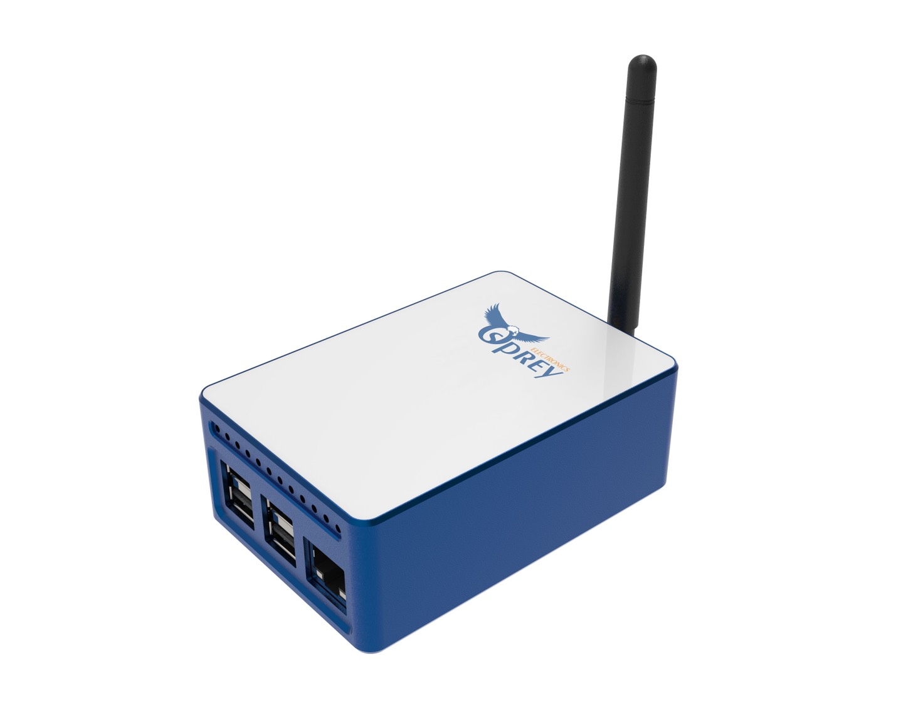
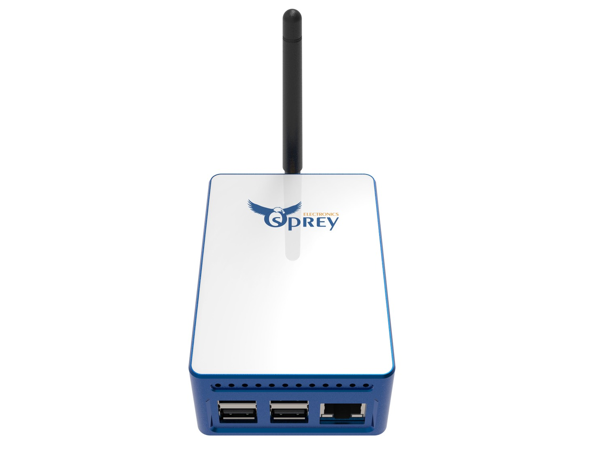

## Ingenious Technology LLC
Application to become an approved third party manufacturer as per HIP19
## Summary
Ingenious Technology is created in 2021 for Block Chain product development, and we intend to build Helium full gateway. We founded Enigma Micro in 2018 for crypto mining hardware business, and Dracaena Technology in 2020 for crypto Mining Software business. Business is selling products at website www.ospreyelectronics.io. For Helium product, we will create a new website and brand to sell.
## Company Information (required)
* What is your company name?
Ingenious Technology LLC
* How long have you been in business? 
We are in Crypto Mining business since 2018. Ingenious Technology LLC is a special entity for Helium Gateway Business to separate business risk.
* What kind of products have you created? 
Crypto Mining Product:
ECU200 FPGA Mining Board (https://www.ospreyelectronics.io/product-page/ECU200)
ECU50 Ethereum Mining Product (https://www.ospreyelectronics.io/product-page/ecu50)
E300 Ethereum Mining product (https://www.ospreyelectronics.io/product-page/e300-180m-eth-hash-rate)
* How many have you sold? 
We sold about 1k ECU200, 8k ECU50, and estimate 7k ECU800 by end of this year.
* What brought you to Helium etc? 
We are impressed by Helium concept and it’s business future.
## Product Information (required)
* Is this is Light Hotspot or Full Hotspot? (please submit two separate applications for Full and Light hotspots)
This is full hotspot.
* Is it for indoor or outdoor?
It is for indoor.
* Please provide a brief description of what you're making? Version 1: Product will use Raspberry Pi 4 + Seeed Lora1302 (USB) module (with Raspberry Pi hat) + high gainer antenna for frequency 868M (EU), 915M(US), 470M (China). We will use ATECC608 Chip to secure the system. Version 2: Product will use Raspberry Pi 4 + Lora1302 (SPI) module (with Raspberry Pi hat) + high gainer antenna for frequency 868M (EU), 915M(US), 470M (China). ATECC608 Chip to secure the system.

## What is your approximate price point? (required)
We will sell our first generation product at around $500, but will reduce the price under $300 after we optimized the hardware cost in second generation product.

## Please provide detailed hardware designs, including relevant parts (required)
Evidence of a functioning prototype - photos, videos. Renderings are OK but physical prototypes are much, much better. 
Your plan for software setup and configuration for the devices. 
This would presumably include remote updates and the ability for hosts to change wifi settings, via Helium's official app or otherwise. 

We will include remote update via Helium official app.

## What is your expected production and delivery timeline? (required)

Production and delivery timeline:
- Hardware prototype: 9/10/2021
- Software development: 9/30/2021
- Radio Frequency certification: 9/30/2021
- Helium Certification: 10/30/2021
- First batch product delivery: 11/15/2021

## Previous shipments (required)
## Startups welcome! 
* Have you shipped anything in the past? Yes or No.
Yes, we have shipped:
- Crypto Mining Product: ECU200 FPGA Mining Board (https://www.ospreyelectronics.io/product-page/ECU200) 
- ECU50 Ethereum Mining Product (https://www.ospreyelectronics.io/product-page/ecu50) 
- E300 Ethereum Mining product (https://www.ospreyelectronics.io/product-page/e300-180m-eth-hash-rate)
* Which countries have you previously shipped regulatory FCC or CE approved products? 
We didn’t ship the FCC or CE but UL certified products to following countries: US, Canada, Europe and China
* Which countries do you plan to ship to? 
North America, Europe and China
## Customer Support (required)
* How will your customers be able to contact you for support for your products? 
Client will be able to reach us through telephone, online store chat, email, and discord. Most of our clients uses discord to contact us.

  Discord channel: https://discord.gg/FnhSy5mqEf
  
  Twitter : https://twitter.com/OspreyElectron
  
  Telephone suport number: +1 (925) 558-0308
  
  Email support address: notifications@ospreyelectronics.io
  
* For how long? How are you planning to handle repairs and replacements? 
We plan to provide 1 year warranty to our product. We will stock products in US and Germany for replacement. Products will be repaired in Shenzhen China.

## Hardware Security Element (required)
* The community is concerned about devices that can be easily hacked, specifically by copying their swarm_key files. Applications should include plan for how the devices will be secured, potentially including:

* Encrypted/locked-down firmware. Yes or no? 
Yes, We will encrypt firmware
* Encrypted storage of the miner swarm_key, either via disk encryption or hardware measures. Yes or No?
No
* Encrypted buses, potting and other anti-tampering measures. Yes or No?
No
* Willingness to submit a prototype for audit, and sharing those audit results publicly (pass or fail) Yes or No?
Yes, we are willing to submit a prototype for audit and share results publicly.

## Hardware Information (required)
* Please let us know:

* Which security (swarm) element are you using? 
ECC608 security
* Which LoRa chipset are you planning to use in your gateway (ie SX1302/03 & SX1250s or SX1301/08 & SX1255/57) 
We use SX1302
We recommend you don't use the SX1301 in new designs 
* Where are you sourcing your components from? 
We will source Raspberry Pi from market, and make our own Lora Mdoule based on Semtech Reference design
* How many radio modules/ concentrators can you procure? 
First batch, we estimate we will procure a couple thousand.

## Manufacturing Information (required)
* Have you built and delivered radio hardware products before?
We have build high frequency products (ECU200) but not radio hardware.
* Have you built gateways before? 
We haven’t built any gateway product but Jing Zeng has worked in network industries for 25 years (Cisco Certified Internet Expert #4578). One team member had experience in Mini Wifi, LTE Router, Mesh Wifi before. 
* How many gateways did you make? 
We didn’t make any gateway but we made other crypto mining products
* If you have not built gateways before, are you using a third party manufacturer? This is the single largest risk with most hardware ventures. If possible please provide information about your manufacturing partners and supply chain.
We have made much complicated hardware boards (FPGA crypto Mining boards) and have experience in hardware business.
For first generation product, in order to fast to market, we will make our own Lora Mdoule based on Semtech Reference design. We have many Raspberry Pi proviers

## Proof of Identity
Per typical KYC/AML procedures, proof of identity for major shareholders (25%+ ownership) will be expected to be provided privately to representatives from Helium Inc or DeWi board members. This will be attested and publicly confirmed by those representatives, e.g. as GitHub comments.
Contact details for this will be provided after your application is submitted on GitHub. 

Ingenious Technology LLC is 100% owned by Jing Zeng
Contact Info: +1.925.858.2818
Email: jing@ingenioussafety.com
Address: 111 Deerwood Road, Suite 200, San Ramon, CA, 94583

## Budget & Capital (required)
* How many of these are you hoping to make and sell? 
We plan to make 1k in 2021 and 10k to 50k in 2022.
* How much money will be required up-front? How much money do you have on-hand, and how much do you have access to? 
We have $400k cash upfront. We have access to close to half a million crypto asset and half million inventory. We have a couple of million personal asset.
* What is your plan for additional financing if required? This is the second biggest risk in new hardware ventures -- getting almost over the line and then running out of cash. 
Our suppliers (Avnet and others) gives us credit for purchasing. We are partner with other manufacturers in China to produce this product and our partner will support us in case we need additional finance.
## Risks & Challenges (required)
Please tell us about some of the challenges that would prevent these products from becoming a reality, and how you might address them.
Because of pandemic, many micro chip are out of stock. We estimate this situation will last to the mid of 2022.
We will pre-order the most critical components in advance (Lora SX1302 and others)

## Other information (required) if you do not provide contact information, we cannot review your proposal
* Contact info (* required)
Jing Zeng
+19258582818
jing@ingenioussafety.com
* Twitter profile - https://twitter.com/OspreyElectron
* Facebook profile -
* Other social profiles -
- Discord channel: Osprey Electronics https://discord.gg/dyJf8DD
* Website - www.ospreyelectronics.io

## Payment methods available 
Crypto, credit card, paypal, check, wire
## Which countries do you plan to ship to and get regulatory certifications for? (required)
North America, Europe and China
