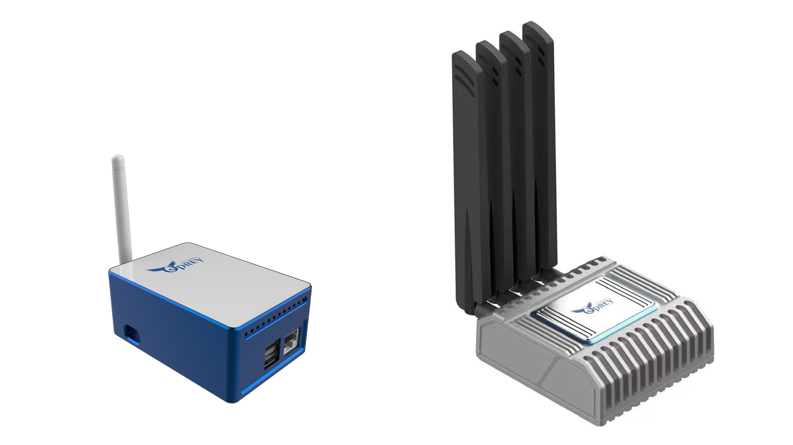

## Ingenious Technology LLC

## Summary:
Ingenious Technology is created in 2021 for Block Chain product development, and we intend to build Helium 5G hotspot. We founded Enigma Micro in 2018 for crypto mining hardware business, and Dracaena Technology in 2020 for crypto Mining Software business. Business is selling products at website www.ospreyelectronics.io and www.dracaena.io.

## Company Information (required)

* What is the company name? Ingenious Technology LLC

* How long has the company been in business? 
 We are in Crypto Mining business since 2018. Ingenious Technology LLC is a special entity for Helium Gateway Business to separate business risk.

* What kind of products have you created? (list specific products, include links if possible)

Crypto Mining Product:
ECU200 FPGA Mining Board (https://www.ospreyelectronics.io/product-page/ECU200)
ECU50 Ethereum Mining Product (https://www.ospreyelectronics.io/product-page/ecu50)
E300 Ethereum Mining product (https://www.ospreyelectronics.io/product-page/e300-180m-eth-hash-rate)
Osprey Hotspot G1 (https://www.ospreyelectronics.io/product-page/osprey-hotpot-g1-us-europe-china)
Computer cooling products (https://www.dracaena.io/)

* How many have you sold? 

We sold about 1k ECU200, 8k ECU50, and estimate 1k E300 miners. We also sold about 1 million dollar computer cooling products.

* What brought you to the Helium Network? 

We are impressed by Helium concept and it’s business future.

## Product Information (required)
* Will this product be sold under the company name, or a different brand name?
  The product will be sold under the trade mark Osprey Electronics.
  
* What is this product's model name? (Hotspot models with different hardware will need a separate HIP19 application.)

Osprey Electronics 5G Hotspot G1

* Is this is a Light Hotspot or a 5G Hotspot? (New applications should be for Light Hotspots or 5G Hotspots)

5G Hotspot

* Is this model for indoor, outdoor, or both? (If there are two different models for indoor and outdoor, list them separately.)

Osprey Electronics 5G Hotspot is Outdoor Hotspot

* Provide a brief description of the product:

Osprey Electronics 5G Hotspot is a Helium 5G Hotstpot. It is the latest Hotspot device in the Osprey product line contributing to cellular applications. It works with Small Cell to provide users with LTE or 5G coverage. It integrates a SX1302 LoRaWAN module and a dedicated ECC608 module, which enable the gateway to do PoC activities and mine HNT and MOBILE tokens at the same time. 

* What is your approximate price point? 

$899

* What is your expected production and delivery timeline? 

Q1 2023

## Previous shipments (required)

* Have you shipped anything in the past? Yes, we have shipped:

Crypto Mining Product: ECU200 FPGA Mining Board (https://www.ospreyelectronics.io/product-page/ECU200)

ECU50 Ethereum Mining Product (https://www.ospreyelectronics.io/product-page/ecu50)

E300 Ethereum Mining product (https://www.ospreyelectronics.io/product-page/e300-180m-eth-hash-rate)

Computer cooling products (https://www.dracaena.io/)

* What types of products have you shipped?

 Mining machines, FPGA cards, Computer cooling, accessories, etc.

* Which countries have you previously shipped regulatory approved products? (FCC, CE, etc.) 

US (FCC), Europe(CE), China(SRRC).

* If you are a startup, are you partnering with another company? What experience does your team have?
N/A

## Which countries do you plan to ship to and get regulatory certifications for? (required) 
FCC

## Customer Support (required)
  Client will be able to reach us through telephone, online store chat, email, and discord. Most of our clients uses discord to contact us.

  Discord channel: https://discord.gg/FnhSy5mqEf
  
  Twitter : https://twitter.com/OspreyElectron
  
  Telephone support number: +1 (925) 558-0308
  
  Email support address: notifications@ospreyelectronics.io

* How long will the company provide customer support? 

 We plan to provide 1 year warranty to our product
 
* How are you planning to handle repairs and replacements? 

 . We will stock products in US for replacement. Products will be repaired in Shenzhen China.

## Hardware Security Element (required)

* Are you using an ECC608. Yes or No? 

Yes
* Encrypted/locked-down firmware. Yes or No?  

No

* Encrypted storage of the miner swarm_key, either via disk encryption or hardware measures. Yes or No? 

Yes

* Encrypted buses, potting and other anti-tampering measures. Yes or No?

Yes

* Willingness to submit a prototype for audit, and sharing those audit results publicly (pass or fail) Yes or No?

Yes

## Hardware Information (required) Please provide detailed hardware designs, including relevant parts.

Osprey Electronics 5G Hotspot

Osprey Electronics 5G Hotspot is a Helium 5G gateway. It works with Small Cell to provide users with LTE or 5G coverage. It integrates a SX1302 LoRaWAN module and a dedicated ECC608 module, which enable the gateway to do PoC activities and mine HNT and MOBILE tokens at the same time. 

* What are your plans for software setup and configuration for the devices?

Ingenious Technology development team will develop a mobile app and webUui for seting up and configurations.

* Which security implementation (ECC608, TPM, TrustZone, other) are you using? 

ECC608

* Which LoRa chipset are you planning to use in your gateway? (We recommend you don't use the SX1301 in new designs.) 

SX1302

* What is the CPU? 

Quad core Cortex-A72 (ARM v8) 64-bit SoC @ 1.5GHz

* Additional Hardware Specifications: 

|   Hardware   |   Description  | 
|  -  | -----------------  | 
| RAM  | LPDDR4 4G |
| Storage  | 64GB SSD |
| LoRa Gateway Chip  | Semtech SX1302 LoRa concentrator chip |
| LoRa Frequency Band  | US915 |
| LoRa Antenna Gain  | 1.2dBi |
| Ethernet  | 1* Gigabit Ethernet Port(10/100/1000/M) |
| Security Chip  | ECC608 |
| Certification  | FCC |
| Input Voltage  | Type C adapter 5V 3A |

## Manufacturing Information (required)
* Have you built and delivered radio hardware products before?

Yes

* Have you built gateways before? 

Yes

* How many gateways have you previously built? 

5K

* If you have not built gateways before, are you using a third party manufacturer or working with a partner? This is the single largest risk with most hardware ventures. If possible please provide information about your manufacturing partners and supply chain.

* Where are you sourcing your components from? 

Globaly.

* How many radio modules/ concentrators can you procure? 

5K per Month

## Proof of Identity

We already went through proof of identity when we applied for Helium full hostpot and verified by DeWi.

## Budget & Capital (required)

* How many Hotspots are you planning to manufacture and sell within the first six months of sales? 

3K~5K

* How much money will be required up-front? How much money do you have on-hand, and how much do you have access to? 

200K USD up-front; we have 200k on-hand

* What is your plan for additional financing if required? (This is the second biggest risk in new hardware ventures, getting almost over the line and then running out of cash.) 

We have enough cash flow from other bussinesses to support this project.

## Risks & Challenges (required)

The crypto market is going downturn and the client demands may fluctuate 

Who will develop the Hotspot onboarding and management app? Will it be an internal team or external company?

Ingenious Technology development team has developed the Hotspot onboarding and management app and launch in July 2022 as G1 Hotspot App.

## Payment methods available (required):

Wire transfer

## Contact Information 

<b>If you do not provide contact information and/or if the company website does not work, we will not review your proposal and the HIP19 application will be automatically denied.</b>

* Contact info (* required)
Jing Zeng
+19258582818
jing@ingenioussafety.com
* Twitter profile - https://twitter.com/OspreyElectron
* Facebook profile -
* Other social profiles -
- Discord channel: Osprey Electronics https://discord.gg/dyJf8DD
* Website - www.ospreyelectronics.io

