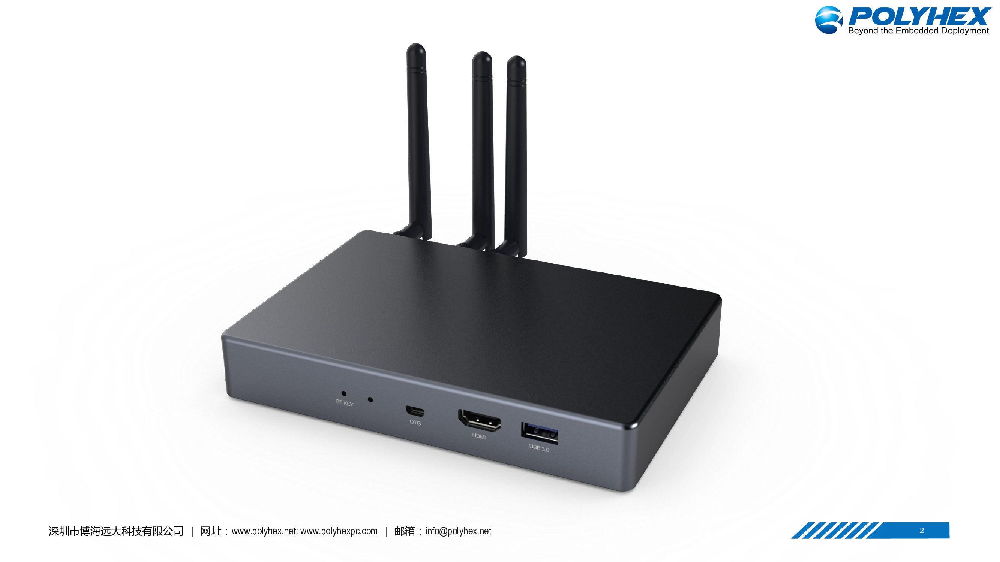
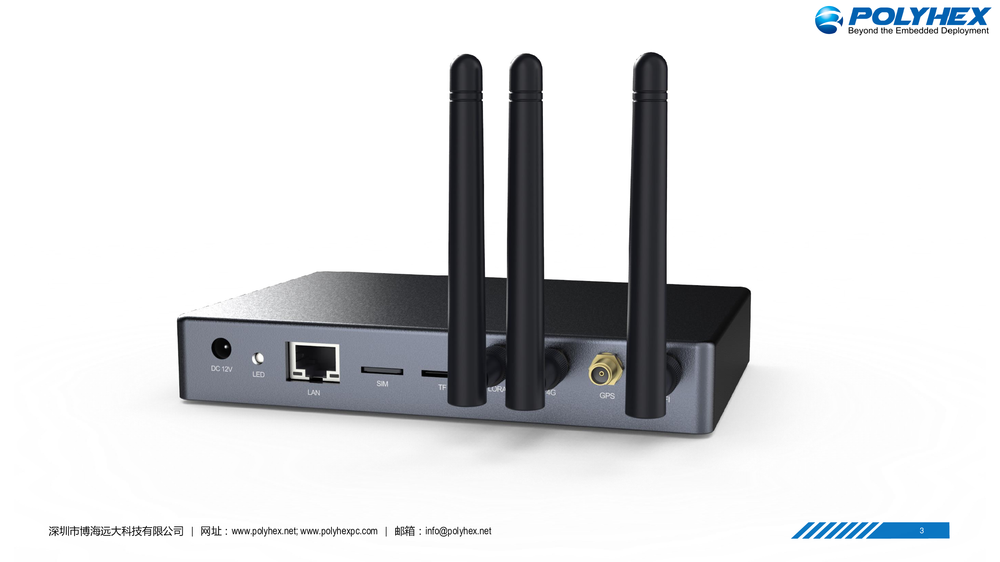
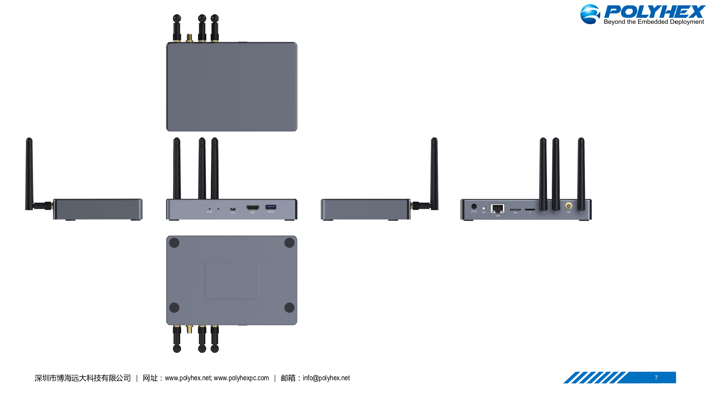

# Portal-A Miner (Polyhex Technology)

Application to become an approved third party manufacturer as per HIP19
# Summary
We have had a greatly vested  interest in Helium, what it represents and its utilities, we believe now it’s the time to bring a level of stability and scalability to HNT network coverage with affordable and readily available Hotspots provided straight to Helium ethusiathists. This will be achieved through drawing upon the calibre of experience, access to secured chip supply chain and the infrastructure at our disposal for manufacturing at a large scale. 
# Company Information (required)
Founded in 2014, Polyhex is an Industrial grade computer and embedded systems manufacturer based in Shenzhen, China, with offices located in Hongkong, Germany and USA. Grounded in the concept to provide the highest calibre of computer hardware customization service to fit our clients‘ needs whether it’s E-payment terminals or fanless industrial automation systems. We have the proven track record of creating a wide catalog of products from crypto currency miners to embedded solutions for public infrastructural development and fortune 500 companies that generates our company an annual revenue of USD $20-30 Million. 

# Product Information (required)
This application is for a Helium full hotspot intended for indoor use. 
The Hotspot is designed to be produced at scale with hardware components our company has a stable supply of. It is specced to be reliable and affordable. 

# What is your approximate price point? (required)
USD $299 Promotional price for first round of early pre sale in Europe

USD $399 Retail price 

# Please provide detailed hardware designs, including relevant parts (required)
Photos of the final product will be provided within a week, chassis production is being finalized. 
We will support the official Helium application for software setup and device configuration. 

The following renders may differ slightly from the final outer appreance once the chasis is ready. 

# What is your expected production and delivery timeline? (required)
Factoring the HIP19 application process, the first batch will be produced and shipped within 6-8 weeks after pre orders are allowed and have been put in place. 
# Previous shipments (required)
We have a wealth of experience with shipping FCC and CE approved products to countries in  Europe, North America and Australia 

# Customer Support (required)
Customers can reach us for support through our main website, staff emails attached in contact info, official twitter and discord (soon to be announced). 
We offer a one year warranty on our product, any repairs required post-warranty period can be arranged by sending to our RMA centers in Germany and the United States. 

# Hardware Security Element (required)
We are utilising the ATECC608A-SSHDA chip for encryption, this will allow the protection of sensitive user data. The swarm key is stored inside IC ECC608. 
Wifi control settings inside the Helium app are fully supported. 
As the manufacturer, the device’s miner utilities, Ubuntu system, kernel and uboot are updated through our OTA servers.

# Hardware Information (required)

Chip | Specifications | Remarks
--- | --- | ---
8-channel LORAA module | `SX1302+SX1303`| Vendor information: Semtech
Mainboard | 4gb RAM+ 64gb EMMC |ARM 
WIFI module | Yes | 
GPS module | Yes | 
ATECC608 | Yes | As per recommendation

# Manufacturing Information (required)
We have built and shipped various radio hardware products. 
We have manufactured and sold more than 60k gateways in the past. 

# Proof of Identity
Will be submitted separately to DeWi

# Budget & Capital (required)
Our manufacturing plant has the capacity to produce 1000+ units a day currently. 
After a round of promotional pre-sale, we plan to ship our future physical stock to branch offices in Nord-Rhein Westfalen, Germany and Los Angeles, USA to be distributed locally for European and North American customers, to get as many devices in our customer’s hands as possible, as fast as possible. 

Our company has a current asset of USD $4M for monthly operations and upto $1.5M can be allocated to monthly production of this device. We have our own R&D team already budgeted for, to further improve upon our product on a constant basis. 

# Risks & Challenges (required)
Any challenges that could be foreseen mainly comes from our factories and HQ based in Mainland China, which could factor product delivery times during national holidays or possible hiccups in transportation. Although it must be said that we do have the capital and experience to tackle every type of foreseeable challenge we might face. 

## Other information (required) if you do not provide contact information, we cannot review your proposal
* Contact form (mainland China) - [here](http://www.polyhex.net/contact.html)
* Contact email (europe) - nick.chen@polyhex.net 
* Contact email (North America) - kevin@polyhex.net 
* Twitter profile - [Polyhex support](https://twitter.com/PolyhexSupport) (soon to open product dedicated profile) 
* Discord  - (available soon)
* Website - [Polyhex Technology](http://www.polyhex.net/)

# Payment methods available 
Currently available: Paypal, wire transfer, cryptocurrency 
# Which countries do you plan to ship to and get regulatory certifications for? (required)
We plan to ship to all of Europe, North America, Australia and New Zealand
