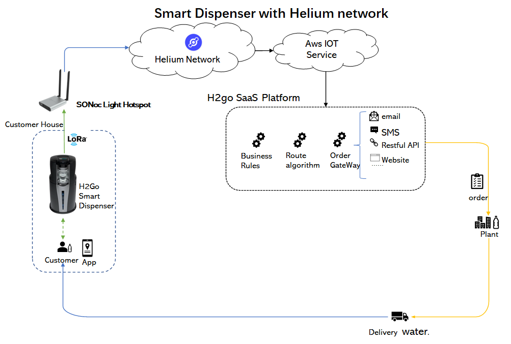
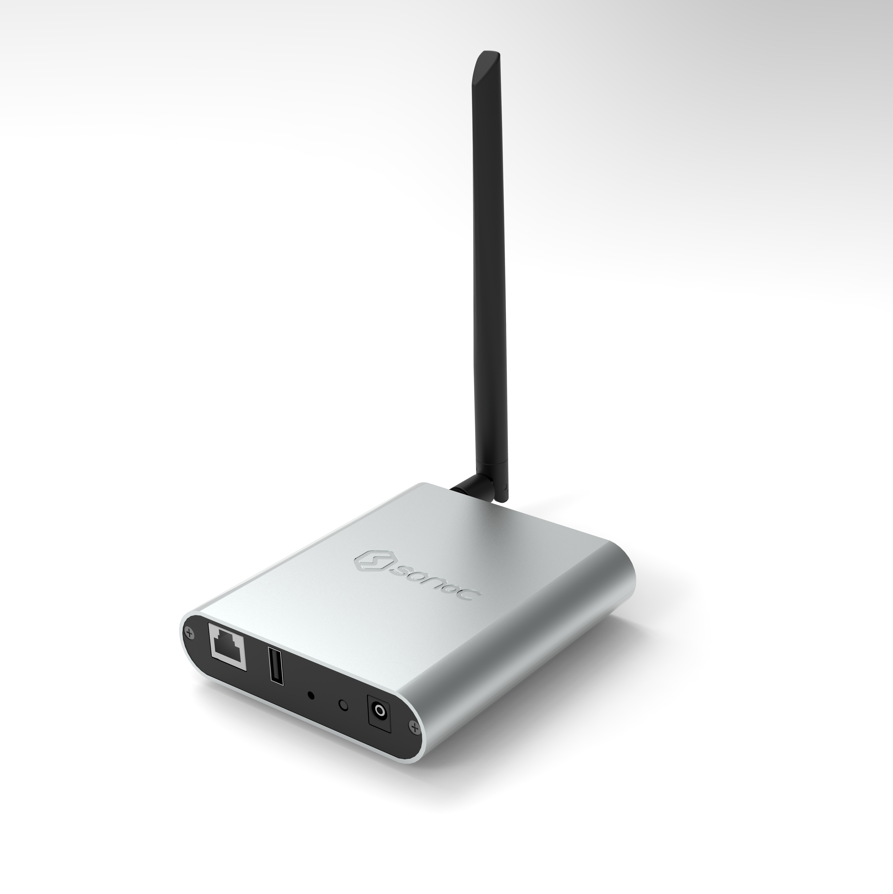

# SONoC-The third-Party Manufacturers

## SONoC Corp.

Application to become an approved third party manufacturer as per HIP19. The submission of a HIP19 application does not guarantee approval. All questions must be answered, any missing information will result in delays.

## Summary

**SONoC is a startup firm focused on international business and IoT development. From 2021 till now, SONoC work hard to expand the coverage of Helium LoRaWAN network. In East Asia including Taiwan and Japan, SONoC work as a distributor for RAK and SenseCap to sell AS923 hotspot. We have shipped more than 5000 pcs of hotspots. SONoC now has a large number of helium users and active communities.**

**With the enormous opportunity of light hotspot, SONoC setup a strategic partnership with H2go corp (https://www.h2goapp.com/). H2go will integrate the SONoC's light hotspot inside the smart water dispenser. With this integration of helium light hotspot, our smart water dispenser can collect IoT datas such as water consumption, drinking habbit of different age groups including male vs. females. And furthermore, with the help of the water dispenser, the Helium LoRaWAN hotspot could acceess into millions of familly, which will be a great promotion for Helium network coverage. It is estimated that there would be more than 10k pcs of light hotspots could be installed with the sales of water dispenser in the San Francisco Bayarea alone.**

**Therefore SONoC is applying to become the manufacturer and vendor of the Helium light hotspot. We believe that we could provide series of  production with much more competiable price and higher quality. With the IoT solution of water dispenser landing, a newer and better LPWAN network, SONoC can do more contributions for Helium ecology.**

## Company Information (required)

- What is your company name?
  - **SONoC Corp.**
- How long has the company been in business?
  - **More than 20years. And start Helium business from 2021.**
- What kind of products have you created? (list specific products)
  - **Industrial Gateways. Helium hotspot like RAK hotspot, SenseCap Hotspot.**
- How many have you sold?
  - **More than 5kpcs Helium Hotspot.**
- What brought you to the Helium Network?
  - **We had shipped more than 5k pcs of hotspots to end customers in Helium ecology, and we are working as both software and hardware developer for h2go on its smart dispenser project. **

**SONoC is a startup firm focused on international business and IoT development. We have over a decade of experience in trading, research and development. With the rapid growth of the technology and market today, SONoC is on the edge of the trend. And we have several strategic partners who has stong ability in supply and manufacture in mainland of China.**
**We hope that we can do more contribution to the growth of helium ecology, with our participation will combine the Internet of things technology with the blockchain, and through our own landing projects and the existing sales networks in North America and Asia.**

## Product Information (required)

- What is this product's model name?
  - **SONoC Light Hotspot SL100**
- Is this is a Light Hotspot or a 5G Hotspot? (Due to the time required for the HIP19 process, new applications should be for Light Hotspots or 5G Hotspots)
  - **Light Hotspot**
- Is this model for indoor, outdoor, or both? (If there are two different models for indoor and outdoor, list them separately)
  - **Indoor**
- Provide a brief description of the product:
  - **Helium's second-generation network architecture with light hotspot greatly reduces the gateway's requirements for CPU and other system resources, which directly reduces the product cost. Compared with the design of other manufacturers, SONoC's light hotspot SL100 designed with a more compact and high integrated ARM SoC scheme, which is specially designed for light gateway, still with excellent computing performance, and further cost down. The SONoC's light hotspot SL100 adopts a SOC with ARM Cortex-A7 dual core up to 1.2GHz as CPU platform and the LoRaWAN concentrator based on SX1302 + SX125x (Mini PCIe module) . Main features of SL100:**
    - **Concentrator based on the Semtech SX1302 and SX125x**
    - **ARM Cortex-A7 CPU with 128MB DDR3 RAM and 512MB Nand Flash**
    - **ECC608 encryption chip for storage of swarm keys**
    - **Wi-Fi: IEEE802.11b/g/n/ac**
    - **Bluetooth: BT V4.2**
    - **Ethernet backhaul with RJ45**
    - **Frequency band: 470MHz/868MHz/915MHz/923MHz**
    - **DC5-DC12 supply**
    - **Small Size:108 * 120 * 26mm**
    - **IP40 for Indoor**
- What is your approximate price point?
  - **$129~$199. We try our best to provide an attractive price  for Helium Ecosystym and customer.**
- What is your expected production and delivery timeline?
  - **After certification by DeWi, Lead time for Pre order will be 4 weeks.（Excluding logistics time）**

## Previous shipments (required)

- **We, SONoC, have our own marketing network and sales channels. We had shipped more than 5k pcs Helium hotspots in Taiwan and Japan, which include brand like RAK and SenseCap. Furthermore, our partner H2go corp had sold more than 1000 pcs of RAK hotspot in north America.**

## Which countries do you plan to ship to and get regulatory certifications for? (required)

Please list specific countries, "worldwide" or "global" are not acceptable.

**Regions covered / shipped to :**

**US915 : United States, Canada**

**EU868: European Union**

**AS923 : Taiwan, Thailand, Malaysia，Indonesia, Japan，and so on**

**CN470: China Mainland**

To achieve it, we would get CE/FCC/IC Certificate first.

## Customer Support (required)

**We will provide our customers with a variety of contact methods to facilitate their access to peer-to-peer product service support on a global scale. We would setup a maintanace platform for salesforce to ship and track the shipment device. We could recall back the failure device based on the tracking number and customer information with our platform.**

**We will provide service support in the following ways:**

**Web : https://SONoC.tw/**

**Facebook: https://www.facebook.com/HeliumTw/**

**Email : [Support@SONoC.tw](**mailto:Support@SONoC.tw)

## Hardware Security Element (required)

- **For our current product, SONoC LoraWan Light Hotspot Gateway - we have adopted the ECC608 security element chip to increase the security of the swarm key.**

  **For future products we are evaluating more options including other security element chips.**

- Are you using an ECC608. 

  - **Yes**

- Encrypted/locked-down firmware.

  - **Yes.The device debugging interface is closed. At the same time, TLS encryption is used to interact with the server during the firmware upgrade process and the firmware security is verified during the upgrade.**

- Encrypted storage of the miner swarm_key, either via disk encryption or hardware measures. 

  - **Yes. We use the ECC608 encryption chip to encrypt and store the miner cluster key.**

- Encrypted buses, potting and other anti-tampering measures. 

  - **Yes. We use the linux access control technology to prohibit all users (including root) from logging in to the command terminal through ssh and serial port. At the same time, the root password of all devices is the only password generated by a specific algorithm to prevent users from tampering with the firmware when logging in to the command terminal.** 

- Willingness to submit a prototype for audit, and sharing those audit results publicly (pass or fail) :

  - **Yes**

## Hardware Information (required) Please provide detailed hardware designs, including relevant parts.

**The SONoC SL100 light hotspot apperance:**

- What are your plans for software setup and configuration for the devices? This would includes remote updates and the ability for hosts to change wifi settings, via Helium's official app or otherwise.
  - **We would develop a maintanance platform for device management and FOTA for firmware upgrade. And an App would be also developed for customer to manage and handle the device.**
- Which security implementation (ECC608, TPM, TrustZone, other) are you using?
  - **ECC608**
- Which LoRa chipset are you planning to use in your gateway? (We recommend you don't use the SX1301 in new designs.)
  - **SX1302**
- What is the CPU?
  - **Arm Cortex A7 dual core up to 1.2GHz**

## Manufacturing Information (required)

- Have you built and delivered radio hardware products before?
  - **Yes.**
- Have you built gateways before?
  - **Yes.**
- How many gateways did you make?
  - **20k pcs/year**
- Where are you sourcing your components from?
  - **From distributor of Semtech**
- How many radio modules/ concentrators can you procure?
  - **10k pcs/month, more than 100k pcs/year.**

## Proof of Identity:

Per typical KYC/AML procedures, proof of identity for major shareholders (25%+ ownership) will be expected to be provided privately to representatives from the Helium Foundation. This will be attested and publicly confirmed by those representatives. Details for this will be provided after your application has been submitted on GitHub.

**To be submitted privately to DeWi.**

## Budget & Capital (required)

- How many hotspots are you planning to manufacture and sell within the first six months of sales?
  - **5kpcs in the 1st batch, after that 10kpcs/month and achieve to more than 50kpcs in 2022.**
- How much money will be required up-front? How much money do you have on-hand, and how much do you have access to?
  - **We have more than $5m cash on-hand.**
- What is your plan for additional financing if required? (This is the second biggest risk in new hardware ventures, getting almost over the line and then running out of cash.)
  - **First of all, we will try our best to control the budget within a reasonable boundary. And we are partnered with other manufacturers to produce this product and our partner will support us in case we need additional finance.**

## Risks & Challenges (required)

Please tell us about some of the challenges that would prevent these products from becoming a reality and how you might address them.

**Nowadays, many micro chip are out of stock.IC supply chain/supply is a big challenge for all of the manufacturers.We estimate this situation will last to the mid of 2022. But SONoC has ability to handle this. We will pre-order the critical components in advance (Lora SX1302 and security elements). ** 

## Payment methods available (required):

**Credit cards including Visa, Mastercard, AMEX, JCB**

**Telegraphic Transfer or Wire Transfer through SONoC**.

**And we also accept crypto.**

## Other information (if you do not provide contact information we cannot review your proposal)

## Contact Info

- Contact Email (required) - Frank@SONoC.tw; Owenyu@SONoC.tw; zzlee@SONoC.tw; support@SONoC.tw
- Website (required) -https://SONoC.tw/
- Twitter profile -https://twitter.com/SONoCTw
- Facebook profile -https://www.facebook.com/HeliumTw/
- Discord -https://discord.com/invite/jVRadSDNew
- Other social profiles -https://linktr.ee/sonoc_tw

