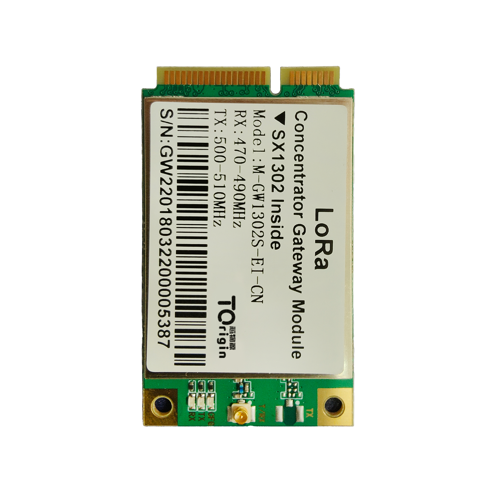
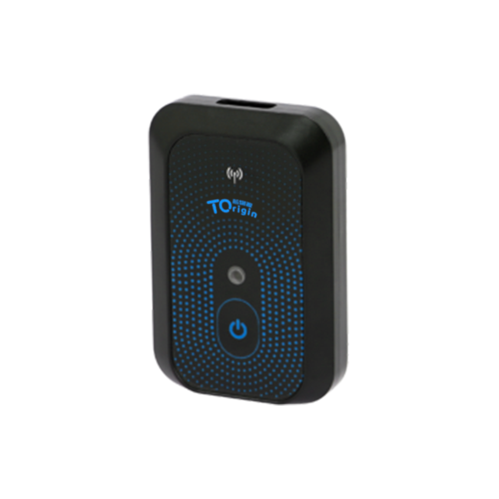
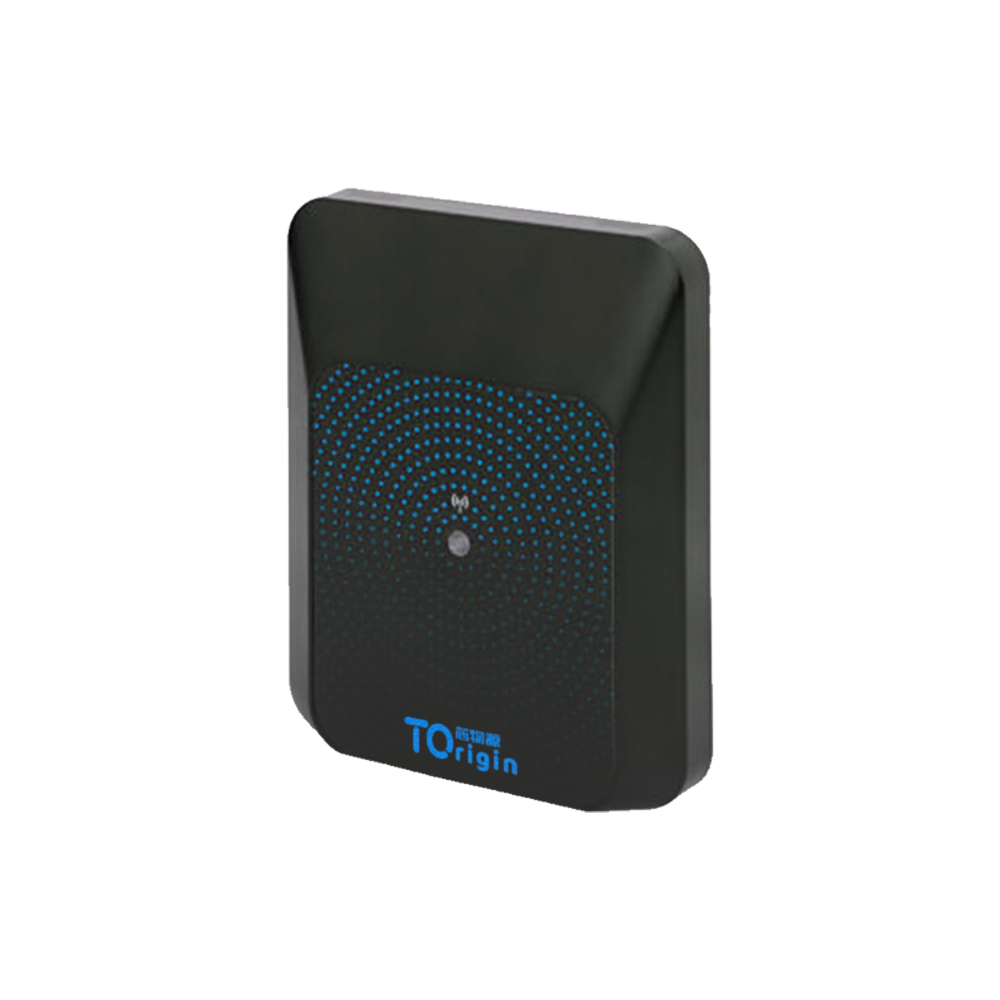

## TOrigin Technology — TOrigin TIP

## Summary
[https://torigin.tech/](https://torigin.tech/) focuses on the innovation and research and development of a new generation of IoT technology, providing customers with IoT products and solutions centered on artificial intelligence, big data, cloud computing, intelligent perception, and edge computing technologies. 

## Company Information
**Q1. What is your company name?**
> **TOrigin Technology**

**Q2. How long has the company been in business?**
> Founded in 2021, TOrigin is located in HongKong，China. The founder and core team members have been designing and manufacturing Single Board Computers for more than 10 years.

**Q3. What kind of products have you created? (list specific products)**
> - TOrigin’s business covers IoT communication products based on LoRa, NB-Iot, LTE, UWB, etc. We have multi-scenario applications in urban pipe network detection and monitoring, roadside smart parking, and indoor positioning.
> - It has multi-scenario applications in urban pipe network detection and monitoring, roadside smart parking, and indoor positioning.

**Q4. How many have you sold?**
> We serve more than 300 clients worldwide.

**Q5. What brought you to the Helium Network?**
> - After being recommended by our customers, we believe that Helium Network will promote the technological development of the entire IoT industry, and hope that our company can develop related products.
> - We are glad to introduce **TOrigin TIP** to the Helium community.

## Product Information

|**Item**|**Description**|
|:--|:--|
|Product Name|TOrigin TIP|
|Product Type|Light Hotspot|
|Expected Release Date|Q2 2022|

**Q1. What is this product's model name?**
> **TOrigin TIP**state

**Q2. Is this is a Light Hotspot or a 5G Hotspot? (Due to the time required for the HIP19 process, new applications should be for Light Hotspots or 5G Hotspots)**
> Yes It’s Light Hotspot.

**Q3. Is this model for indoor, outdoor, or both? (If there are two different models for indoor and outdoor, list them separately)**
> This model is for indoor.

**Q4. Provide a brief description of the product:**
> **TOrigin TIP** is a new Indoor Light Hotspot. It is based on 580MHz MIPS processor and Semtech SX1302 LoRa concentrator chip-set. The LoRaWAN frequencies we are planning to support are EU868 and US915. 
It is a highly reliable, easy to use, indoor light hotspot for the Helium network.

**Q5. What is your approximate price point?**
> Price range is between $299-$499 according to the market situation.

**Q6. What is your expected production and delivery timeline?**
> We expected to start the production in Q2-2022 and start to deliver the first batch in June-2022.

## Previous shipments
**Q1. Have you shipped anything in the past?**
> Yes，we have.

**Q2. What types of products have you shipped?**
> We have shipped IoT gateway devices to Southeast Asia, Africa in the past.

**Q3. Which countries have you previously shipped regulatory approved products? (FCC, CE, etc.)**
> - **Southeast Asia**
> - **Africa**

**Q4. If you are a startup, are you partnering with another company? What experience does your team have?**
> - We have cooperated with many world-renowned software and hardware companies in China, such as Intel, Western Digital, Dell, Samsung, Amazon and so on.
> - The core members of our company are all from the world's top 500 companies and have more than ten years of technology research and development experience.
> - We provide the standard hardware solutions, custom design & manufacturing services for global customers to accelerate their electronic product development and time to market.

## Which countries do you plan to ship to and get regulatory certifications for?
- **Southeast Asia**
- **Africa**

## Customer Support
**Q1. How will your customers be able to contact you for support for your products?**
> - We provide OTA based software, which can automatically push and install the latest software code into the hotspots.
> - We provide online Documents and Wiki for user guide and trouble shooting.
> - We can also provide email support in 24/7.
> - Customers can contact our local distributor for support as well.
> - Customers can also contact us from twitter / discord / Facebook/Github / Wechat.

**Q2. How long will the company provide customer support?**
> Our products come with 3 years warranty.

**Q3. How are you planning to handle repairs and replacements?**
> we plan to sell the hotspots through our distributor network, the customers can ship the defective units to our local distributors or directly to us,we will repair or replace those defective units.

## Hardware Security Element
*The community is concerned about devices that can be easily hacked, specifically by copying their swarm_key files. Applications should include plan for how the devices will be secured. The approved security element is an ECC608. If you would like to use an alternative security element your HIP19 will require additional review, please email the Helium Foundation (christina@helium.foundation).*

**Features**
 - Concentrator based on the Summary Semtech SX1302, 
 - Support EU868 and US915 

**Q1. Are you using an ECC608. Yes or No?**
> Yes, we use **ATECC608** crypto chip.

**Q2. Encrypted/locked-down firmware. Yes or No?**
> Yes.

**Q3. Encrypted storage of the miner swarm_key, either via disk encryption or hardware measures. Yes or No?**
> Yes, we use **ATECC608** crypto chip to increase the security of swam_key.

**Q4. Encrypted buses, potting and other anti-tampering measures. Yes or No?** 

*(Please note, the final design will be audited against this statement. Do not answer 'yes' unless the design will have these features and a description of where they are implemented can be provided.)*

> Yes，Security boot and firmware signature.

**Q5. Willingness to submit a prototype for audit, and sharing those audit results publicly (pass or fail) Yes or No?**
> Yes，we will.

## Hardware Information Please provide detailed hardware designs, including relevant parts.
Evidence of a functioning prototype - photos/videos. Renderings are OK but physical prototypes are much, much better. 

**Q1. What are your plans for software setup and configuration for the devices?This would includes remote updates and the ability for hosts to change wifi settings, via Helium's official app or otherwise.**
> We are developing the software to match our device for effective use, in addition, our device has the function of setting wifi.

**Q2. Which security implementation (ECC608, TPM, TrustZone, other) are you using?**
> **ATECC608**

**Q3. Which LoRa chipset are you planning to use in your gateway? (We recommend you don't use the SX1301 in new designs.)**
> SX1302/1303+SX1250

**Q4. What is the CPU?**
> RK3566

**Q5. Other Hardware Specifications:**

|**IPTV Parameters**|**Description**|
|:---|---|
|CPU|RK3566|
|RAM|4G|
|ROM|32G|
|Spec1|Equipped with audio channel interface, left and right channels, video, ground 4 3.5mm RAC ports|
|Spec2|IR receiver control|

|**LoRaWAN frequencies**|**Description**|
|:---|---|
|CPU|580MHz MIPS processor|
|RAM|128MB DDR|
|ROM|16MB Flash|
|Network|Fast Ethernet and 2.4G Wi-Fi networks|
|Power|12V DC Power|
|Spec1|Built-in ATECC608 security chip|
|Spec2|OTA support|

## Manufacturing Information

**Q1. Have you built and delivered radio hardware products before?**
> Yes, we have built and delivered many radio hardware products with Wi-Fi / 4G / LoRa / Bluetooth radio.

**Q2. Have you built gateways before?**
> Yes, We lanched our LoRa [IoTGatway](https://torigin.tech/ProductInfoCategory?categoryId=63343)

**Q3. How many gateways did you make?**
> 5Kpcs

**Q4. If you have not built gateways before, are you using a third party manufacturer or working with a partner? This is the single largest risk with most hardware ventures. If possible please provide information about your manufacturing partners and supply chain.**
> Foxconn, a high-tech company under Hon Hai Precision Industry Co., Ltd., was founded in 1974 by Terry Gou who is now its Chairman. The company now boasts over 1.2 million employees and a global fleet of clientele.

**Q5. Where are you sourcing your components from?**
> There are many sources for our components, including international well-known companies and local manufacturers.

**Q6. How many radio modules/ concentrators can you procure?**
> We have about 6Kpcs SX1302/1303+SX1250 components in stock and we can meet the demand in 2022.

## Proof of Identity
*To be submitted privately.*

## Budget & Capital
**Q1. How many hotspots are you planning to manufacture and sell within the first six months of sales?**

> 5Kpcs.

**Q2. How much money will be required up-front? How much money do you have on-hand, and how much do you have access to?**

> We prepared US$1.2M to support this project initially, we have around US$2M cash and can access up to US$3M.

**Q3. What is your plan for additional financing if required?** 
(*This is the second biggest risk in new hardware ventures, getting almost over the line and then running out of cash.*) 

> Our business is profitable, the shareholders could invest US$3M fund to support this project.

## Risks & Challenges
The current challenge is the component supply, we are working with our supplier partners to ensure constant supply.

## Contact Info 
- **Email**: bd@torigin.tech
- **Website**: https://torigin.tech/

## Payment methods available:
- **paypal**
- **TT**
- Supported tokens: **ERC20-USDC, BSC-BUSD, ERC20-USDT and TRC20-USDT.**

