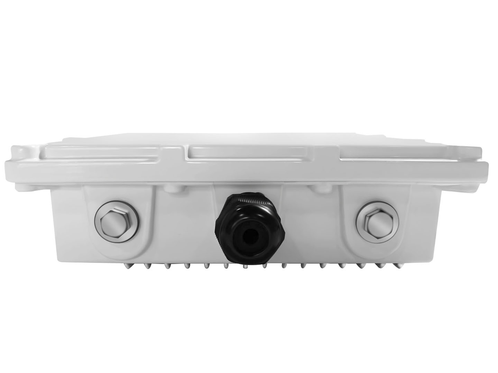

# Na2He Technology Co., Ltd
### Application to become an approved third party manufacturer as per [HIP19](https://github.com/helium/HIP/blob/master/0019-third-party-manufacturers.md)

## Summary

The company is committed to the R & D and market application of industrial Internet of things and big data products. The company focuses on providing industrial intelligent gateway, equipment remote maintenance and management, equipment big data application cloud platform and other application services for industrial equipment manufacturers, factories and industrial applications. We will complete the corresponding hardware production according to the requirements specified by helium, Meet customer needs in the market.

## Company Information (required)

* What is your company name?&emsp;Na2He Technology Co., Ltd

* How long have you been in business? &emsp;It has been 7 years since it started operation in 2014

* What kind of products have you created? &emsp;We have been manufacturing and R & D in the field of module production, and have produced Lorawan Smart lighting controller and Lorawan Smart gateway so far

* How many have you sold?&emsp;So far, we have shipped 800000 units in the international market and have shipping experience in Egypt, Sichuan & Guizhou, Thailand and Myanmar.

* What brought you to Helium etc?&emsp;Digital currency is a new economic growth point, and digital currency transactions are legal in the United States. In order not to lose competitiveness in this field in the next few years, we have been paying attention to the relevant developments of digital currency. We understand that helium is open to applications from various equipment manufacturers. We are willing to take this opportunity to provide our hardware technology to help realize the development of decentralized network

## Product Information (required)

Na2he for helium hotspot miner, indoor version, valuation: $200 ~ 250.

Note: the indoor version is still under development and will be continuously updated in the future  

1．LoRa Concentrator SX1302  
2．Communication mode: Wifi / GPRS  
3．Key storage encryption chip: ATECC608  
4．Network connectivity 2.4 GHz and 5.0 GHz IEEE 802.11ac wireless  
5．Lorawan Smart temperature sensor 

 

 

 

 

 

It runs on the arm hardware platform, the operating system is Linux, and the software remote upgrade is realized through network ports, GPRS and other networks
1. Regularly send a request to the server to report the current version and receive files
2. Request file download
3. If the network is interrupted, that is, the "update file table" exists, repeat the second step
4. If the file check code and the updated file provided on the server are deleted during the update process, repeat the first ste

## Customer Support (required)

We have the local telephone and e-mail in China on the official website. In order to facilitate customers outside China to contact us, we have opened the discord channel. We promise to provide 18 months of free warranty. The company has its own independent warehouse. We will provide replacement service in the shortest time due to the failure caused by the hardware of the equipment itself.

#

## Hardware Information (required)

LoRa  SX1302

## Manufacturing Information (required)

The company has its own hardware production team, production workshop and production line, which will strictly control each product to ensure the quality of production. The company's production workshop is in Shanghai, and Wang Liu is supplied with China Mobile and Huawei. At the same time, the company is also a member of Lora association to further meet the production standards in Lora.

## Proof of Identity

To be submitted in private.

## Budget & Capital (required)

We plan to sell 100000 ~ 200000 sets of equipment
Working capital: $1 million. We are planning to attract other investors to join us

## Risks & Challenges (required)

We are faced with more effective cost reduction so that miners can buy our products at a lower price. We're not worried about it

Purchasing components is still challenging in the current market - some supply chain problems affecting the whole industry - but as part of gemtek group, we have strong purchasing power and we have obtained sufficient inventory to produce the above quantities.

## Other information (required)

* Contact info (* required) - &emsp;na2heiot@gmail.com
* Twitter profile -
* Facebook profile -
* Other social profiles -
* Website -&emsp; [http://www.e-ai.net/](http://www.e-ai.net/)
* Payment methods available -   &emsp; paybal / unionpay / visa
* Regions covered / shipped to - &emsp;Global scope
