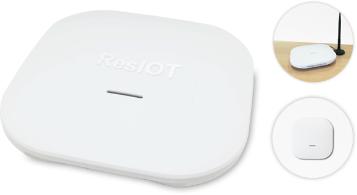
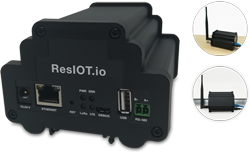
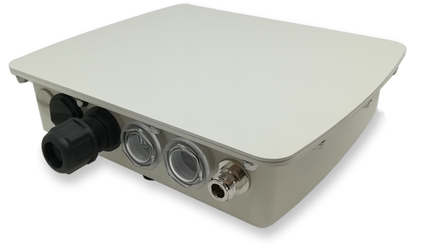
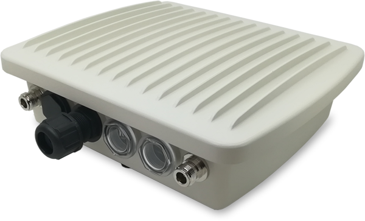
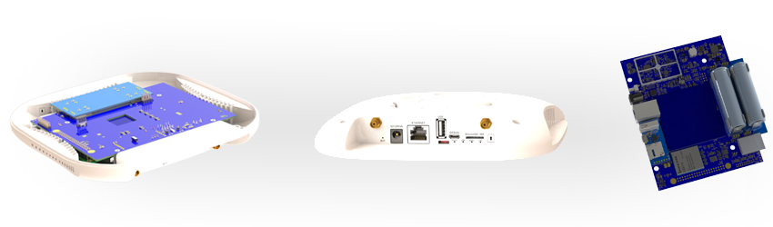
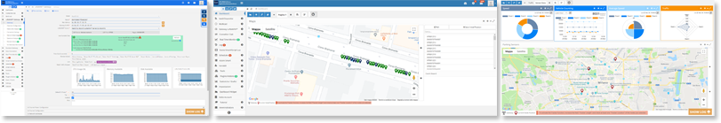

## ResIOT X1 Helium Full-Hotspot Miner

## Summary

® Logo"/>

 ResIOT® is a software and hardware solution to ensure connectivity and reliability in every context, from the Smart City to the Industrial IoT, designs networks of all sizes, and provides all the tools for the management, monitoring and use of data, from the gateway to the front-end in a reliable context. It also has software/hardware components that allow the installation of carrier-grade networks with very high availability and scalability. ResIOT® develops and maintains software assistance (Business or Carrier-Grade Versions):

- <b>ResIOT® Merlin IoT Box</b>: software to be installed on the gateways for centralized monitoring, connection and configuration
- <b>ResIOT® ISRC</b>: Infrastructure Server/Radio Control 
- <b>ResIOT® ASIoT</b>: Application Server / IoT Platform
- <b>ResIOT® LNS</b>: LoRaWAN® Network Server 

ResIOT® manufactures SoHo, Business and Carrier grade, indoor and outdoor LoRaWAN gateways. All ResIOT® products are <b>made in Italy!</b> Our main gateway models are:

<b>ResIOT® X1 - Built exclusively as Helium Hotspot Full-Miner, avaliable in two versions: Ethernet,WiFi/BLE and Ethernet,WiFi/BLE + 2G/3G/4G Modem, it's the perfect compact Wall-mounting or Desktop device</b>
 <i>All product information can be found in the 'product information' section below</i>
 
® X1 Helium Full-Hotspot Miner"/>

<b>ResIOT® X2</b> - IoT BOX LoRaWAN® 8 Channels DIN-rail/Desktop Gateway indoor with Ethernet, WiFi and modem 2G/3G/4G
 Link [https://www.resiot.io/en/lorawan-gateway-resiot-x2/](https://www.resiot.io/en/lorawan-gateway-resiot-x2/)
 

<b>ResIOT® X4</b> - Outdoor IP67 Base Station 8 Channels Business-grade LoRaWAN® Gateway with Ethernet/PoE, WiFi and modem 2G/3G/4G
 <b>Available in Helium Hotspot Full-Miner version</b>
 Link [https://www.resiot.io/en/lorawan-gateway-resiot-x4/](https://www.resiot.io/en/lorawan-gateway-resiot-x4/)
 

<b>ResIOT® X7</b> - Outdoor IP67 Base Station 8-32 Channels Carrier-grade LoRaWAN® Gateway with Ethernet/PoE, WiFi and modem 2G/3G/4G
 Link [https://www.resiot.io/en/lorawan-gateway-resiot-x7/](https://www.resiot.io/en/lorawan-gateway-resiot-x7/)
 

 <b>ResIOT® also provides 2G/3G/4G connectivity on gateways by equipping them with ChipSIMs as an official partner of Kpn B.V.</b>

## Company Information
ResIOT® is the trade name for Ublsoftware Srl, a private Italian company founded in 2014 in Milan
- 2014 - ResIOT IoT Platform
- 2016 - ResIOT LoRaWAN Network Server 
- 2016 - first place for innovation in Italy
- 2017 - Member of the **LoRa Alliance®**
- 2017 - ResIOT LNS LoRaWAN Network Server + IoT Platform Free Edition Cloud or on-Premises
- 2017/18 - ResIOT LoRaWAN Network Server + IoT Platform + Infrastructure/Management Server Carrier-Grade Edition
- 2018 - ResIOT LoRaWAN Gateway X2
- 2019 - ResIOT LoRaWAN Gateway X7
- 2020 - ResIOT LoRaWAN Gateway X4
- 2021 - ResIOT X1 Helium Hotspot Full-Miner
- over 8.000 users worldwide
- over 3.000 gateways provided

The Helium network can bring enormous benefits in the implementation of global IoT networks, ResIOT is an extremely specialized market player and we think we can make a huge contribution providing extremely reliable solutions.

## Product Information
<b>ResIOT® X1 - Helium Hotspot Full-Miner</b> has been designed to meet all the specific requests of the Helium network, <b>it is a high reliable product</b> perfect to be installed in business places and buildings like offices and schools. This gateway works in a range of temperatures from -20 °C to + 70 °C. There are 2 main versions available: 
* Ethernet versions
  * ResIOT-X1-ETH-1-868-HW (<b>GTIN/EAN</b> 8051884310107) <b>Ethernet/WiFi/BLE, LoRa 868MHz</b>
  * ResIOT-X1-ETH-1-915-HW (<b>GTIN/EAN</b> 8051884310121) <b>Ethernet/WiFi/BLE, LoRa 915MHz</b>
* Modem (LTE) versions
  * ResIOT-X1-LTE-1-868-HW (<b>GTIN/EAN</b> 8051884310114) <b>Ethernet/WiFi/BLE/Modem 2G/3G/4G, LoRa 868MHz</b>
  * ResIOT-X1-LTE-1-915-HW (<b>GTIN/EAN</b> 8051884310138) <b>Ethernet/WiFi/BLE/Modem 2G/3G/4G, LoRa 915MHz</b>

 This product comes with an <b>included online platform</b>, ResIOT Helium console (well described below), in order to monitor, configure, remote access, diagnostic the hotspots and configure alerts and notifications

 Full hardware specification:
* Cpu: <b>6x Core Cortex ARM, 2x A72 dual core 2Ghz + 4x A53 quad core 1.4Ghz</b>
* Ram: <b>2Gb LPDDR4</b>
* Flash: <b>32Gb eMMC</b>
* LoRa® baseband processor: <b>Chipset Semtech SX1303 able to receive up to 8 LoRa® modulated packets simultaneously. Max TX Power +27 dBm, Receiving Sensitivity -142.5dBm</b>
* Secure Element: <b>Microchip ECC608B</b>
* Power supply/Consumption: <b>12/24v </b>
* Consumption: <b>for the Ethernet versions, the average power consumption is 12V/0.3A (4W) and the annual power consumption is about 35 kWh </b>
* Modem & SIM: <b>Only for LTE version, Modem Quectel 4G, LTE, 3G, 2G, EMEA EDGE GSM/GPRS. Chip SIM MFF2 included and ready to be activated (worldwide connectivity! See sim.resiot.io for more details). MicroSIM 3FF slot available. You can use your own SIM Card (ChipSIM will be automatically deactivated)</b>

 
® X1 Helium Full-Hotspot Miner" width=250/>

 
<b>[Download Datasheet: ResIOT® X1 - Helium Hotspot Full-Miner](https://www.resiot.io/documents/ResIOT-X1_Datasheet_V1.3_EN_20211118.pdf)</b>

## What is your approximate price point?
ResIOT-X1-ETH-1-868-HW <b>$440</b>
 ResIOT-X1-ETH-1-915-HW <b>$440</b>
 ResIOT-X1-LTE-1-868-HW <b>$480</b>
 ResIOT-X1-LTE-1-915-HW <b>$480</b>

## Please provide detailed hardware designs, including relevant parts
 

<b>ResIOT® X1</b> different views. From left to right: inside-the-case view, ports-side view, motherboard scheme

## What is your expected production and delivery timeline?
We have enough hardware components to build 3000 pieces as soon as integration is approved by the helium/dewi team.
We should be able to get components to build an additional 12.000 miners by the end of Q2 2022.
After that, depending on marketing and components availability, we estimate to be able to deliver 5/10k or more pieces per month.

## Previous shipments
ResIOT has already sold and delivered over 3.000 LoRaWAN gateways - X2, X4 and X7 models, for indoor and outdoor application, in both business and carrier-grade solutions

## Which countries do you plan to ship to and get regulatory certifications for?
We plan to ship to all of Europe. Below the certifications that we successfully already got for our products:

											   
* Safety testing according to standards:
  * EN 62368-1:2020 + A11:2020_IEC 62368-1:2018
* Radio spectrum testing according to standards:
  * EN 300 220-1 V3.1.1
  * EN 300 220-2 V3.1.1
* EMF testing according to standards:
  * EN 62311:2020_IEC 62311:2019
  * Human exposure evaluation
* EMC testing according to standards:
  * EN 300 328 V2.2.2
  * EN 301 489-1 V2.2.3
  * EN 301 489-17 V3.2.4
  * EN 301 489-3 V2.2.0
  * EN 301 489-52 V1.2.1
* Cellular & GSM testing according to standards (LTE version only):
  * EN 301 908-1 V15.1.1.
  * EN 301 908-13 V11.1.2
  * EN 301 511 V12.5.1
* Declaration of Conformity
  * [Download (ResIOT-X1-ETH-1-868-HW)](https://resiot.io/documents/ResIOT-X1-ETH-1-868-HW_Declaration_of_conformity_EU_CE_RED.pdf)
  * [Download (ResIOT-X1-LTE-1-868-HW)](https://resiot.io/documents/ResIOT-X1-LTE-1-868-HW_Declaration_of_conformity_EU_CE_RED.pdf)

We are also planning FCC certification for the 915MHz US band.

## Customer Support
ResIOT support relies on a ticketing system that has been running since 2015. For any kind of information or support, customers can open a ticket at the following address: https://login.resiot.io/submitticket.php
 Whenever needed, our assistance team can get in touch with customers by phone or remote assistance software.
 ResIOT also has an RMA procedure to handle hardware repair or replacement: https://login.resiot.io/rma.php

## Hardware Security Element
In order to meet the security requirements of the current Helium hardware guidelines, besides other industry-standard software-based measures, ResIOT hotspots use the <b>Microchip ECC608B</b> secure element, a component able to generate and store the swarm_key and to ensure the highest grade of security.
The ECC608B can store secrets and process security functions using private keys.
Additionally, when signatures and encryptions are performed, the key is never exposed to the OS or in the RAM.
ResIOT locks the key registers in a non-reversible way, which makes it impossible for anyone to overwrite or accidentally lose an existing private key. Even if the hardware is physically compromised, the key cannot be recovered or overwritten.

* Encrypted/locked-down firmware. Yes or no? **Secure boot is enabled by default on all our gateways. Secure boot detects tampering with boot loaders, key operating system files and unauthorized flashing. Detections are blocked from running before they can attack or infect the system**
* Encrypted buses, potting and other anti-tampering measures. Yes or No? **ResIOT X1 indoor miners are shipped with a built-in temperature, accelerometer and shock detection system. Thanks to the ResIOT IoT platform where the miners are registered by their users, it's possible to create and configure events based on the sensor readings**

## Hardware Information
* Which security implementation (ECC608, TPM, TrustZone, other) are you using?  **We rely on the Microchip ECC608B secure element to store private keys.** 
* Which LoRa chipset are you planning to use in your gateway? **SX1303 + 2xSX1250**
* What is the CPU? **Hexa-Core Cortex ARM, 2x A72 dual core 2Ghz + 4x A53 quad core 1.4Ghz**

## Manufacturing Information 
* Have you built and delivered radio hardware products before? **Yes, we have extensive experience building and shipping LoRaWAN Gateways for both indoor and outdoor. We have shipped over 3.000 gateways.** 
* Have you built gateways before? **ResIOT started manufacturing and selling its own industrial gateways in 2016.**
* How many gateways did you make? **ResIOT has already sold and delivered over 3.000 gateways - X2, X4 and X7 models**
* Where are you sourcing your components from? **Global supply chain**
* How many radio modules/ concentrators can you procure? **As stated above, we have 3.000 pieces ready for shipment once certification from dewi is done**

## Proof of Identity
ResIOT is more than happy to provide proof of identity to DeWi and/or Helium

## Budget & Capital
* How many hotspots are you planning to manufacture and sell within the first six months of sales? **Between 3.000 and 15.000**
* How much money will be required up-front? How much money do you have on-hand, and how much do you have access to? **Orders to build the first 15.000 pieces have already been paid for. Depending on market conditions, ResIOT will be able to order components for additional 5/10k miners/month or more if demand increases!**
* What is your plan for additional financing if required? **As a company, we have an excellent relationship with our financial institutes that have been supporting us for the last 10 years. In addition, we also have sources of private financing so that we can maximize the availability of cash flow throughout the production and sales process.**

## Risks & Challenges
Chip shortage is an issue today, as well as the reliability of the shipping and distribution networks. LoRa modules need to be pre-ordered 10 months in advance, other components orders have to be placed months in advance and that requires some serious planning. We have a lot of experience with manufacturing our own hardware, so we don’t anticipate any other issue as we've been working with our manufacturer partners for years and we know they can deliver.

## ResIOT Helium Console
ResIOT offers the ability to register your hotspots over the dedicated [ResIOT Helium Console](https://helium.resiot.io).
 Miners registered over the ResIOT Helium Console have access to a range of features offered by the online platform:
* Hardware performance monitoring
* Geolocation monitor
* Helium Mining stats
* Customizable alerts whenever a gateway timeouts or is offline
* Read and handle the miner sensor readings: ResIOT X1 is shipped with built-in temperature, accelerometer and shock sensors. Smart triggers can then be configured based on user logic rules.
* Remotely update software on the hotspot on-demand or via scheduled tasks
* Remotely access your gateway on-demand (optional)
 

## Contact Info 
* Contact Email - **Steven Raimondi - helium@resiot.io**
* Website - https://www.resiot.io
* Twitter profile - https://twitter.com/ResIOT_Server
* Facebook profile - https://www.facebook.com/ResIOTSolutions/
* Other social profiles - https://www.youtube.com/c/ResIOT

## Payment methods available:
* SEPA International Bank Transfer 
* Credit Card Secure with Stripe
* Paypal
* Amazon Pay
