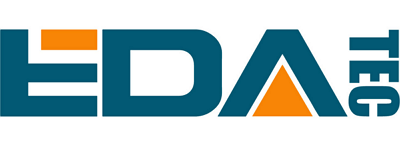

## EDA Technology - Light Hotspot M1

### Application to become an approved third party manufacturer as per [HIP19](https://github.com/helium/HIP/blob/master/0019-third-party-manufacturers.md)

## Summary

[EDATEC](https://edatec.cn) is one of [Raspberry Pi's Global Design Partners](https://www.raspberrypi.org/for-industry/design-partners/) who is serving global customers with standard hardware products, custom design and manufacturing services based on Raspberry Pi Technology platform in IoT, Inudstrial Control, Automation & Artificial Intelligenc applications.

EDATEC has been working on IoT for years and has several mature IoT Gateway solutions for LoRaWAN and Bluetooth Mesh networks.  We launched LoRa [IoT Gateway](https://edatec.cn/en/Product/Embedded_Computers/2019/0826/77.html) solution in 2018, which is based on Semtech SX1301 and Raspberry Pi Computer Module 3+, we sold this solutions to more than 200 customers in worldwide.

And we designed our own LoRa modules based on SX1302/1303+SX1250.

We are glad to introduce **EDA-IoT Light Hotspot M1** to the Helium community.

## Company Information

Founded in 2017, EDATEC is the first Raspberry Pi's Design Partner in Asia, located in Shanghai, China. The founder and core team members have been designing and manufacturing Single Board Computers for more than 20 years.

EDATEC offers solutions for IoT, Industrial Control, Automation, Computing & Artificial Intelligence solutions based on Raspberry Pi Technology platform.

We provide the standard hardware solutions, custom design & manufacturing services for global customers to accelerate their electronic product development and time to market.

We have R&D centers in Shanghai and Wuhan, we have our production facility, which is based in Dongguan China, and it is also **Raspberry Pi certified manufacturer**.

Thanks to more than 4 years' experience in developing IoT market and intensive embedded hardware and software design capability, we are very confident to engage Helium hotspot project.

## Product Information

**Product Name:** EDA-IoT Light Hotspot M1

**Product Type:** Light Hotspot

**Expected Release Date:** Q3 2022

EDA-IoT Light Hotspot M1 is a new Indoor Light Hotspot. It is based on 580MHz MIPS processor and Semtech SX1302 LoRa concentrator chip-set. The LoRaWAN frequencies we are planning to support are EU868 and US915. The product will be certified by FCC & CE and other regulation in specific countries.

It is a highly reliable, easy to use, indoor light hotspot for the Helium network.

**Features**

* Concentrator based on the Semtech SX1302, Support EU868 and US915 LoRaWAN frequencies
* 580MHz MIPS processor
* 128MB or 256MB DDR
* 16MB or 32MB Flash
* Fast Ethernet and 2.4G Wi-Fi networks
* Bluetooth 5.1 for Gateway configuration with Andorid / iOS App
* Built-in ATECC608 security chip
* OTA support
* 12V DC Power in
* Support Powered over PoE
* Dimension: 117mm(L) x 107mm(W) * 26mm(H)
* CE, FCC Certified

## What is your approximate price point?

The approximate price point is arround 199 USD.

## What is your expected production and delivery timeline?

We expected to start the production in Q3-2022 and start to deliver the frist batch in Sep-2022

## Previous shipments

We shipped more than 100Kpcs Raspberry Pi based solutions in 2021

## Customer Support

EDATEC sold products and served hundreds of customers around the world in the past 4 years. We can always provide professional technical support for customers.

How will your customers be able to contact you for support for your products?

* We provide OTA based software, which can automatically push and install the latest software code into the hotspots
* We provide online Documents and Wiki for user guide and trouble shooting
* We can also provide email support in 24/7
* Customers can contact our local distributor for support as well
* Customers can also contact us from twitter / discord / Github / Wechat

For how long? How are you planning to handle repairs and replacements?

* Our products come with 1 year warranty, we plan to sell the hotspots through our distributor network, the customers can ship the defective units to our local distributors or directly to us,we will repair or replace those defective units.

## Hardware Security Element

* Encrypted storage of the miner swarm_key, either via disk encryption or hardware measures.
  * **Yes**, we use **ATECC608** crypto chip to increase the security of swam_key.
* Encrypted buses, potting and other anti-tampering measures.
  * N/A
* Willingness to submit a prototype for audit, and sharing those audit results publicly (pass or fail)
  * **Yes**

## Hardware Information

* Which security (swarm) element are you using?
  * **ATECC608**
* Which LoRa chipset are you planning to use in your gateway (ie SX1302/03 & SX1250s or SX1301/08 & SX1255/57)
  * **SX1302+SX1250**
* Where are you sourcing your components from?
  * **We sourced the components from authorized component distributors like Arrow, Future Electronics and local manufacturers**
* How many radio modules/ concentrators can you procure?
  * **We stocked around 10Kpcs SX1302/1303+SX1250 components, and we have strong PO pipeline with our supplier for 2022 demand**

## Manufacturing Information

* Have you built and delivered radio hardware products before?
  * **Yes**, we have built and delivered many radio hardware products with Wi-Fi / 4G / LoRa / Bluetooth radio
* Have you built gateways before?
  * **Yes**, We lanched our first LoRa [IoT Gatway](https://edatec.cn/en/Product/Embedded_Computers/2019/0826/77.html) product in 2018
* How many gateways did you make?
  * **5Kpcs**

## Proof of Identity

To be submitted privately.

## Budget & Capital

* How many of these are you hoping to make and sell?
  * **50Kpcs in 2022.
* How much money will be required up-front? How much money do you have on-hand, and how much do you have access to?
  * **We prepared US$1M to support this project initially, we have around US$3M cash and can access up to US$5M**.
* What is your plan for additional financing if required? This is the second biggest risk in new hardware ventures -- getting almost over the line and then running out of cash.
  * **Our business is profitable, the shareholders could invest US$5M fund to support this project.**

## Risks & Challenges

Please tell us about some of the challenges that would prevent these products from becoming a reality, and how you might address them.

**The current challenge is the component supply, we are working with our supplier partners to ensure constant supply.**

## Other information

* Contact info - support@edatec.cn
* Twitter profile - [twitter.com/EDAIoT](https://twitter.com/EDAIoT)
* Website - [edatec.cn](https://edatec.cn)

## Payment methods available

paypal/TT

## Which countries do you plan to ship to and get regulatory certifications for?

* Eurpose
* US
