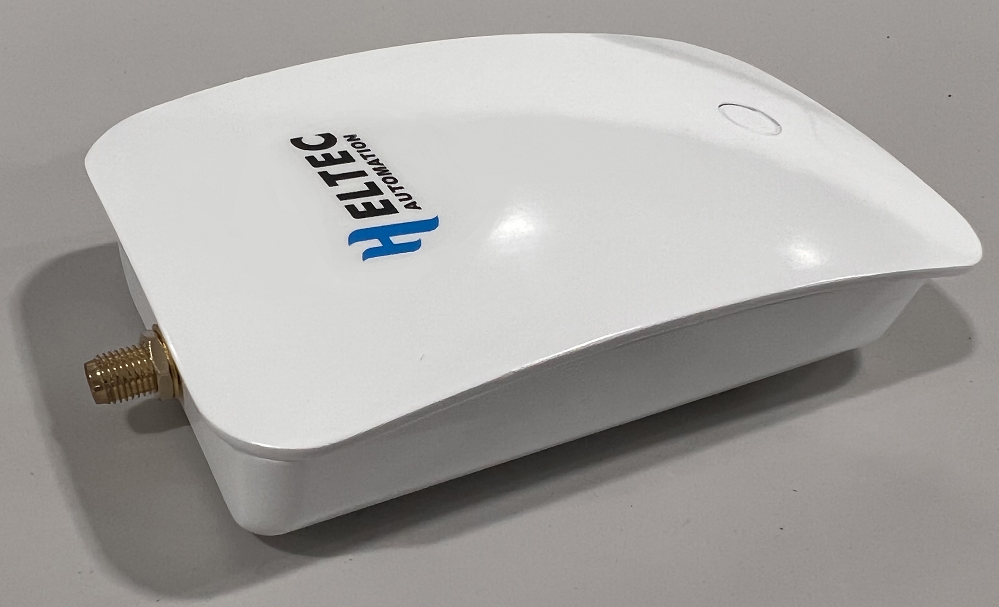

# Chengdu Heltec Automation Technology Co., Ltd.
### Application to become an approved third party manufacturer as per [HIP19](https://github.com/helium/HIP/blob/master/0019-third-party-manufacturers.md)

## Summary

Happy to be back here in the HIP 19 application!

We had launched two full hotspot [HT-M2808](https://heltec.org/project/ht-m2808/) and [HT-M2802](https://github.com/dewi-alliance/hotspot-manufacturers/blob/main/applications/heltec-m2802.md) LoRaWAN Indoor Gateway. Thanks to all the voices from the community, we have much feasible feedback and now we are going to build a light hotspot: **HT-M7603 Light Hotspot**.

## Company Information

We began developing and selling LoRa/LoRaWAN products in Q3 2017, having been founded in 2014. With extensive experience developing LoRa devices and associated cloud computing, we migrated the Arduino and associated toolchain for the ASR650X series SiP in 2019. This is the first time that a PSoC series MCU has been demonstrated to be capable of running Arduino flawlessly (We call it CubeCell Series). Our products are used by partners worldwide, including in remote Antarctica (Scott Base).

We operate our own rework facility for SMT components. As a result, we conduct all R&D, manufacturing, and testing in-house, allowing us to maintain strict control over the manufacturing process and product quality.

The Helium blockchain, in our opinion, provides a decentralized public network that communicates with the blockchain. Everybody benefits from and contributes to this network. This will significantly aid in the large-scale deployment of LongFi/LoRaWAN networks, paving the way for the near future Internet of Everything. This is why we seek certification as a manufacturer of officially approved hotspots.

## Product Information

The following are our current LoRa related products:

- Helium LongFi Hotspot (HT-M2808): [Heltec Indoor Hotspot](https://heltec.org/project/ht-m2808/)
- Heltec LoRaWAN Gateway series: [Heltec Gateway Series](https://heltec.org/proudct_center/lora/lora-gateway/)
- Heltec LoRaWAN Node series: [Heltec LoRa End Node List](https://docs.heltec.cn/#/en/products/lora/lora_node/heltec_lora_node_list)

We have amassed a wealth of experience in product design, structural design, and manufacturing during the R&D and production of LoRa products. Our design philosophy prioritizes market-oriented products. The term "market-oriented" here does not simply refer to what users require; it refers to a variety of factors such as whether the upstream supply chain can meet production requirements or not, and whether the chips, components, and other components required by the product have a sufficient life cycle or can still be purchased on the open market.

### Heltec Light Hotspot (HT-M7603)

HT-M7603 is an light hotspot device compatible with Helium blockchain technology. It has many features such as small size, convenient deployment and low cost.

**Estimated price:** 259 USD

**Hardware information:**

| Resource              | Description                                    |
| --------------------- | ---------------------------------------------- |
| CPU                   | MT7628 MIPS24KEc@580MHz                        |
| RAM                   | 128MB DDR2                                     |
| ROM                   | 32MB FLASH                                     |
| Wi-Fi                 | IEEE 802.11 b/g/n 2.4GHz with internal antenna |
| Ethernet              | 10/100M Ethernet                               |
| Security              | ATECC608                                       |
| LoRa Baseband Chip    | SX1303 + SX1250, 8 channels                    |
| LoRa Supported Bands  | EU868, US915, AU915, AS923                     |
| Host Size (mm)        | 116 * 65 * 30                                  |
| Operating Temperature | -20°C to 60 °C                                 |

**Interface:**

| Interface              | Description                                                  |
| ---------------------- | ------------------------------------------------------------ |
| Power Source Input x 1 | 5V DC.                                                       |
| RJ45 Socket x 1        | Ethernet connection.                                         |
| SMA Socket x 1         | LoRa antenna with SMA socket.                                |
| Button x 1             | System config.                                               |
| Type C Scoket x 1      | Used to flash firmware during production.                    |
| RGB LED                | System status (Power, System, Miner Satatus, LoRa TX, LoRa Rx). |

**Expected Time line:**

- Submit PR to HIP 19 -- March 2022
- Hardware audit -- April 2022
- Onboarding integration -- May 2022
- Pre-sale -- After helium has approved the third party manufacturer audit, Expected end of May 2022
- Shipping to customers -- end of May 2022

**Hotspot config & upgrade:** The Heltec Light Hotspot (HT-7603) will include OTA upgrade and auto-upgrade function, with the one-key configuration button, users can configure the hotspot via Helium's official APP or Heltec APP.

**Production capacity:** According to market demand, 5000～10000 sets can be produced per month in the future.

## Customer Support

- Provide detailed documents and instructions in [Heltec Document Page](https://heltec-automation-docs.readthedocs.io/);
- [Heltec Community](http://community.heltec.cn/);
- [Discord Channel](https://discord.gg/QbWcMdUa);
- [Support Email](support@heltec.cn);
- WeChat and QQ for China mainland;
- Remote SSH access to issues Hotspot;
- 1 Year warranty for hardware;
- Defects due to manufacturing will be replaced FOC, naturally damaged or user damaged can be sent back for repair, the user will pay for the repair costs, freight, tariffs, etc.

## Hardware Security

All the miner variants feature a secure element, powered by ATECC608 from Microchip. And the key data to be secured (`swarm keys`, `API tokens`, etc) are kept in a separate partition which is encrypted and secured by using the secure element.

Additionally, prior to performing the firmware upgrade, the hardware and copyright verification processes will be performed. We have a wealth of experience in this field. Beginning in 2020, each product we create will include a serial number that can be used to verify its authenticity, unlock software permissions, and obtain corresponding technical information and support.

## Manufacturing Information

Each year, we sell over 300,000 LoRa devices, which include LoRa gateways, LoRa end nodes, LoRa development boards, and LoRa modules. And this data continues to grow. All of our products are manufactured in-house at our SMT manufacturing facility. Daily assembly capacity is up to 600,000 components. As a result, we offer PCBA services to our customers in addition to manufacturing our own products. Throughout this process, we've developed a strong and stable working relationship with a variety of suppliers, ensuring a steady supply of a variety of devices.

If we are fortunate enough to be approved as a hotspot manufacturer, we will discontinue offering public PCBA services. Our factory will be responsible for fully manufacturing, testing, and assembling Heltec's hotspots and other products.

## Proof of Identity

To be submitted in private.

## Budget & Capital

We are a financially stable company. We have sufficient budget and capital to design, prototype, manufacture products, and support for customers. In addition to the company's daily expenses, we have prepared sufficient special funds to ensure the smooth progress of the Helium project.

## Risks & Challenges

From the perspective of Q3 2020, the shortage of chips globally become a barrier for most hardware manufacturers.

We identified the primary challenge as the worldwide shortage of chips and electronic components beginning in Q3 of 2020, as well as the inability to guarantee lead times. This, I believe, is also a roadblock for the majority of hardware manufacturers.

As a result of our accumulated experience in the field, we purposefully avoided highly visible devices when designing the products. And we keep a certain quantity of component in stock to cover initial production.

## Other information

* Desired Discord support channel name - [Heltec Automation](https://discord.gg/QbWcMdUa)
* Twitter profile - [@HeltecOrg](https://twitter.com/HeltecOrg)
* Website - [https://heltec.org](https://heltec.org/)
* Payment methods available - Most credit cards including Visa, Mastercard, JCB, AliPay, Wechat Pay, Bank Transfer. Apple Pay is applying for activation.
* Regions covered / shipped to - We have [more than 20 agents / distributors worldwide](https://heltec.org/distributors-list/), products will ship worldwide to regions where product is certified.

