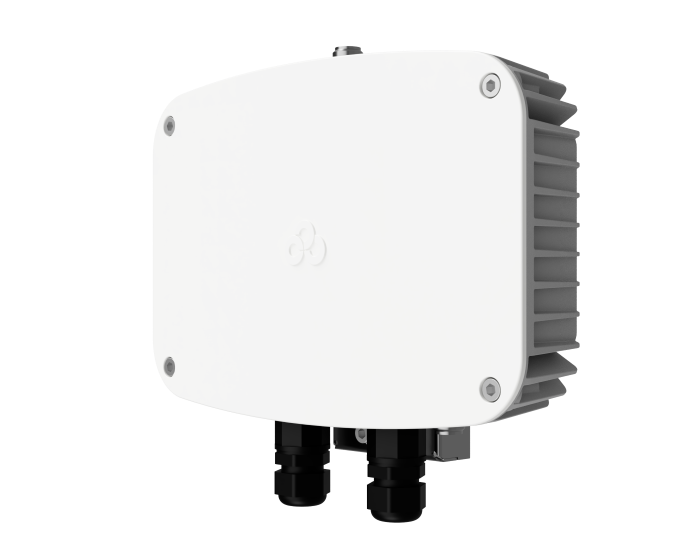

# HeNet B.V. / LongAP
### Application to become an approved third party light hotspot manufacturer as per [HIP19](https://github.com/helium/HIP/blob/master/0019-third-party-manufacturers.md)

## Summary

HeNet B.V. previously sold the LongAP One hotspot with almost 800 units currently online. LongAP One is one of the best
earning hotspots We are now introducing the **LongAP Pro** and **LongAP Light** hotspots.

## Company Information

HeNet B.V. is a company from the Netherlands that specializes in security solutions with the main focus on cryptography.
We previously sold the LongAP One Helium hotspot. We started in 2021 as a newly founded spin-off and
LongAP One was our first product we brought to the market. We sold approximately 800 pieces. 

## Product Information

Our products are aimed at the professional market. We won't be selling to the consumer market.

### LongAP Pro

**Expected release date**: Q1 2022 - Q2 2022 (depending on launch of light-hotspots on the Helium network)

**Expected price point**: 600-800 EUR ex. VAT

LongAP Pro will be a light-hotspot in an outdoor IP65 housing.

**Specs**:
- 800 MHz Dual-Core MIPS processor
- 256 MB of RAM
- Gigabit ethernet with PoE
- LoRa concentrator based on SX1302 (EU868 initially)
- Fiberglass +3dBi LoRa Antenna with N-type connector
- Metal case (pole and wall mount supported)
- Powered over PoE
- Security chip that stores hotspot/swarm-key

Option LTE:
- 4G/LTE Cat 1 interface
- GPS
- Internal 4G/LTE+GPS antenna
- World-wide SIM with data installed that can be enabled in our dashboard

Option Solar:
- Kit to run LongAP Pro off-grid on solar and batteries.

Our devices will be updated via our own secure updating system like we do with LongAP One. Management
occurs via our own secure online dashboard.

## What is your approximate price point?
LongAP Pro: 600-800 EUR ex. VAT

## Please provide detailed hardware designs, including relevant parts

## What is your expected production and delivery timeline?
Q1 2022 - Q2 2022 (depending on launch of light-hotspots on the Helium network)

## Previous shipments
LongAP One was our first product we brought to the market with CE certification. We sold approximately 800 pieces.

## Which countries do you plan to ship to and get regulatory certifications for?
Initially only to Europe with CE certification.

## Customer Support
Support will be provided over e-mail and our own Discord and general troubleshooting will be available on our website.

## Hardware Security

Our devices contain a Microchip ATECC608 for key-storage and cryptographic operations. Keys are non-exportable ensuring a high level of security.

## Hardware Information 

See above

## Manufacturing Information
We previously developed LongAP One. We source critical components such as security-ICs and LoRa ICs directly from
their manufacturers via our relationships we have build in the past months. We have secured parts for at least 5000 units
this year. 

## Proof of Identity

Submitted and verified by DeWi during previous HIP19 application.

## Budget & Capital

We have enough funds available to produce in the required volumes. We get our HNT for the onboarding fees buy using our 
corporate exchange accounts and possibly via payments in HNT and the rewards of our limited set of test hotspots.

## Risks & Challenges

The semiconductor shortage is still ongoing resulting in very long lead-times for critical components. We already sourced a number of critical components (for example the security chips) and have them currently in stock, however new supply could have long lead times.

## Other information

* Discord server: [https://discord.gg/n3E3gvZr6b](https://discord.gg/n3E3gvZr6b)
* Twitter profile - [@LongAPcom](https://twitter.com/longapcom)
* Website - [longap.com](https://longap.com)
* Contact Email (required) - support@longap.com
* Regions covered / shipped - We initially focus on the European market with CE certification with planned expansion to other regions later.

## Payment methods available:
Handled through our distributor(s), but SEPA Wire Transfers must be supported for EU distributors. 
