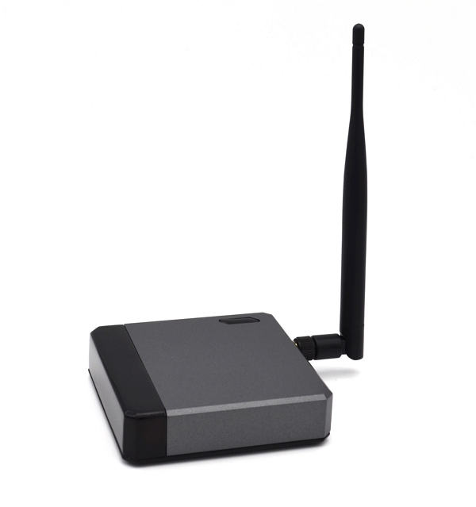
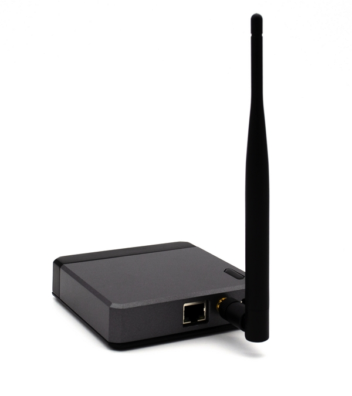

## IBGTG INC. - Indoor Full Hotspot

### Application to become an approved third party manufacturer as per [HIP19](https://github.com/helium/HIP/blob/master/0019-third-party-manufacturers.md)

## Company Information

IBGTG INC. is a startup company, registered in Colorado, US. The founder has been working in the virtual currency and blockchain market for many years,we are very promising for Helium business model and would like to manufacture Helium Hotspot and promote it into our customers in virtual currency network.

We have design and manufacturing partner in Asia, who is higly capable to design Hotspot based on our specification and they have quality production facilities to support us for the future production

## Product Information

**Product Name:** IBGTG Hotspot

**Product Type:** Full Hotspot

**Expected Release Date:** Mar 2022

IBGTG Hotspot is a Full Hotspot for PoC and Data Transfer, we used ARM Cortex A72 Quad Core 1.5GHz processors and Semtech SX1302/1303 LoRa concentrator. We will release EU868 and US915 first then look for the opportunity for other frenqucy. Our product will be FCC & CE certified

**Key Features**

* Concentrator based on the Semtech SX1302/1303, Support EU868 and US915
* Processor is based on ARM Cortex A72 Quad Core 1.5GHz 64bit CPU
* Config 2GB DDR & 32GB SD Card
* Gig-Ethernet & Dual-band Wi-Fi network
* Support Bluetooth 5.0
* ATECC608 security chip
* Use Aluminum metal case to remove the heat of whole system
* Support OTA
* 12V DC input
* Dimension: 110mm(L) x 110mm(W) * 29mm(H)

## What is your approximate price point?

The approximate price point is arround 599 USD.

## What is your expected production and delivery timeline?

We plan to start the production in Mar-2022, and start to deliver in April-2022

## Previous shipments

We didn't ship any hardware products in the past

## Customer Support

We are going to build a technical support team to support the customers through different channels and our design partner will backup us for any intensive technical issue.

For how long? How are you planning to handle repairs and replacements?

* We will provide 1 year warranty, we can upgrade the software through OTA if there are any software issue happened, we will replace the hardware for the customers if it is hardware issue.

## Hardware Security Element

* Encrypted storage of the miner swarm_key, either via disk encryption or hardware measures.
  * we use **ATECC608**
* Encrypted buses, potting and other anti-tampering measures.
  * **Yes**
* Willingness to submit a prototype for audit, and sharing those audit results publicly (pass or fail)
  * **Yes**

## Hardware Information

* Which security (swarm) element are you using?
  * **ATECC608**
* Which LoRa chipset are you planning to use in your gateway (ie SX1302/03 & SX1250s or SX1301/08 & SX1255/57)
  * **SX1302/1303+SX1250**
* Where are you sourcing your components from?
  * **Our manufacturing partner will source the components and all of materials for us.**
* How many radio modules/ concentrators can you procure?
  * **Our manufacturing partner will source radio module for us.**

## Manufacturing Information

* Have you built and delivered radio hardware products before?
  * **No**, but our design partner has lots of experience on radio hardware design
* Have you built gateways before?
  * **No**, but our design partner did before
* How many gateways did you make?
  * **Zero**, but our design partner release thousands of gateways in the market.

## Proof of Identity

To be submitted privately.

## Budget & Capital

* How many of these are you hoping to make and sell?
  * **50K~100Kpcs in 2022**.
* How much money will be required up-front? How much money do you have on-hand, and how much do you have access to?
  * **The founder will invest US$500K for the first step, we will invest more soon**.
* What is your plan for additional financing if required? This is the second biggest risk in new hardware ventures -- getting almost over the line and then running out of cash.
  * **We are experienced in virtual currency exchange,we have enough cash to run this project.**

## Risks & Challenges

Please tell us about some of the challenges that would prevent these products from becoming a reality, and how you might address them.

**We can see the only challenge is the component supply, our manufacturer partner is confident to mitigate the risk through their strong supply chain capability.**

## Other information

* Contact info - network@ibgtg.cn
* Website - (https://www.ibgtg.cn)

## Payment methods available

paypal/TT

## Which countries do you plan to ship to and get regulatory certifications for?

* Eurpose
* US
