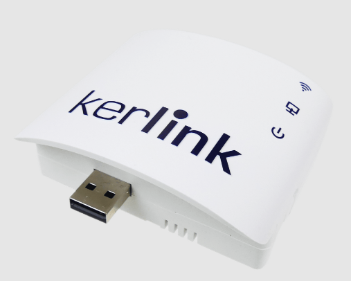
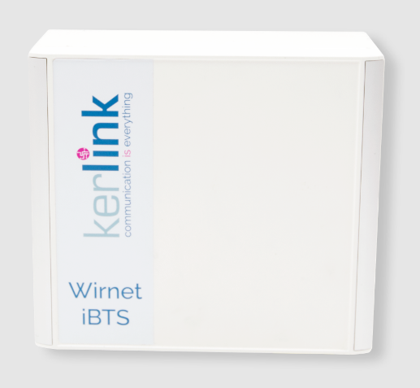

# Kerlink

## Summary

Kerlink is an IoT connectivity-network and management-software company that assists business and cities of all sizes to design, launch and operate IoT Network, and reliable and securely connect things that matter, over time.

Kerlink manufactures best-in-class industrial, carrier grade, indoor and outdoor LoRaWAN access points, and provides tools to operates a reliable infrastructure

Below are the indoor WirnetTM iZeptoCell (Ethernet & Cellular versions), and WirnetTM iBTS (outdoor, ethernet + 4G).

_WirnetTM iZeptoCell_

_WirnetTM iBTS_

References:
*   [https://www.kerlink.com/product/wirnet-ibts/](https://www.kerlink.com/product/wirnet-istation/)
*   [https://www.kerlink.com/product/wirnet-izeptocell-serie/](https://www.kerlink.com/product/wirnet-izeptocell-serie/)

Kerlink will release miner software to run inside the gateways (light miner) and maintain OTA updates to keep it up to date.

## Company Information

Kerlink, an Innovative IoT pioneer and pure industrial player, has been founded in **2004** in France.

*   Designed the first worldwide LoRaTM Gateway in **2013**
*   **Founding** and **Board Member** of the **LoRa AllianceTM** since **2015**
*   **Founding** and **Board Member** of the **uCiFi AllianceTM** (Smart Cities convergence initiative) since **2017**
*   Provided more than **75 000** LoRaWAN gateways, over all continents
*   Deployed the largest LoRaWAN Network in the world (India)
*   Worldwide presence (**US**, **France**, **Singapore**, **India**, **Japan**)
*   Listed on French **Euronext Growth** since May **2016**

Kerlink products and services (network infrastructure operation) bring a high level of quality for reliable, efficient, and secure IoT network, dedicated to Industries, Enterprises, cities, and professional services

Its vertical ecosystem and partnership open huge opportunities to deploy massive Iot solution on Helium network.

## Product Information

Kerlink portfolio, compatible with Helium network, contains high quality and radio performances, resilient and secure gateways, based on the same hardware and software architecture, with a 8-channels LoRaWAN modem (Semtech Reference design v1 and v2 depending on models), a worldwide bands 4G modem and 10/100 ethernet controller.

All gateways come in 868MHZ, 915MHz and 923MHz variants, and support US915, AU915, AS923-*, EU868, IN865, RU867, etc. LoRaWAN regional parameters.

## Customer Support

Kerlink has a worldwide 24/7 level 2 support teams based in France, USA (California), India, Singapore, and Japan.

Kerlink will provide worldwide support and replacements or reverse logistics through our distribution network.

## Hardware Security

Kerlink gateways have an embedded hardware security built in the CPU, provided by ProvenCoreTM and based on ARM TrustZone. The behavior is very similar to an ECC chip and is the same for all Kerlink products independently with the full miner or light miner version  (iZeptoCell & iBTS products have equivalent security integration as the ones already running with the full miner). This has a dedicated processing and storage unit that can store secrets and process security functions (signature, encryption) using private keys. The key is stored ciphered in a hardware memory that is not reachable from the Linux Kernel or userland. Even if the hardware is physically compromised, the key cannot be recovered. When the hardware performs signatures or encryptions, the key is never loaded into the RAM.

When the firmware signature verification is enabled, the bootloader will refuse to load the firmware unless the signature matches the key burned in the CPU. The CPU has 4 slots of keys that are fuses, and one slot can be erased in the event of key compromising.

The bootloader itself cannot be modified (locked).

Kerlink can provide more information upon demand and is willing to comply to any third-party audit.

Kerlink gateways can be configured to be monitored by the WanesyTM Management Center (WMC) software. This is a cloud-based SaaS that enables remote gateway management (OTA firmware upgrade, configuration change, monitoring, KPIs, supervision, alarms, etc.). The connection between the gateways and the WMC is secured by an OpenVPN connection. The OpenVPN certificate and private key are stored in the ProvenCoreTM hardware security module. The key is never reachable from the Kernel or userland and cannot be compromised. TLS and security negotiation for the VPN are handled by ProvenCoreTM so that the key is never loaded into the RAM.

Kerlink gateways can remotely self-configure using a provisioning server called WanesyTM Operational Assistant (WOA). The gateways have a private key generated in production and download a certificate (PKCS10) from WOA to authenticate themselves. This provides TLS client-based and server-based mutual authentication. Provisioning information that WOA may send (OTA, configuration, etc) are securely transmitted only to the gateway authorized and authenticated for it.

Kerlink is using this security to store the swarm_key, generated in production. WOA save the public key part of the swarm key and never store the private key. The gateway can authenticate on WOA during the onboarding procedure, to generate the add_gateway transaction and provide it to WOA. WOA then provide it to the phone wallet app once ownership of the gateway by the phone wallet app has been identified (like a QR code on the gateway). The wallet app signs the transaction. The onboarding procedure for light miner is the same as the full miner procedure. The onboarding server retrieve the swarm public key from WOA, the transaction from the blockchain and can sign the add_gateway transaction. The private swarm key never leaves the gateway, is never stored by Kerlink, and it cannot be recovered since it is stored ciphered in the hardware security memory.

## Manufacturing Information

Kerlink Group is a leading global provider of connectivity solutions for designing, launching, and operating public & private Internet of Things networks. Its comprehensive product portfolio includes industrial-grade network equipment, best-of-breed network core, operations and management software, value-added applications and expert professional services, backed by strong R&D capabilities. Kerlink specializes in enabling future-proof intelligent IoT connectivity for three major domains: Smart Cities – metering, parking, street lighting, waste management, air quality & pollution, building & facilities, assets monitoring… Smart Industries – fleet & asset tracking, energy & utilities, oil, gas & mining, airports, harbors, infrastructure, manufacturing, retail… and Smart Territories – precision agriculture, environment protection and rural towns & areas. More than 120,000 Kerlink installations have been rolled out with more than 330 clients in 69 countries. Based in France, with subsidiaries in the US, Singapore, India, and Japan, Kerlink is a co-founder and board member of the LoRa Alliance® and the uCIFI Alliance™. It is listed on Euronext Growth Paris under the symbol ALKLK.

For more information, visit https://www.kerlink.com/ or follow us on Twitter @kerlink_news.

## Proof of Identity

Kerlink SA is a stable public company, listed at Euronext Growth, Paris stock exchange.

All financial information are public:

https://live.euronext.com/en/ipo-showcase/kerlink

## Budget & Capital

Kerlink SA is a stable public company, listed at Euronext Growth, Paris stock exchange.

All financial information are public:

https://live.euronext.com/en/ipo-showcase/kerlink

## Risks & Challenges

The main challenges are businesses. The best value of the Helium network is IoT proof-of-coverage allowing connectivity for Massive IoT applications.

But These Application need to become real. And Kerlink, as a Pioneer and Pure player, is a real valuable go-in-between to connect concrete use cases to Helium Network.

## Other information

* Desired Discord support channel name: Kerlink
* Twitter profile: https://twitter.com/kerlink_news
* Facebook profile: -
* Other social profiles: https://www.linkedin.com/company/kerlink/ — https://www.instagram.com/kerlink_news/ — https://www.youtube.com/channel/UCXR60-5v1ksOD3r4NW-lLyw
* Website: https://kerlink.com
* Payment methods available: -
* Regions covered / shipped to: worldwide

