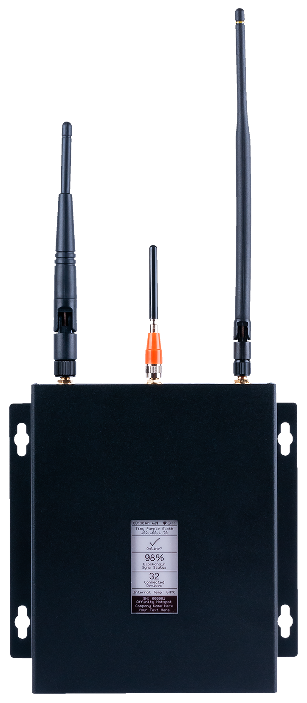
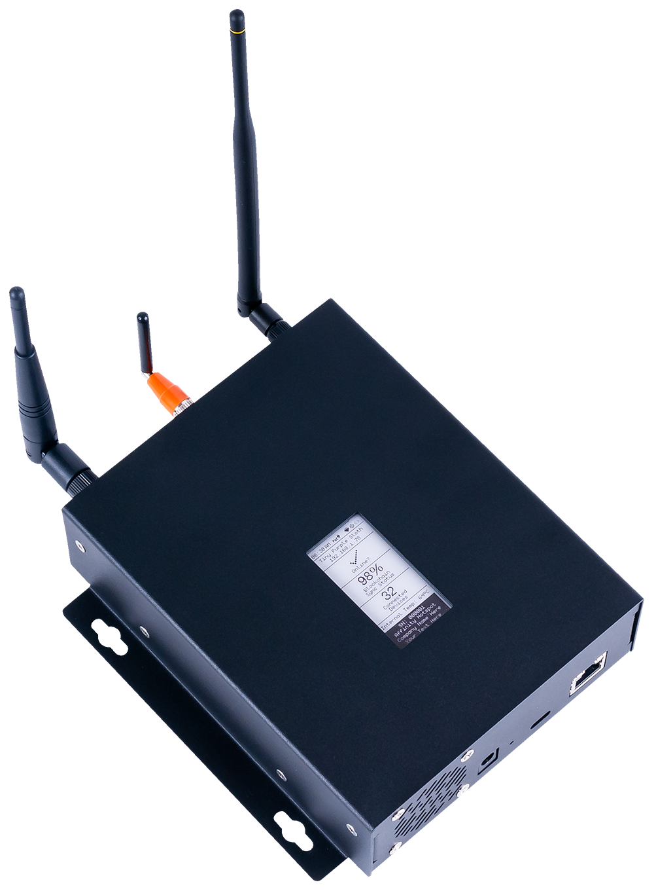

# KS Technologies, LLC
### Application to become an approved third party manufacturer as per [HIP19](https://github.com/helium/HIP/blob/master/0019-third-party-manufacturers.md)

## Summary

KS Technologies, LLC (KST) first Helium product to market is an indoor Hotspot. The KST Affinity Gateway will bring much-needed features to businesses that have multiple Hotspots in multiple locations. The KST Affinity Gateway is targeted towards Enterprise clients and features a white glove tailored experience. Remote health monitoring, PoE, and extended temperature ranges are a few of the features provided.

## Company Information

KST is an 18-year-old company located in Colorado Springs, Colorado. KS Technologies specializes in IoT products, test and measurement, private label products, and engineering services. Founded by a former Agilent IC engineer, KST utilizes Fortune 50 processes and procedures when developing both private label and in-house products. We bring a multidisciplinary approach to design and engineering. We have system architecture, hardware, firmware, mechanical, and UI/UX engineers on staff. KST’s current product portfolio consists of IoT sensors and measurement products. We have sold thousands of products to Fortune 50 companies as well as small businesses and municipalities. KST has enjoyed a multi-year relationship with Helium, having deployed KST sensors on Helium's network and participated in joint webinars together. KST recognizes the need for a Helium Hotspot that is more attuned toward business clients with multiple locations and Hotspots. 

## Product Information

The Affinity Gateway includes an industrial-grade Compute Module combined with an 8 channel low-phase noise LoRaWAN concentrator card built by KST. 

The Affinity Gateway includes:
* Barrel jack for power
* Power-over-Ethernet (PoE)
* USB Type-C
* Embedded digital display
* WiFi
* GPS
* External Antennas for LoRa, WiFi, and GPS

The Affinity Gateway is tamper-proof, offers tamper-detect, and can be wall-mounted securely.

The Affinity Gateway allows for:
* Enterprise-level commissioning and wallet aggregation for Affinity Fleets of Devices
* USB-based local configuration
* Remote configuration and setup via Secure Dashboard
* Firmware Over-the-Air (FOTA) Updates
* Access to remote management and Affinity health data
* Cloud-based GPS in locations where hardware GPS is unavailable
* No App support will be available for the Helium App

KST has 30 lab prototypes currently under test and characterization within our in-house lab. FCC/IC certifications are also underway. We will produce 350 production prototypes to be completed in Q1 2022 and expect to be in full production by Q2 2022.

## Previous shipments

KST has shipped 250,000+ devices to North America and Europe. We are well versed in the FCC and CE requirements and the approval process. KST plans to ship Affinity to North American customers only at launch. The KST Affinity Outdoor Light Gateway is under active development as well.

## Customer Support

North American customer support will be handled in the following manner -
1. Immediate, 24-hour/7-day per week support via automated response
2. 9 AM - 5 PM Mountain Time (Colorado) Chat Support
3. US-based, dedicated KST Team Member Per Enterprise Customer

## Hardware Security Element

The Affinity Gateway includes an ECC608 Secure Element authentication chip. This critical component is glob-topped or similarly treated to heighten physical security.

The Affinity Gateway includes a Factory Bootloader, Factory Image, and a Factory ROM database that is non-volatile and not impacted during FOTA. All firmware images are key-signed, among other security technologies.

The Affinity Gateway includes an Intrusion Detection System (IDS) to detect threats, access attempts, or any unauthorized processes starting up or running.

The Affinity Gateway does not support the installation of any applications on the Gateway by the end customer/client.

Each Affinity Gateway has a unique key and secret, issued at the factory, that provides access to communications.

Cloud “alarms” exist for specified conditions reported by Affinity Gateways.

Affinity Samples have been submitted to the DeWi for Hardware Audit. Prototype to be submitted to Helium for audit.

## Hardware Information

Swarm key is stored on an ECC608 Secure Element authentication chip.

KST uses the SX1303, SX1250, and SX1261 Semtech-based radio technologies.

KST has long-standing relationships with semiconductor companies and distributors and will procure parts from these channels.

KST has built our own mini-PCIe card. Components for 2021 quantities have been procured.  We are currently working on securing components for 2022.

## Manufacturing Information

KST has built and delivered hundreds of hardware projects. We have 18 years of experience in product development and manufacturing. KST engineers and builds products for Fortune 50 companies, private label products, and we have our own product portfolio.  KST has well-established processes and procedures for road mapping and delivering products. KST has long-term relationships with component manufacturers, board fabrication companies, semiconductor companies, and SMT houses. We use US-based companies for manufacturing, thus allowing complete control and visibility to the manufacturing and supply chain. KST owns all intellectual property and manufacturing rights.

## Proof of Identity

KS Technologies is a privately held company. Proof of identity will be provided separately. 

## Budget & Capital

KST plans to produce 350 units in Q1 2022. Our annual production in 2022 will be between 5,000 and 10,000 Affinity Hotspots. Component sourcing is the largest upfront cost. KST is well-capitalized to take on the engineering and manufacturing efforts. Further, KST has well-established relationships with institutions that can provide debt financing should this be required.

## Risks & Challenges

This biggest challenge is key component availability. KST engineered Affinity using our own KST mini-PCIe card and using a non-Raspberry Pi Compute Module. This reduces our dependence on a volatile supply chain. 

## Other information
 
* Contact info - info@kstechnologies.com
* Desired Discord support channel name: #KSTechnologies
* Twitter profile: [@kstechnologies](https://twitter.com/kstechnologies)
* Facebook profile: [KS Technologies, LLC](https://www.facebook.com/pages/KS-Technologies-LLC/107015177588)
* Linkedin: [KS Technologies, LLC](https://www.linkedin.com/company/ks-technologies-llc)
* Website: [https://kstechnologies.com](https://kstechnologies.com)
* Payment methods available: Credit card for new customer evaluations. / Purchase Orders for Enterprise Customers.
* Regions covered/shipped to: North America

