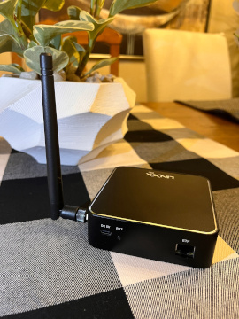

## YOUR NAME

Linxx Inc.

## Summary

Linxx Inc is founded in June 2021 in Southern California. We want to combine our expertise in professional management, software innovation, hardware design and manufacturing knowhow to make Hotspot devices for the Helium network.  We will also team with partners to develop LoRa IoT devices to be deployed in the Helium people's network. 

## Company Information

* What is your company name?  
  
  Linxx Inc.

* How long have been in the business?  
  
  This is a 6 month old startup.

* What kind of products have you created?  
  
  We have created a working Helium Full Hotspot device.

* How many have you sold?  
  
  None

* What brought you to Helium etc?  

	- We are impressed by people's enthusiasm to join in the Helium network.  
	
	- We appreciate the community friendly open source software development model.  
	
	- The wide spread deployment of Helium hotspots will create LoRa device business opportunities.  

	- We can make contribution to the Helium network growth.

## Product Information

* What is this product's model name or model number?  
  
  Linxx Hotspot 

* Is this Light Hotspot or Full Hotspot?  
  
  Full Hotspot for this application.

* Is it for indoor or outdoor?  
  
  For Indoor usage.

* Provide a brief description of what you're making.
  
  The Hotspot hardware is based on the Raspberry Pi/4B which handles WIFI/BLE/Ethernet communication.  LoRa communication is handled through SemTech SX1302 based Gateway module. Elliptic curve cryptographic calculation is done using Microchip ATECC608 security chip.

## What is your approximate price point? 

The pre-order price is set to be US$379.

## Please provide detailed hardware designs, including relevant parts.

CPU: ARM Cortex-A72 1.5GHz（Raspberry Pi Module 4B)  
Storage：32GB SD Card    
Memory：2G/4G DDR4  
LoRa：SX1302 Module  
Network：Ethernet/WIFI/BLE  

The device can be fully reset through a reset button.  It can be paird through bluetooth to a cell phone.  Setup such as WIFI password, etc., can be performed through Helium official app.

## What is your expected production and delivery timeline?

We plan to produce up to 1,000 units in the first two months following the application approval. 

We have the commitment of 3K Raspberry PI units from resellers.  We have also secured good number of LoRa gateway modules from a reputable vendor.

## Previous shipments

Linxx has not made any previous shipment yet.

## Startups Welcome!

- Have you shipped anything in the past?  
  
  No

- Which countries have you previously shipped regulatory FCC or CE approved products?  
  
  No.  But we have contacted an agency for the FCC & CE application and will cooperate with them in all of the application procedures.

- Which countries do you plan to ship to?  
  
  US and EU.

## Customer Support

* How will your customers be able to contact you for support for your products?  
  
  Online chat, email and phone support.

* For how long? How are you planning to handle repairs and replacements?  
  
  We expect our response time to be within 24 hours.  
    
  The support team is located in US west coast.  Live phone support is available during the normal business hours.
  
  We cover our Hotspot device with a limited one year warranty.
  
## Hardware Security Element (required)

* The community is concerned about devices that can be easily hacked, specifically by copying their swarm-key files. Applications should include plan for how the devices will be secured, potentially including:
Encrypted/locked-down firmware. Yes or no?   
  
  YES

* Encrypted storage of the miner swarm-key, either via disk encryption or hardware measures. Yes or No?  
   
  YES

* Encrypted buses, potting and other anti-tampering measures. Yes or No?  
  
  YES
  
* Willingness to submit a prototype for audit, and sharing those audit results publicly (pass or fail) Yes or No?  

  YES

## Hardware Information (required)

Please let us know:

* Which security (swarm) element are you using?  

  ATECC608 from MicroChip
   
* Which LoRa chipset are you planning to use in your gateway (ie SX1302/03 & SX1250s or SX1301/08 & SX1255/57) We recommend you don't use the SX1301 in new designs:   

  Semtech SX1302 & SX1250S

* Where are you sourcing your components from?  
  
 Okdo, Canakit, RS Components, SparkFun, Arrow, Micro Center, RAK Wireless, Etc.

* How many radio modules/ concentrators can you procure?  
  
  Right now we are experiencing a global chip shortage.  It is to our advantage that we have good working relationship with the vendors and suppliers.  
    
  Under current chip constraints, we expect to procure around 10K pieces a year.  Without the constraints, we expect to procure around 30K pieces a year.

## Manufacturing Information (required)

* Have you built and delivered radio hardware products before? 

  No

* Have you built gateways before?  
  
  No

* How many gateways did you make?  

  N/A
   
* If you have not built gateways before, are you using a third party manufacturer? This is the single largest risk with most hardware ventures. If possible please provide information about your manufacturing partners and supply chain.  

  Our working partner in Los Angeles is D-Link. 
  
  Our China manufacture partner is ShenZhen Zowee.  Our team member has a long term good working relationship with them.

## Proof of Identity

Per typical KYC/AML procedures, proof of identity for major shareholders (25%+ ownership) will be expected to be provided privately to representatives from Helium Inc or DeWi board members. This will be attested and publicly confirmed by those representatives, e.g. as GitHub comments. Contact details for this will be provided after your application is submitted on GitHub.

## Budget & Capital (required)

* How many of these are you hoping to make and sell?  

  We'll produce 1,000 units in the first two months and 2,000 units a month after that.
  
* How much money will be required up-front? How much money do you have on-hand, and how much do you have access to?   
  
  Our initial starting capital is US$500,000, and the funding member will invest another US $1 million depending on the requirement.

* What is your plan for additional financing if required? This is the second biggest risk in new hardware ventures - getting almost over the line and then running out of cash.  
  
  We have several working partners showing a strong interest to our products.  They have expressed interests to become equity investors.

## Risks & Challenges (required)

Please tell us about some of the challenges that would prevent these products from becoming a reality and how you might address them.

As a new startup, there will be challenges.  Fortunately, our team members are made of seasoned professionals in each of their own fields, ranging from professional management, financing, engineering, marketing and manufacturing.  We believe Helium is a great project.  We are enthusiastic to work on the Hotspot product and many others in our pipeline.  We will work together to all the obstacles and make this a success!

## Other information (required) 

if you do not provide contact information we cannot review your proposal. 

- Contact info (* required)  
  
  Nancy Zhang (nancyz@linxxiot.com)

- Twitter profile -  

- Facebook profile -

- Other social profiles -

- Website –　https://linxxiot.com

## Payment methods available:　

- Paypal
- Visa/Mastercard
- Alipay

## Which countries do you plan to ship to and get regulatory certifications for? (required) 

- US
- EU