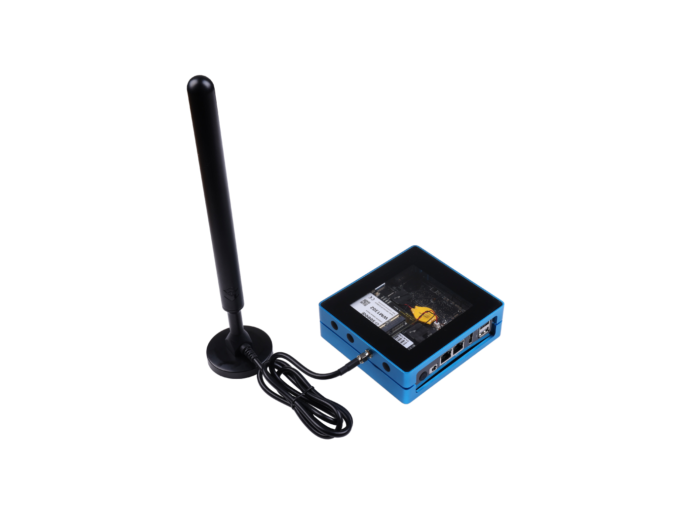

## Seeed Studio

## Summary:
Seeed had launched a full hotspot SenseCAP M1 LoRaWAN Indoor Hotspot in July 2021. Thanks to all the voices from the community, after we applied for our light hotspot M2 and M3, now we are going to build our new hotspot - SenseCAP M4 Square. Seeed has been working on the Internet of Things for years and has mature equipment production and maintenance capability. With extensive experience in developing LoRa devices from Seeed, we are glad to introduce SenseCAP M4 Square with Full Hotspot to the Helium community.

Can't wait to share more.

## Company Information (required)

* What is the company name?

Seeed Technology Co.,Ltd.

* How long has the company been in business?

Since 2008.

* What kind of products have you created? (list specific products, include links if possible)

Seeed is a hardware-focused technology company serving global developers and system integrators with best-in-class IoT hardware products and turn-key services. 
Seeed had launched a full hotspot [SenseCAP M1 LoRaWAN Indoor Gateway](https://www.seeedstudio.com/SenseCAP-M1-LoRaWAN-Indoor-Gateway-US915-p-5023.html) in July 2021, and [SenseCAP M2 Data Only LoRaWAN Indoor Gateway](https://www.seeedstudio.com/SenseCAP-M2-Data-Only-LoRaWAN-Indoor-Gateway-SX1302-US915-p-5342.html) in 2022. 
Seeed has launched many nodes that support Helium network: [https://www.seeedstudio.com/LoRaWAN-Device-c-1920.html](https://www.seeedstudio.com/LoRaWAN-Device-c-1920.html)

* How many have you sold? 

Seeed has 1k+ products being distributed by 200+ distributors across 150+ countries and regions to serve more than a million customers.For the past few years, we sold millions of products to customers worldwide.
From July 2021, We have been shipped 200K+ Helium hotspots to the community.

* What brought you to the Helium Network?

Seeed is a hardware-focused technology company serving global developers and system integrators with best-in-class IoT hardware products and turn-key services. Seeed has been working on the Internet of Things for years and has mature equipment production and maintenance capability. Helium network is one of the biggest IoT network in the world and have increasing demands for the IoT devices. We have confident that we could serve the community with high quality IoT products and help together to build the network to the next stage.

## Product Information (required)

* Will this product be sold under the company name, or a different brand name?

SenseCAP is a product line and brand name of Seeed. SenseCAP M4 Square will be sold under SenseCAP brand name.

* What is this product's model name? (Hotspot models with different hardware will need a separate HIP19 application.)

SenseCAP M4 Square

* Is this is a Light Hotspot or a 5G Hotspot? (New applications should be for Light Hotspots or 5G Hotspots)

Light Hotspots.

* Is this model for indoor, outdoor, or both? (If there are two different models for indoor and outdoor, list them separately.)

Indoor Hotspot

* Provide a brief description of the product:

SenseCAP M4 Square is a device designed to run multiple web 3.0 applications and help you build decentralized networks. It has excellent hardware features to support the extension of multiple applications while providing easy and friendly methods to deploy Helium Hotspot, FluxNode and other web 3.0 Apps with SenseCAP Hotspot App.

* What is your approximate price point? 

$299 at Seeed Studio, and the early bird price is $269.

* What is your expected production and delivery timeline? 

Q1 2023

## Previous shipments (required)

* Have you shipped anything in the past? 

Yes, we have shipped 200k+ SenseCAP M1 to the worldwide.

* What types of products have you shipped?

IoT hardware including: Gateways, sensors, antennas, accessories, etc.

* Which countries have you previously shipped regulatory approved products? (FCC, CE, etc.) 

FCC, CE, etc.

* If you are a startup, are you partnering with another company? What experience does your team have?
N/A

## Which countries do you plan to ship to and get regulatory certifications for? (required) 

FCC, CE.

## Customer Support (required)

* How will your customers be able to contact you for support for this products? 

To better communicate with our customers and solve issues in a timely manner, we have developed a Help Center supported by a tech support team with colleagues from different time zones. If you encounter any product-related issue, you are welcome to create a tech support ticket on SenseCAP Help Center.
We also have SenseCAP MX Official Discord Server for community to discuss any product related information and issue: https://discord.com/invite/SENSECAP
All the related product information can be found via SenseCAP MX Official website: www.sensecapmx.com and documentation can be on our Doc Center: https://www.sensecapmx.com/docs 
Customers could also drop a mail to support@sensecapmx.com when encountering product issue or tech support is needed.

* How long will the company provide customer support? 

SenseCAP products are all enjoying one year warranty it there are product defects.

* How are you planning to handle repairs and replacements? 

SenseCAP products are all enjoying one year warranty it there are product defects. Customers could apply for repairs and replacements when product defect has been detected.

## Hardware Security Element (required)

* Are you using an ECC608. Yes or No? 

Yes

* Encrypted/locked-down firmware. Yes or No?  

Yes

* Encrypted storage of the miner swarm_key, either via disk encryption or hardware measures. Yes or No? 

Yes

* Encrypted buses, potting and other anti-tampering measures. Yes or No?

N/A

* Willingness to submit a prototype for audit, and sharing those audit results publicly (pass or fail) Yes or No?

Yes

## Hardware Information (required)

SenseCAP M4 Square is an x86-based web 3.0 device. It is integrated with WM1302 module in the form of full kit or extension kit, and contains dedicated ECC608, TPM2.0 modules, which enable the device to do  activities and mine HNT and other blockchain tokens at the same time.

* What are your plans for software setup and configuration for the devices?

SenseCAP MX Team has developed the SenseCAP Hotspot App which was launched in April 2022. It could operate as the software setup and configuration app. It also includes remote updates and the ability for hosts to change wifi settings.

* Which security implementation (ECC608, TPM, TrustZone, other) are you using?

ECC608

* Which LoRa chipset are you planning to use in your gateway? (We recommend you don't use the SX1301 in new designs.)

SX1302/1303

* What is the CPU?

Intel® Celeron® J4125, Quad-Core 2.0-2.7GHz

* Additional Hardware Specifications:

### SenseCAP M4 Square Datasheet

|   Hardware   |   Description  | 
|  -  | -----------------  | 
| CPU  | Intel® Celeron® J4125, Quad-Core 2.0-2.7GHz |
| RAM  | LPDDR4 8G |
| Storage  | 512GB SSD |
| LoRa Gateway Chip  | Semtech SX1302/1303 LoRa concentrator chip |
| LoRa Frequency Band  | EU868 / US915 |
| LoRa Antenna Gain  | 3dBi External Antenna with Base |
| Ethernet  | 2* Gigabit Ethernet Port(10/100/1000/2500M) |
| LoRaWAN Protocol | Supports Class A, C |
| Security Chip  | ECC608 |
| Certification  | FCC / CE |
| Input Voltage  | DC Jack input 12-19V DC |

## Manufacturing Information (required)

* Have you built and delivered radio hardware products before?

Yes

* Have you built gateways before? 

Yes

* How many gateways have you previously built? 

200k+

* If you have not built gateways before, are you using a third party manufacturer or working with a partner? This is the single largest risk with most hardware ventures. If possible please provide information about your manufacturing partners and supply chain.

Seeed has own manufacture factory and mature supply chain.

* Where are you sourcing your components from? 

Globaly.

* How many radio modules/ concentrators can you procure? 

30K per Month

## Proof of Identity

Submitted and verified by DeWi.

## Budget & Capital (required)

* How many Hotspots are you planning to manufacture and sell within the first six months of sales? 

10K~30K

* How much money will be required up-front? How much money do you have on-hand, and how much do you have access to?

10 million USD and it can be flexiable if the market need more Hotspots.

* What is your plan for additional financing if required? (This is the second biggest risk in new hardware ventures, getting almost over the line and then running out of cash.)

We have enough cash flow to support this project.

## Risks & Challenges (required)

There might be challenges from this product's worldwide shortage of chips and accessories. Seeed has a solid and stable global production and supply chain to reduce the possible risks, and we have a sophisticated plan for future delivery of products to overcome the problems and difficulties listed above.

Who will develop the Hotspot onboarding and management app? Will it be an internal team or external company?

SenseCAP MX Team has developed the Hotspot onboarding and management app and launch in April 2022 as SenseCAP Hotspot App.

## Payment methods available (required):

Wire transfer

## Contact Information

If you do not provide contact information and/or if the company website does not work, we will not review your proposal and the HIP19 application will be automatically denied.</b>

* Contact Email (a company email is required) - support@sensecapmx.com
* Company Website (required) - https://www.sensecapmx.com/
* Hotspot Sales Website - https://www.sensecapmx.com/
* Twitter - https://twitter.com/sensecapmx
* Discord - https://discord.com/invite/SENSECAP
* Other social profiles / websites - https://www.seeedstudio.com/
