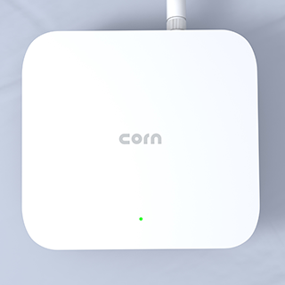
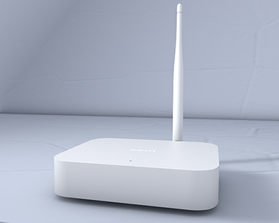
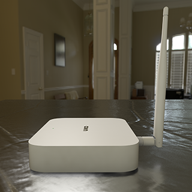

## Shanghai Stamp Technology Co., Ltd.

## Summary:

[Stamp Technology](www.stamp-tec.com) is a subsidiary of [Powerbridge Technologies Co., Ltd.](www.powerbridge.com) (NASDAQ: PBTS). Powerbridge Technologies has been committed to providing industry software consulting, design, R&D, operation and maintenance for communication operators, enterprises and institutions, and customs ports through advanced technologies such as the IoT, cloud computing, big data, and artificial intelligence. Orientation information service. In 2018, Powerbridge Technologies specially established Stamp Technology, focusing on the R&D and application of AI&IoT, blockchain, Metaverse and other technologies.

In terms of hardware, we provide rich and convenient digital and intelligent access capabilities, system integration capabilities and platform service capabilities through extensive research and deployment of smart terminal devices and IoT devices.

In terms of software, we devoted to research on new technology applications such as the IoT, Edge Computing、Big Data、Machine Learning、Block Chain etc, to realize the operation management of smart cities and the intelligent application of various business scenarios, and to realize the digital transformation of urban life.

## Company Information (required)
* What is the legal company name?
  * **Shanghai Stamp Technology Co., Ltd.**

* How long has the company been in business? 
  * **4 years**

* What kind of products have you created? (list specific products, include links if possible)
  * **[Smart Street Light](http://www.stamp-tec.com/1384)**
  * **[Intelligent Supervision Platform](http://www.stamp-tec.com/1543)**
  * **[Multimodal Transport Platform](http://www.stamp-tec.com/1556)**
  * **[Smart Park APP](http://www.stamp-tec.com/1573)**

* How many have you sold?
  * **The sales volume of the software, hardware products and solutions we developed for Powerbridge Technologies will be US$4.555 million in 2021. Revenue data for the past three years of parent company powerbridge, [View details](https://www.sec.gov/Archives/edgar/data/1754323/000121390022025838/f20f2021_powerbridge.htm). **
  

* What brought you to the Helium Network?
  * **We are an IoT company under a listed company, committed to the construction of the IoT ecosystem. The access and communication of IoT devices requires a complete network, and the construction of such a network requires a huge cost. Helium uses Block Chain technology to encourage users to widely deploy hotspot devices with small size, low power consumption, and long-distance transmission. The goal is to build a global decentralized distributed wireless hotspot network, which coincides with our idea . Therefore, we hope to promote the development of the IoT by integrating into Helium Network.**

## Product Information (required)
* Will this product be sold under the company name, or a different brand name?
  * **Sold under company name, CORN as brand name**

* What is this product's model name? (Hotspot models with different hardware will need a separate HIP19 application.)
  * **CORN-200**

* Is this is a Light Hotspot or a 5G Hotspot? (New applications should be for Light Hotspots or 5G Hotspots)
  * **Light Hotspot**

* Is this model for indoor, outdoor, or both? (If there are two different models for indoor and outdoor, list them separately.)
  * **Indoor**

* Provide a brief description of the product(s):
  * **CORN-200 is the first generation of Helium hotspot product developed by us, it uses a ROCKCHIP Quad-core Cortex-A55 64-bit processor and integrates SX1302+SX1250 LoRaWAN module and dedicated ECC608 module.**

* What is your approximate price point?
  * **$199**

* What is your expected production and delivery timeline?
  * **Submit PR to HIP 19 -- December 2022**
  * **Hardware audit -- December 2022**
  * **Onboarding integration -- January 2023**
  * **Pre-sale -- After Helium has approved the third party manufacturer audit, Expected end of February 2023**
  * **Shipping to customers -- March 2023**

## Previous shipments (required)
(If you're a startup, please include detailed information about your team's previous experience or information about company partners.)
* Have you shipped anything in the past?
  * **We mainly develop software, hardware and provide integrated solutions for the parent company. such as Smart Street Light with Lora gateway, Intelligent Supervision Platform, Multimodal Transport Platform.**

* What types of products have you shipped?
  * **IoT hardware devices, system software, integrated solutions, etc.**

* Which countries have you previously shipped regulatory approved products? (FCC, CE, etc.) 
  * **Our company's products are mainly sold in China, and provide technical services to the European and North American markets. We have rich experience in Scheme output and after-sales service.**

* If you are a startup, are you partnering with another company? What experience does your team have?
  * **Our cooperative companies are:**
    - [WPGINTERNATIONALLIMITED](https://www.wpgholdings.com/main/index/zhcn)
    - [Shenzhen cloudsight wireless Co., Ltd](http://www.cloudsight-wireless1.com/)
  * **The products we have developed are:**
    - [Smart Street Light](http://www.stamp-tec.com/1384)
    - [Intelligent Supervision Platform](http://www.stamp-tec.com/1543)
    - [Multimodal Transport Platform](http://www.stamp-tec.com/1556)
    - [Smart Park APP](http://www.stamp-tec.com/1573)

## Which countries do you plan to ship to and get regulatory certifications for? (required) 
  * **We plan to sell in EU countries and UK, plan to obtain CE and UKCA certification.**

## Customer Support (required)
* How will your customers be able to contact you for support for this products?
  * **We provide 7 * 24 hours after-sales service, users can contact us via [Email](stamp@corniot.com) and [Discord](https://discord.gg/TNMcfpSPwb).**

* How long will the company provide customer support?
  * **We provide a one-year warranty.**

* How are you planning to handle repairs and replacements?
  * **We provide online upgrade system, which can enable users to update to the latest version, and customers can mail the defective parts to our local dealer or our maintenance dot, and we will repair or replace the defective parts.**

## Hardware Security Element (required)
* The community is concerned about devices that can be easily hacked, specifically by copying their swarm_key files. Applications should include plan for how the devices will be secured. The approved security element is an ECC608. If you would like to use an alternative security element your HIP19 will require additional review, please email the Helium Foundation (christina@helium.foundation).
* Are you using an ECC608. Yes or No?
  * **Yes**

* Encrypted/locked-down firmware. Yes or No?
  * **Yes**

* Encrypted storage of the miner swarm_key, either via disk encryption or hardware measures. Yes or No?
  * **Yes**

* Encrypted buses, potting and other anti-tampering measures. Yes or No? (Please note, the final design will be audited against this statement. Do not answer 'yes' unless the design will have these features and a description of where they are implemented can be provided.)
  * **No**

* Willingness to submit a prototype for audit, and sharing those audit results publicly (pass or fail) Yes or No?
  * **Yes**

## Hardware Information (required) Please provide detailed hardware designs, including relevant parts.
Evidence of a functioning prototype - photos/videos. Renderings are OK but physical prototypes are much, much better.

* What are your plans for software setup and configuration for the devices?
This would includes remote updates and the ability for hosts to change wifi settings, via Helium's official app or otherwise.
  * **The OTA remote upgrade system can be realized through the built-in control console, and the Wifi settings can be changed by connecting to the Bluetooth through the mobile phone APP.**

* Which security implementation (ECC608, TPM, TrustZone, other) are you using?
  * **ECC608**

* Which LoRa chipset are you planning to use in your gateway? (We recommend you don't use the SX1301 in new designs.)
  * **SX1302+SX1250**

* What is the CPU?
  * **RK3566**

* Additional Hardware Specifications:
  | Hardware Specification |                                |
  |------------------------|--------------------------------|
  |Processor               |ROCKCHIP RK3566 Quad-core Cortex-A55 64-bit SoC @ 1.8GHz|
  |Security Element        |ATECC608|
  |Memory                  |1GB LPDDR4|
  |Storage                 |8GB eMMC Flash memory|
  |LoRaWAN                 |SX1302+SX1250|
  |LoRa Frequency Band     |EU868|
  |Bluetooth               |BLE4.2|
  |WiFi                    |2.4GHz IEEE 802.11b/g/n wireless LAN|
  |Ethernet                |RJ-45 (10M / 100 M)|
  |OTA                     |Support|
  |Input Voltage           |DC 12V - 2A|
  |Certification           |CE (Pending) / UKCA (Pending)|

## Manufacturing Information (required)
* Have you built and delivered radio hardware products before?
* Have you built gateways before?
  * **Yes，[Smart Street Light with Lora gateway](http://www.stamp-tec.com/1384)**

* How many gateways have you previously built?
  * **10000+**

* If you have not built gateways before, are you using a third party manufacturer or working with a partner? This is the single largest risk with most hardware ventures. If possible please provide information about your manufacturing partners and supply chain.
  * **[WPGINTERNATIONALLIMITED](https://www.wpgholdings.com/main/index/zhcn), [Shenzhen cloudsight wireless Co., Ltd](http://www.cloudsight-wireless1.com/).**

* Where are you sourcing your components from?
  * **[WPGINTERNATIONALLIMITED](https://www.wpgholdings.com/main/index/zhcn), [Shenzhen cloudsight wireless Co., Ltd](http://www.cloudsight-wireless1.com/).**

* How many radio modules/ concentrators can you procure? 
  * **We have sufficient supply chain protection, and there is no risk of out-of-stock.**

## Proof of Identity
Per typical KYC/AML procedures, proof of identity for major shareholders (25%+ ownership) will be expected to be provided privately to representatives from the Helium Foundation. This will be attested and publicly confirmed by those representatives. Details for this will be provided after your application has been submitted on GitHub.
 * **To be submitted privately to DeWi.**

## Budget & Capital (required)
* How many Hotspots are you planning to manufacture and sell within the first six months of sales?
  * **10000+**

* How much money will be required up-front? How much money do you have on-hand, and how much do you have access to?
  * **Our company is operating well with sufficient cash flow and reserves.**

* What is your plan for additional financing if required? (This is the second biggest risk in new hardware ventures, getting almost over the line and then running out of cash.)
  * **No**

## Risks & Challenges (required)
Please tell us about some of the challenges that would prevent these products from becoming a reality and how you might address them.
Who will develop the Hotspot onboarding and management app? Will it be an internal team or external company?
  * **Our team has several members with more than ten years development experience who are responsible for developing the Hotspot onboarding management application. We actively answer and solve Helium project issues. For example: make-start-app issue [#48](https://github.com/helium/maker-starter-app/issues/48) [#46](https://github.com/helium/maker-starter-app/issues/46).**
  * **The digital currency market is turbulent, and users are worried that the cycle of investing in Helium hotspot mining machines to obtain income is too long, and they may not be enthusiastic about deploying hotspot networks. We plan to develop more and more practical IoT application scenarios devices for the market, and encourage users to deploy and use the Helium network.**

## Payment methods available (required):
  * **Digital currencies supported by the coinbase, such as USDC.**

## Contact Information 
<b>If you do not provide contact information and/or if the company website does not work, we will not review your proposal and the HIP19 application will be automatically denied.</b>
* Contact Email (a company email is required) - stamp@corniot.com
* Company Website (required) - http://www.stamp-tec.com
* Shop Website - http://www.corniot.com
* Discord - https://discord.gg/TNMcfpSPwb
* Twitter - https://twitter.com/CORN_IoT