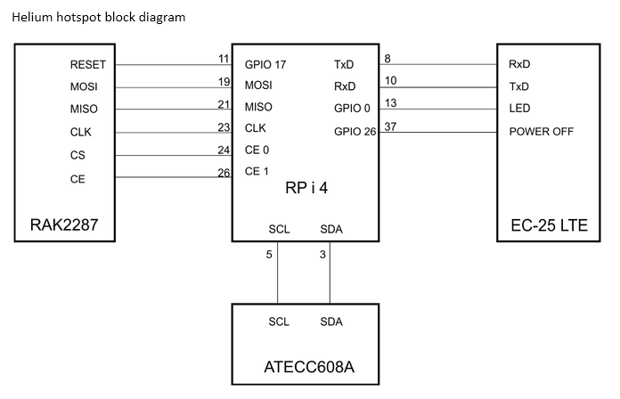
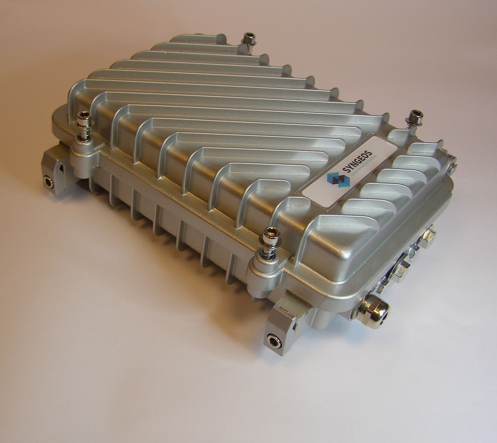
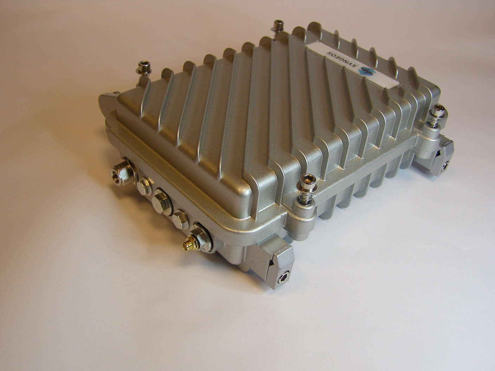
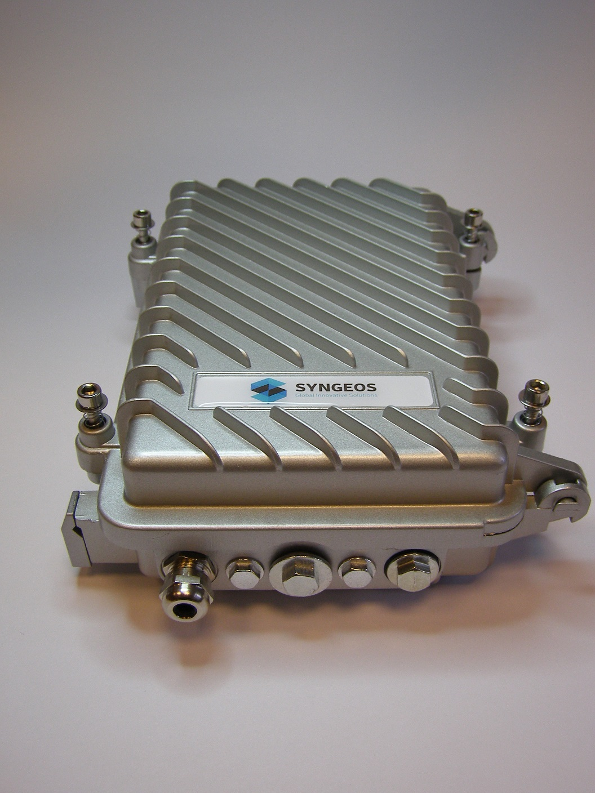
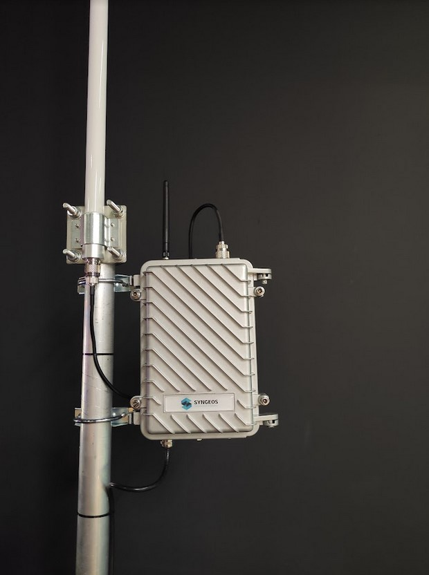

## Global Innovative Solutions

Application to become an approved third party manufacturer as per HIP19. All questions must be answered. Any missing information will result in delays.
## Summary

The Global Innovative Solution have built a nation-wide air quality monitoring system, an IoT based network utilizing air quality and weather sensors and various communication technologies such as 4G, LoRaWAN, WiFi to transfer data to the cloud server. We provide both end sensor devices as well as server side applications. Our aim is to cover European countries with dense air quality and weather sensor network and offer complete solutions based on collected data.  
We would be proud if our hotspot can become a certified Helium Hotspot and our company can take advantage of existing experience with building large scale IoT networks to provide high quality Helium hotspots to our customers.

## Company Information (required)
* What is your company name?

  SYNGEOS Global Innovative Solutions

* How long have you been in business?

  The Global Innovative Solution company was established in 2017.

* What kind of products have you created?

  We’ve designed, manufactured and been actively developing and maintaining a nation-wide IoT (Internet of Things) based air quality monitoring system deployed in over 2500 locations (as of January 2022 and increasing). It is one of the two biggest and most popular air quality systems in Poland. Our system consists of devices communicating with the central cloud server via 4G GSM network, fixed internet connections, and LoRa WAN.  For LoRa gateways the cloud server exposes Semtech packet forwarder protocol endpoint.
  System acquires air quality data (including PM1, PM2.5, PM10, concentration of gasses such as CO2, SO2, NO2, O3) as well as weather data (temperature, humidity, pressure). Current coverage is presented on a map at http://www.panel.syngeos.pl
  Apart from web application we also provide mobile applications for iOS and Android available in App Store and Google Play to download.

* How many have you sold?

  We have sold over 2500 air quality sensor devices. Majority of devices have been sold in subscription models to over 500 local governments and public institutions in Poland.

* What brought you to Helium?

  We are developing a nation-wide Internet of Things network with more than 2500 locations which is an ideal asset to build radio network such as LoRa. We can take advantage of the solid customer base and IoT network locations we built. Although the majority of our IoT network uses 4G technology we have designed and developed LoRa gateway and LoRa air quality station compatible with our air quality system. We are eager to join the Helium project to develop new technologies and be involved in the Helium community. We think our experience and assets perfectly fit into the Helium Hotspots technology and business model.

## Product Information (required)
* What is this product's model name or model number?

  Syngeos Helium Hotspot, model SHL-01/01/22

* Is this is Light Hotspot or Full Hotspot? (please submit two separate applications for Full and Light hotspots)

  We are planning to produce Full Hotspot.

* Is it for indoor or outdoor?

  We are planning to produce outdoor devices.

* Provide a brief description:

  The hotspot in IP67 waterproof enclosure with various fastening options (wall, mast). Various antennas mounted directly to the RP-SMA connector or via wire. Hotspot powered by 230V AC as a standard, however optionally can be powered by solar panels.  Our hotspots are tested in an environmental test chamber.

* What is your approximate price point?

  The price is approximately EUR 1000 per device. At the later stage, after the first production batch is delivered, we are planning to optimize production costs.

* What is your expected production and delivery timeline?

  We are capable of manufacturing 1000 hotspots monthly with delivery time up to 3 months once the global semiconductor supply chain is back to normal in 2022. We plan to increase the production capacity in 2023.
    * Production and delivery timeline:
    * Hardware prototype - ready
    * Software development - June 2022
    * CE certification -  July 2022
    * Helium certification -  September 2022
    * First batch product delivery - October 2022

## Previous shipments (required)

* Have you shipped anything in the past? What types of products have you shipped?

  We’ve produced 2500 devices to date and are actively manufacturing and delivering new devices.

* Which countries have you previously shipped regulatory FCC or CE approved products?

  Our products are CE approved, and we've shipped them to Poland.

## Which countries do you plan to ship to and get regulatory certifications for? (required)

We are ready to ship our products to EU countries. Poland is a member of the EU and no further regulations and certifications are required to sell to the EU countries (free movements of goods in the EU internal market).

## Customer Support (required)
* How will your customers be able to contact you for support for your products?

  Clients will be able to reach us through telephone, online chat, email.

* For how long?

  We provide customer support and have a proven technical department including mobile technical stuff for all our products including Helium hotspots. We plan to provide a 1 year warranty to our hotspots.

* How are you planning to handle repairs and replacements?

  Repairs and replacements time is up to 3 business days in Poland and up to 5 business days within the EU.

## Hardware Security Element (required)
* The community is concerned about devices that can be easily hacked, specifically by copying their swarm_key files. Applications should include plan for how the devices will be secured. The approved security element is an ECC608. If you would like to use an alternative security element your HIP19 will require additional review, please email Dewi (christina@dewi.org).

* Are you using an ECC608. Yes or no?

  Yes, we use ECC608 chipset for encryption.

* Encrypted/locked-down firmware. Yes or no?

  Yes, we plan the firmware to be encrypted.
  The firmware will be locked-down.

* Encrypted storage of the miner swarm_key, either via disk encryption or hardware measures. Yes or No?

  Yes, the swarm_key will be encrypted and stored inside the ECC608 chipset.

* Encrypted buses, potting and other anti-tampering measures. Yes or No?

  The device is not equipped with USB connectors, nor SD card so that none of the external devices can be connected. This minimizes the risk of tampering the software and configuration. The case is secured by an anti sabotage switch and user is notified when the case is open by unauthorized person.

* Willingness to submit a prototype for an audit, and sharing those audit results publicly (pass or fail) Yes or No?

  Yes, we have a prototype and are ready to submit it for an audit. We will share audit results publicly.

## Hardware Information (required). Please provide detailed hardware designs, including relevant parts.
Evidence of a functioning prototype - photos, videos. Renderings are OK but physical prototypes are much, much better.

The hotspot is based on a custom design PCB (main board) and contains the following components:
* Raspberry Pi CM4 with eMMC (2GB RAM/32GB eMMC)  memory chipset. Since Raspberry Pi has confirmed it expects supply chain issues in 2022 we have used Raspberry Pi 4 (4 GB RAM/32 GB microSD) in the prototype however we are planning to replace it with Raspberry Pi CM4 once it is available on the market.
* RAKWireless RAK2287 gateway with mPCIe connector (!)
* QUECTEL Modem EC-25 LTE with mPCIe connector (!)
* Security chipset Microchip ATECC608CC
* Power supply: INPUT 230 VAC OUTPUT 5V/3A (optionally INPUT 24V DC)
* NEBRA outdoor IP67 enclosure . In the future we are expecting to design and manufacture enclosure by our own to optimize costs and be less depended on suppliers
* LoRa 868 MHz antenna Fiberglass 5dB  N-Female - RP-SMA -600 mm
* LTE antenna 8dB SMA -190 mm

(!) By using mPCIe connectors in the hotspot design the aforementioned RAK gateway and modem can be replaced with equivalent products. We want the design to be flexible enough to tackle global semiconductor outages and supply chains issues.
The block diagram and photos of functioning prototype has been shown below:

Photos of functioning prototype:

* What are your plans for software setup and configuration for the devices?
  This would include remote updates and the ability for hosts to change WiFi settings, via Helium's official app or otherwise.

  The device has a built-in web based administrator panel for setup and device configuration. The Quick Start Guide is provided for an easy setup. Setup can be completed by connecting the computer with a web browser via Ethernet connection.
  SSH access is enabled for advanced configuration. SSH access is only provided via Ethernet connection for security.
  The hotspot is equipped with LTE modem and can be managed remotely via a management application (Helium’s official app) located on a cloud server. The remote management included software updates.

* Which security implementation (ECC608, TPM, TrustZone, other) are you using?

  We use Microchip ATECC 608 for security

* Which LoRa chipset are you planning to use in your gateway? (i.e. SX1302, SX1303, etc, only list one)
  We recommend you don't use the SX1301 in new designs.

  We use SX1302/03 chipsets.

* What is the CPU?

  Broadcom BCM2711, Quad core Cortex-A72 (ARM v8) 64-bit SoC @ 1.5GHz

* Other Hardware Specifications:

  Dimensions: 235mm x 155mm x 75mm
  Weight: 1.4 Kg
  Operational temperature: -20 °C … 65  °C
  Operational relative humidity: 0% … 99% RH

## Manufacturing Information (required)
* Have you built and delivered radio hardware products before?

  We have built LoRa and LTE devices.

* Have you built gateways before?

  We have built LoRa gateway based on packet_forwarder software by Semtech using IMST iC880A-SPI LoRaWAN Concentrator with SX1301 chipset.

* How many gateways did you make?

  We have made and deployed 50 LoRa gateways and 2500 LTE

* If you have not built gateways before, are you using a third party manufacturer? This is the single largest risk with most hardware ventures. If possible please provide information about your manufacturing partners and supply chain.

  We plan using RAKWireless concentrators for the Helium gateway project.

* Where are you sourcing your components from?

  For Raspberry Pi we plan using various suppliers. For PCB and case we plan to cooperate with local suppliers we have been working with earlier.

* How many radio modules/ concentrators can you procure?

  Radio component volume we can procure will depend on hotspots orders

## Proof of Identity
Per typical KYC/AML procedures, proof of identity for major shareholders (25%+ ownership) will be expected to be provided privately to representatives from Helium Inc or DeWi board members. This will be attested and publicly confirmed by those representatives.
Contact details for this will be provided after your application is submitted on GitHub.

Proof of identity will be completed after application is submitted and shared via private channel as per requirements.

## Budget & Capital (required)
* How many hotspots are you planning to manufacture and sell within the first six months of sales?

  We are capable of producing up to 6000 hotspots within the first six months. Given global supply chain issues the plan will be further adjusted.

* How much money will be required up-front? How much money do you have on-hand, and how much do you have access to?

  We may invest 1000000 EUR to start the Helium project as well as for production and delivery.

* What is your plan for additional financing if required? (This is the second biggest risk in new hardware ventures, getting almost over the line and then running out of cash.)

  Our regular IoT business is growing fast. We have been signing 30-50 agreements every month which  guarantees constant growth and stability. We have received deferred payment terms from many of our suppliers.

## Risks & Challenges (required)
Please tell us about some of the challenges that would prevent these products from becoming a reality and how you might address them.

Due to pandemic global supply chains are broken. We are experiencing semiconductor shortages and find this to be the biggest risk today. Depending on components availability we plan to build an internal stock as a buffer. Additionally we have designed the hotspot to be as flexible as possible in terms of avoiding vendor locks and being able to use alternative suppliers.

## Other information if you do not provide contact information we cannot review your proposal.
## Contact Info
* Contact Email (required) - info@syngeos.pl
* Website (required) - https://syngeos.pl/
* Twitter profile -
* Facebook profile - https://www.facebook.com/syngeos
* Other social profiles - https://www.linkedin.com/company/18122968/admin/

## Payment methods available (required):
We currently accept customer credit card payment / paypal / or bank wire.

