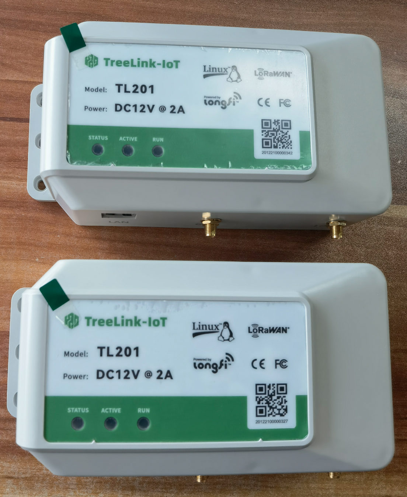
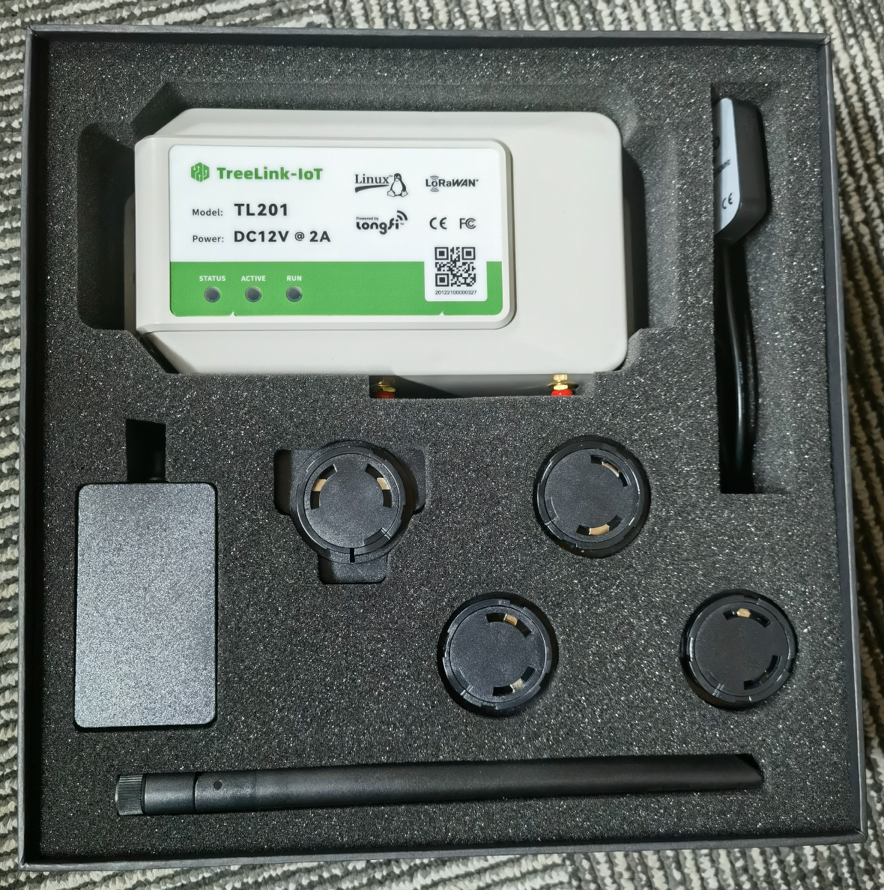

## Hangzhou ShuLian Technology Co., Ltd.

Application to become an approved third party manufacturer as per HIP19. All questions must be answered, any missing information will result in delays.
## Summary

## Company Information (required)
* What is your company name?
* Hangzhou ShuLian Technology Co., Ltd.

* How long has the company been in business? 
* Since 2021

* What kind of products have you created? (list specific products)
* We focus on low power iot, LPWAN IOT solutions and hardware production. Such as IoT gateways, IoT end devices, IoT sensors, IoT modules. Our founding team is the first batch of LoRaWAN modules and gateways in China.

* How many have you sold? 
* 500K

* What brought you to the Helium Network? 
* We are impressed by Helium concept and it’s business future. Helium blockchain is a very good business model for IoT promotion. We hope to be able to do more applications under helium's network coverage in the future. We now have Lorawan-based terminal products, such as parking-sensor & charging-socket & smok-sensor & rubber-tapping-robot etc, and used in Europe/Middle East/China/Southeast Asia/South Korea and other regions.

## Product Information (required)
* What is this product's model name? 
* TreeLink Light Hotspot TL301

* Is this is Light Hotspot? Y/N (Due to the time required for the HIP19 process, new applications should be for Light Hotspots only)
* Y

* Is this model for indoor, outdoor, or either? (If there are two models, list them separately)
* Indoor

* Provide a brief description of the product:
* What is your approximate price point? 
* $260

* What is your expected production and delivery timeline? 
- Hardware prototype: 04/15/2022
- Software development: 04/30/2022
- Radio Frequency certification: 06/20/2022
- Helium Certification: 06/25/2022
- First batch product delivery: 07/10/2022

## Previous shipments (required)
Startups welcomed!
* Have you shipped anything in the past? What types of products have you shipped?
* Yes

* Which countries have you previously shipped regulatory approved products? (FCC, CE, etc.) 
* China, CNAS

* If you are a startup, are you partnering with another company? What experience does your team have?
* We have embedded software and hardware design experience and product mass production experience.

## Which countries do you plan to ship to and get regulatory certifications for? (required)

## Customer Support (required)
* How will your customers be able to contact you for support for your products? 
* The client will be able to reach us through telephone, online chat, and email. 

* How long will the company provide customer support? 
* We plan to provide 1 year warranty to our products.

* How are you planning to handle repairs and replacements? 
* We will stock products in US and Germany for replacement. Products will be repaired in Hangzhou China.

## Hardware Security Element (required)
* The community is concerned about devices that can be easily hacked, specifically by copying their swarm_key files. Applications should include plan for how the devices will be secured. The approved security element is an ECC608. If you would like to use an alternative security element your HIP19 will require additional review, please email Dewi (christina@dewi.org).
* Are you using an ECC608. Yes or No?
* Yes

* Encrypted/locked-down firmware. Yes or No? 
* Yes

* Encrypted storage of the miner swarm_key, either via disk encryption or hardware measures. Yes or No?
* Yes

* Encrypted buses, potting and other anti-tampering measures. Yes or No? (Please note, the final design will be audited against this statement. Do not answer 'yes' unless the design will have these features and a description of where they are implemented can be provided.)
* No

* Willingness to submit a prototype for audit, and sharing those audit results publicly (pass or fail) Yes or No?
* Yes

## Hardware Information (required) Please provide detailed hardware designs, including relevant parts.
Evidence of a functioning prototype - photos/videos. Renderings are OK but physical prototypes are much, much better. 

Figure 1. Light Hotspot TL301

Figure 2. Light Hotspot

* What are your plans for software setup and configuration for the devices? This would includes remote updates and the ability for hosts to change wifi settings, via Helium's official app or otherwise. 
* We will develop an app based on the official sdk.

* Which security implementation (ECC608, TPM, TrustZone, other) are you using? 
* ECC608

* Which LoRa chipset are you planning to use in your gateway? (We recommend you don't use the SX1301 in new designs.) 
* SX1302 + SX1250

* What is the CPU?
* Broadcom BCM2711 quad-core Cortex-A72 (ARM v8) 64-bit SoC @ 1.5GHz (raspberrypi CM4 module ｜ CM1001008)

* Other Hardware Specifications: 
-1 GB LPDDR4
-8 GB on board EMMC chip
-Bluetooth 5.0
-Network connection to 2.4ghz and 5.0ghz IEEE 802.11AC wireless
-Gigabit Ethernet

## Manufacturing Information (required)
* Have you built and delivered radio hardware products before?
* Yes, We have been engaged in the design of wireless products. We have a professional RF design team, including antennas, PCBs, and schematics. And we also have factory to manufacture the gateway. We have a complete radio frequency test equipment.

* Have you built gateways before? 
* Yes, We have many IoT gateway products.

* How many gateways did you make? 
* 10K

* If you have not built gateways before, are you using a third party manufacturer? This is the single largest risk with most hardware ventures. If possible please provide information about your manufacturing partners and supply chain.
* We have a long history of business relationships with trusted manufacturing partners and have successfully delivered major projects over the years.

* Where are you sourcing your components from? 
* Semtech China & Microchip China & Element14

* How many radio modules/ concentrators can you procure? 
* 250K

## Proof of Identity
Per typical KYC/AML procedures, proof of identity for major shareholders (25%+ ownership) will be expected to be provided privately to representatives from Helium Inc or DeWi board members. This will be attested and publicly confirmed by those representatives.
Details for this will be provided after your application is submitted on GitHub. 
* We are willing to provide contact information and identification via email.

## Budget & Capital (required)
* How many hotspots are you planning to manufacture and sell within the first six months of sales? 
* We plan to make 60k in 2022 and 100K in 2023.

* How much money will be required up-front? How much money do you have on-hand, and how much do you have access to? 
* We reserved `US$3M` to support this project initially, more to invest according to the progress of project.

* What is your plan for additional financing if required? (This is the second biggest risk in new hardware ventures, getting almost over the line and then running out of cash.) 
* Our business is profitable, the shareholders could invest `US$5M` fund to support this project. We have cooperative investors who can invest `US​$5M` after our shipments exceed 25K.

## Risks & Challenges (required)
Please tell us about some of the challenges that would prevent these products from becoming a reality and how you might address them.
* The main risk is the continuity of the materials used to manufacture the product and maintaining sufficient quantity in the warehouse to fill any shortage of shipments. In addition to marketing the product and opening new markets, we will keep advancing to market the product. The time we spent doing helium integration testing and the time we spent communicating with each other to solve the problems encountered in the process.

## Other information if you do not provide contact information we cannot review your proposal
## Contact Info 
* Contact Email (required) - support@treelink-iot.com
* Website (required) - www.treelink-iot.com
* Twitter profile - https://twitter.com/Treelinkiot
* Facebook profile - https://www.facebook.com/Treelinkiot
* Discord - 
* Other social profiles - 

## Payment methods available (required):
Available payment methods:
Most credit cards, including Visa, Mastercard, AMEX;
Apple Pay, PayPal, JCB, Alipay, UnionPay, wechat Pay, crypto currency (USDT) and bank transfer.

