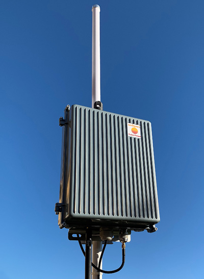
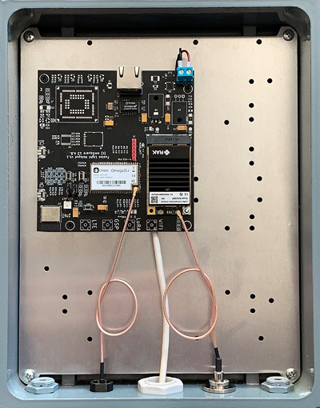

# omSquare

Application to become an approved third party manufacturer as per HIP19

## Summary

This is a certification requirement of 'Fusion Hotspot', Helium light gateway made by omSquare s.r.o, Czech republic (EU)

## Company Information
omSquare s.r.o. is a company from the Czech Republic (EU) designing a variety of hardware and software solutions for our business partners. 
Among the customers are Internet Service Providers, Logistics companies and Payment processing companies. We started as an R&D company
designing mainly customized hardware and firmware products, with the advantage of cloud-based software development.

We have a strong team of experienced professionals in the field of project management, architecture, software design, hardware design and manufacturing.

We grew up and succeeded thanks to the possibility of using open-source software. Because of this, we contribute to various open-source projects, 
namely Zephyr, Micropython, LLVM.

Here is the list of relevant products we have designed and produced:

- Smart Parcel Boxes for large parcel delivery company with Bluetooth Low Energy communication with mobile devices  - over 18000 installations as today
- Ethernet PoE switch for ISP utilizing only customers power supply without the need to use common house electricity - over 2500 pieces delivered
- IP watchdog for ISP - over 8200 pieces delivered
- Vending machines serving cold and fresh beer, 20 units lend to various season actions
- 2.4GHz and 5GHz microstrip antennas for ISP wifi hotspots - over 7800 of sector antennas distributed to top local ISP
- PIR sensors utilizing battery and Bluetooth mesh technology - complete design for a business partner, production is outsourced

All product we have designed operates only in EU countries and have CE certification.

We are crypto-enthusiasts and that's why we found the Helium network as a perfect place to make use of our experience from hardware, software and crypto.

From a business perspective the Fusion Light Hotspot is our first retail product, however, we are convinced that we can take advantage of our previous 
experiences and at the same time expand our business.

## Product Information

### Fusion Light Hotspot

Fusion Light Hotspot is Helium Light Hotspot primarily designed for outdoor installation but suitable for running indoor as well.

**Status:** Ready to start production

**Expected release date**: Q1 2022

**Estimated price**: 400 EUR

Our goal is to provide industry-grade products for covering large-scale and uninhabited areas (eg agriculture fields) as we observe that there is increased demand for utilizing IoT devices but at the same time customers have concerns about vendor locks due to monopolized WAN/MAN network providers.

**Hardware Design**

Fusion Light Hotspot gateway is a custom design based on
- Onion Omega 2S+ Computer module (Mediatek MT7688, mipsle architecture) running customized OpenWrt Linux
- RAK2287 mPCIE LPWAN Concentrator with Semtech SX1302 chip and ZOE-M8Q GPS
- Microchip ATECC608 for pki/crypto operations
- Espressif ESP32-C3 for BLE support
- providing Wifi, BLE and Ethernet connectivity
- primarily intended for outdoor use i.e. IP65 waterproof enclosure

All chosen components have been proved in many industrial and retail products.

**Software Design**

Fusion Light Hotspot uses standard Helium software gateway-rs and Semtech lora packet forwarder.
Custom software solution for onboarding, management, monitoring and software updates is implemented to ensure our customers with reliable and smooth operations. 

We want to ship Fusion Light Hotspot only in EU countries and thus adapt radio parts strictly to comply with EU legislative.

### Cold Fusion Light Hotspot

Cold Fusion Light Hotspot is Helium Light Hotspot primarily designed only for outdoor off-grid installation.

**Status:** Currently in development

**Expected release date**: Q4 2022

**Estimated price**: 500 EUR 

Cold Fusion Light Hotspot is a subsequent product from Fusion Hotspot family intended for running off-grid for covering uninhabited areas. 

**Hardware Design**

It shares the same design as Fusion Light Hotspot with those differences:

- integrated 4G/LTE Modem to access IP network
- integrated MPPT Solar battery charger
- suitable Solar panel and battery included

## Expected production and delivery timeline

Manufacturing plan for Fusion Light Hotspot
- manufacture first batch of 200 units (Q1 2022)
- manufacture next batches per 1000-3000 units quarterly

## Previous shipments
No previous shipments of Fusion Light Hotspot.

## Customer Support
Our primary goal is to deliver high-quality products while considering providing effective support for them.
Discord is our primary communication channel with the strength to guide users directly to dedicated Discord channels where our experts and community can help very effectively.

We provide a standard two-year warranty for any defects not caused by the user. 
Our primary focus is on Central Europe, so shipment of spare parts or device replacement should be quick and efficient.

## Hardware Security Element
ATECC608A for secure storage of swarm_key is used in accordance with HIP 19 requirements. Standard gateway_mfr is used for initial provisioning.
Optional support for SLS32AIA is currently in development (not a subject of actual approval).
* Encrypted/locked-down firmware - NO 
* Encrypted storage of the miner swarm_key. - YES - ATECC608A
* Encrypted buses, potting and other anti-tampering measures - NO
* Willingness to submit a prototype for audit, and sharing those audit results publicly (pass or fail) - YES

## Hardware Information
- Onion Omega 2S+ Computer module 
- RAK2287 mPCIE LPWAN Concentrator with Semtech SX1302 & SX1250s
- ATECC608A for pki/crypto operations

## Manufacturing Information
We have designed custom radio protocols using Silabs FMSK radio chip in ISM (868MHz) band. We have also designed Bluetooth Low energy devices and also design custom antennas for these products. We also designed sector antennas in 2.4GHz and 5GHz bands for local ISP providers. We have experience in theoretical antenna design using modern design software (Sonnet suite mainly) and also have the equipment to measure S-parameters in our lab. We also build power delivery and antennas for Mikrotik router boards based gateways.

We are capable of producing batches of about one hundred devices per day on our production line. We own stencil printers, pick and place machines and vapour-phase soldering machine capable to solder BGA chips.

## Proof of Identity

Submitted and verified by DeWi.

## Budget & Capital
Fusion Light Hotspot production will be funded from private funds of omSquare and shareholders.
For the initial stage, we have reserved hundreds of thousands EUR.

It includes 
- product design
- certification
- manufacturing of the first batch of 200 units (Q1 2022)
- manufacturing of next batch 1000-3000 units 

We are in touch with potential private and institutional investors in case we need to significantly extend our production capacity.

## Risks & Challenges
The COVID-19 pandemic caused a global chip shortage. The global lack of a chip will last at least until the second half of 2022, some possibly until the end of 2022. We are in process of pre-ordering the most important components.

## Other information
* Contact email <info@omsquare.com>
* [Fusion Hotspot Discord profile](https://discord.gg/BZPShbNXYb)
* Website [www.fusionhotspot.io](https://www.fusionhotspot.io)

## Payment methods available 
* Payment Card for fiat transfers
* Cryptocurrencies (BTC lighting gateway and various altcoins will be accepted)

## Which countries do you plan to ship to and get regulatory certifications for? 
Our primary focus is on Central Europe.

