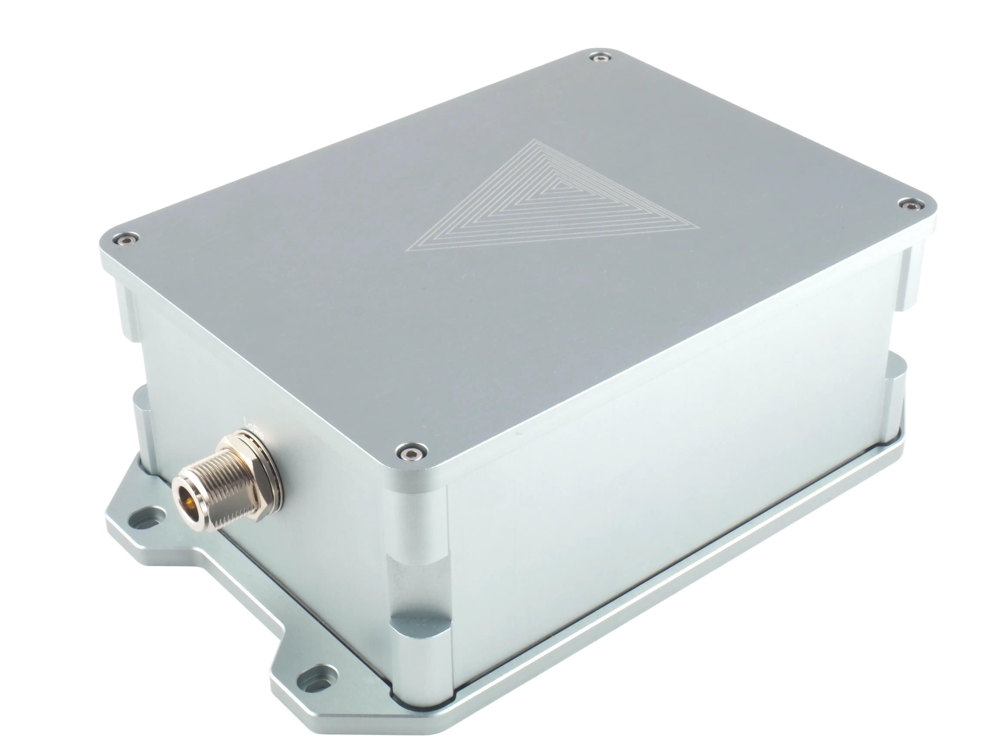
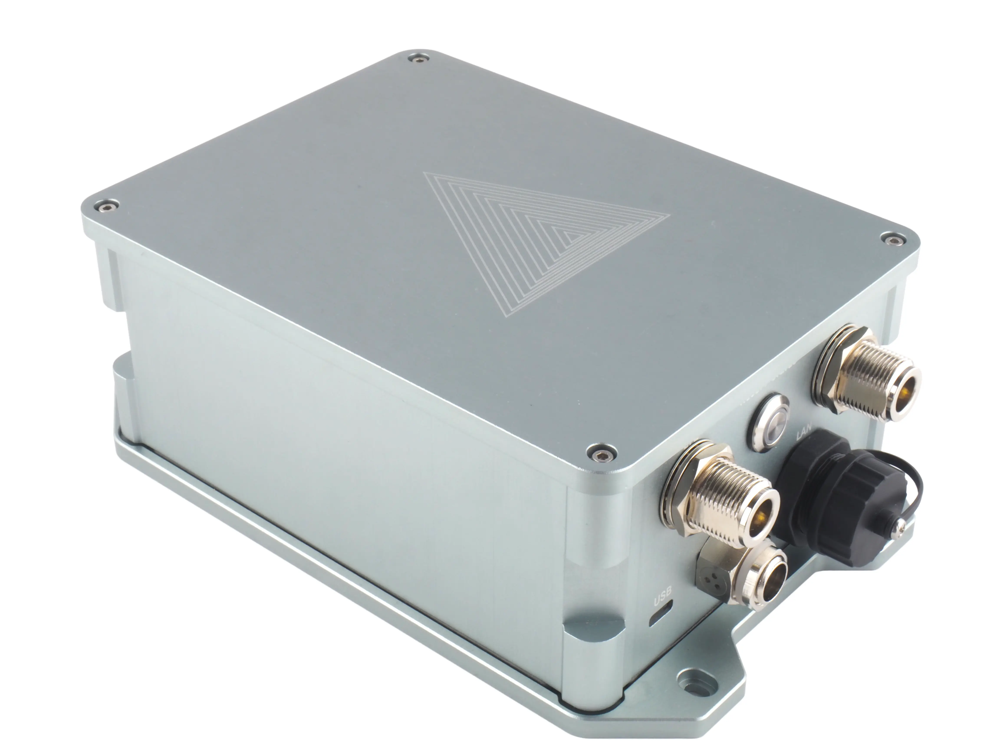

## tapdo technologies GmbH

Application to become an approved third-party manufacturer as per HIP19. 

## Summary:
The QuantumLink is a LoRaWAN Helium hotspot developed bei tapdo technologies.  

## Company Information (required)
We are a Germany-based IoT company founded in 2017. We started as a hardware startup developing and producing the tapdo IoT button which was funded on [Kickstarter](https://www.kickstarter.com/projects/1550573257/tapdo-the-fingerprint-button-to-assign-over-20-fun) in 2017. 
Since 2018 we extended our business to develop IoT turnkey solutions for industrial customers including hardware and cloud software. We have developed and sold LoRa devices since 2018 (e.g. BLE/LoRaWAN pressure measurement devices). 
The development of a LoRaWAN Helium hotspot complements our portfolio coherently, and we are able to provide our customers with a better overall package.
By opening up to the consumer market, we also want to open up new business areas and attract the attention of new customers in the industrial environment.

## Product Information (required)

| Question                                  | Answer                                        |
|-------------------------------------------|-----------------------------------------------|
| product's model name                      | QuantumLink                                   |
| Light Hotspot or a 5G Hotspot?            | Light Hotspot (potential upgrade to Wi-Fi 6E) |
| model for indoor, outdoor, or both        | both                                          |
| approximate price point                   | $700                                          |
| expected production and delivery timeline | Q4/2022                                       |

The QuantumLink is a Light Hotspot for outdoor use (IP65). Nevertheless, the stylish aluminum housing in light gray also makes the hotspot an eye-catcher indoors. At its core, the hotspot is based on the Raspberry Pi CM4 with at least 1 to 4 GB RAM. 8 GB of flash memory are built-in. The hotspot is connected via LAN or Wifi. Via a mini PCIe slot an expansion with a 4G modem is also possible. These features make the Hotspot an ideal candidate for off-grid use. A Wi-Fi 6E card can also be installed as an alternative to the 4G modem. With this we hope to be able to support the Wifi subDAO (HIP-64) in the future.
The software is based on balena OS. We plan to offer a custom online dashboard that monitors the devices 24/7 and enables fleet operators to efficiently manage their fleet remotely and independently of the helium network.

## Previous shipments (required)
We have built and shipped several thousand IoT devices to B2B customers. However, we do not have much experience with the distribution of products to end customers. 
For this reason, we have hired a professional store manager with several years of experience and commissioned an agency to set up the infrastructure. For us, it is a high concern to continue the quality of our product also in sales and service.

## Which countries do you plan to ship to and get regulatory certifications for? (required) 
At the beginning, we plan to sell in the European market starting with Germany, Austria and Switzerland. The mandatory CE marking for this is intended. An opening for further markets is being planned, but is not quite concrete yet.

## Customer Support (required)
Support is available via Discord, email, website and telephone (8h/day). There are no plans to end the support to a certain time. We offer repairs within the scope of the legal warranty of 2 years. 
Even if the hotspot is once no longer supported by us, it should be easily repairable by the user in most cases. In terms of sustainability, all parts in the hotspot are easily accessible. The modular design with the Raspberry Pi Compute Module and the Concentrator Card allow a simple replacement of defective components.  

## Hardware Security Element (required)

| Question                                                                                              | Answer       |
|-------------------------------------------------------------------------------------------------------|--------------|
| Are you using an ECC608?                                                                              | Yes          |
| Encrypted/locked-down firmware?                                                                       | No           |
| Encrypted storage of the miner swarm_key, either via disk encryption or hardware measures.            | Yes (ECC608) |
| Encrypted buses, potting and other anti-tampering measures.                                           | No           |
| Willingness to submit a prototype for audit, and sharing those audit results publicly (pass or fail)  | Yes          |

## Hardware Information (required) 

### General
* Raspberry Pi CM4 Compute Module with 1GB to 4GB RAM 
* Storage: 8GB
* Concentrator based on the Semtech SX1302 with ADR and LBT
* ECC608 secure element
* WiFi: 2.4/5GHz IEEE802.11 b/g/n/ac wireless,
* Ethernet Connectivity 10/100 Mbps (RJ45)
* Bluetooth: 5.0/BLE
* RGB-LED for status
* Push button

### LoRa Parameter
* Frequency Band: 868MHz (frequency optimized)
* Communication: Helium, LoRaWAN
* Modulation: LoRa
* Mode: Half duplex
* Receive 8 LoRa channels multi-data rates (SF5 ~ SF12 / 125 simultaneously kHz) + 2 mono-data rate (LoRa 250/500kHz and FSK 50kbps)
* Listen before talk (LBT). The device will enter Rx mode and check the interference signal level before starting the transmission. 
* Adaptive Data Rate (ADR). ADR allows to easily scale a LoRaWAN network and can drastically increase the capacity of the network
* LNA - Low Noise Amplifier for maximum receiving sensitivity (Receiving sensitivity up to - 140dBm)
* PA - Power Amplifier for boost transmission performance (maximum output power +27dBm, software controlled to meet regulations)

### Connectivity
* LoRaWAN Concentrator with N-Type connector (female)
* WiFi (N-Type connector)
* Ethernet (RJ45) with optional PoE
* Mini PCIe card slot (for optional 4G card) and N-Type connector
* SIM card slot (nano)
* SD card slot
* USB-C power connector (for indoor use)
* Power connector for  DC12V 2A required  (9V - 15V)

## Manufacturing Information (required)
| Question                                                                                                                                                                                                                                 | Answer                                                                                                                                                                                    |
|------------------------------------------------------------------------------------------------------------------------------------------------------------------------------------------------------------------------------------------|-------------------------------------------------------------------------------------------------------------------------------------------------------------------------------------------|
| Have you built and delivered radio hardware products before?                                                                                                                                                                             | Yes                                                                                                                                                                                       |
| Have you built gateways before?                                                                                                                                                                                                          | Yes                                                                                                                                                                                       |
| How many gateways did you make?                                                                                                                                                                                                          | 350                                                                                                                                                                                       |
| If you have not built gateways before, are you using a third party manufacturer? This is the single largest risk with most hardware ventures. If possible please provide information about your manufacturing partners and supply chain. | We do the final assembly and firmware upload at our facility, but rely on a local EMS service provider we have worked with frequently in the past to manufacture and assemble the boards. |
| Where are you sourcing your components from?                                                                                                                                                                                             | We buy our components only from official distributors or directly from the manufacturer. We leave the procurement of non-critical passive components to the EMS service provider.         |
| How many radio modules/ concentrators can you procure?                                                                                                                                                                                   | 3000 hotspots in Q4/2022                                                                                                                                                                  |

## Proof of Identity
We'll submit the information to DeWi.

## Budget & Capital (required)
We run a stable business and financed the development of the Hotspot. We have secured materials for an initial batch of 3.000 hotspots, including LoRaWan chips and the Raspberry Pi compute modules.

Additionally, we have a powerful investor backing the project.

## Risks & Challenges (required)
Risks lie in the availability of individual components (chip crisis). Supply is assured for the first series of 3000 units. If certain parts are then no longer available, it may be necessary to replace them with alternative components. Depending on the component, a further audit would be necessary.

## Payment methods available (required):
* Credit Card
* PayPal
* Klarna
* Amazon Pay
* Bank transfer
* …

## Contact Information 
* Contact Email: [info@tapdo.io](mailto:info@tapdo.io)
* Website: https://tapdo.io/

