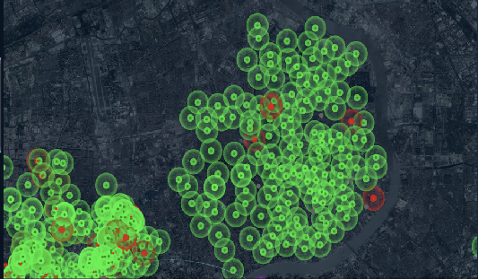
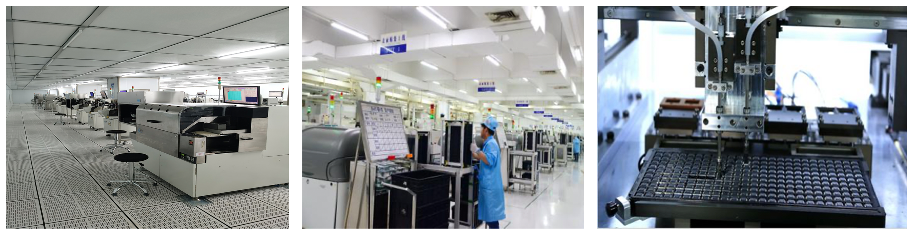
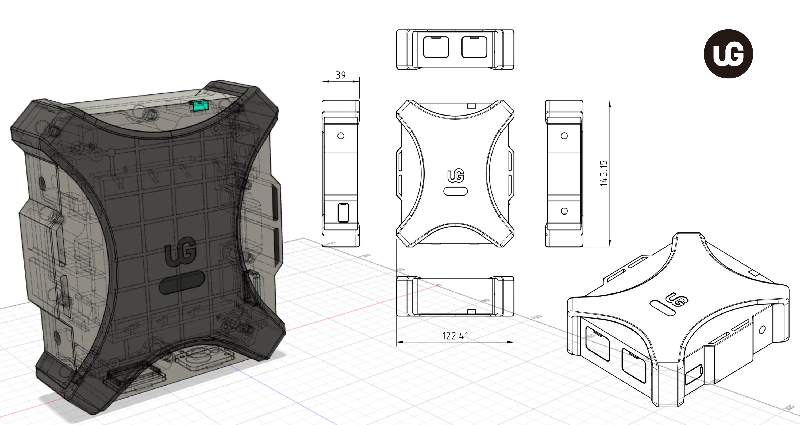
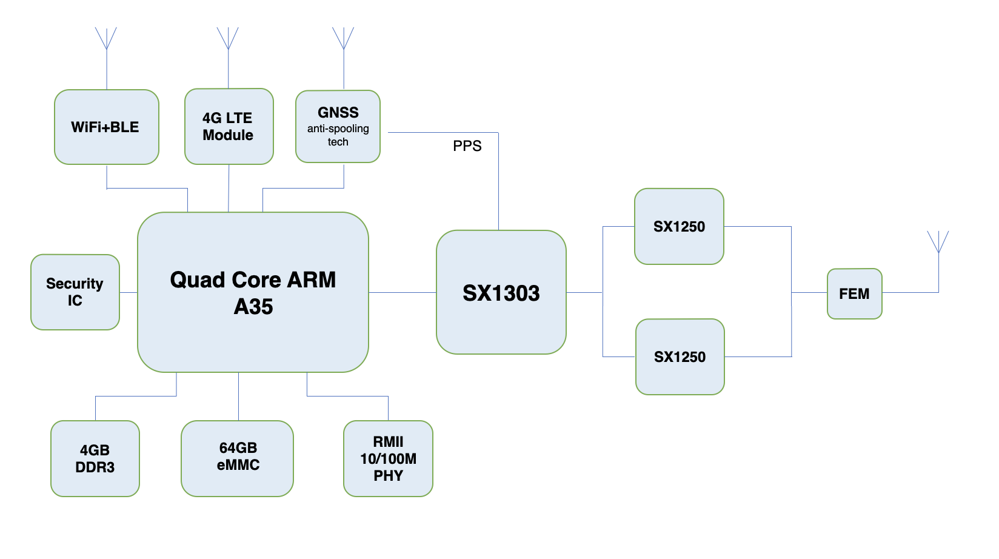

# uGWAN (Amber-Link)

#### HIP19 amendments for alternate security implementations

## Summary

'uG' is named as user generated, we called uGWAN as user generated Wide-Area Network.

By powered with Helium blockchain protocol, 'uG' products will upgrade to fully compatiable with Helium Network, including hotspot, multi-type environment sensor, aged care security devices, asserts tracking tags, etc.

## Company Information
**Amber-Link** founded at Shanghai Zhangjiang Hi-Tech Park in 2016. We focus on smart city, aged care security, assert tracking and environment sensor business for 5+ years. Design and deploy LoRaWAN hotspots with cable carrier operator, stat grid, local community together in Shanghai, Zhejiang, Anhui, Guizhou, etc.

 

*2K+ hotstpot, with 300K+ sensor deployed for smart city since 2018.*

Amber-link invested factory to setup own production line, including SMT and online automatic testing, with ISO9001/14001/45001, IATF16949 certificated.

 

Products including:

- Dual-band(SubGHz + 2.4GHz) LoRaWAN Hostspot & Nano(Single/Dual channel) LoRa Hotspot

- NS and IoT Platform

- SX1302/1303 PCI-E module, LoRa+BLE device module

- Environment (PH/oxygen, Tempeature/Humidity, Smoke, MicroWeave) Sensor

- Industry controller (Modbus/485/relay/pressure/3-axis motion) sensor

- Assert tracking (WiFi, GNSS, BLE), badges, tire sensor, etc.

  

A decentralized secured open network, world-wide roaming service, fair policy for long term maintenance, lower data transfer fee and public document/apply process, Helium network is linking all of the key factors together and leading to change the world's IoT data service mode, new IoT era is coming.

## Product Information 
uGW800(L) Pro are designed as Helium full-node hotspot for global market, support both indoor and outdoor deployment. 'L' version support 4G LTE.

To match with LoRaWAN regional parameters, uGW800 series will deliver to EU868/US915/AS923 firstly, then support more regions step by step, including CN470/RU864/IN865/AU915/KR920, etc.

* uGW800 Pro, Helium Full-node Hotspot (Ethernent, Wi-Fi), Estimated Price: $399.00
* uGW800L Pro, Helium Full-node Hotspot (Ethernet PoE, Wi-Fi, 4G LTE), Estimated Price: $499.00

**uGW800(L) Pro Hotspot Features:**

| Item                | Description                                                  |
| ------------------- | ------------------------------------------------------------ |
| CPU                 | Quad core Cortex-A35 64-bits CPU@1.5GHz                      |
| RAM                 | 2GB DDR3                                                     |
| FLASH               | 64GB eMMC                                                    |
| Wi-Fi               | IEEE 802.11b/g/n 2.4G                                        |
| BLE                 | Bluetooth low energy 4.2                                     |
| Ethernet            | 10/100M (PoE on 'L' version only)                            |
| LTE ('L' only)      | LTE-FDD(B1/B3/B5/B7/B8/B20/...), LTE-TDD(B34/B38/B39/B40/B41), Nano SIM |
| Security            | Chipsec DX83E08                                              |
| LoRa Baseband       | SX1303 + SX1250x2 (8+1 channels)                             |
| LoRa Bands          | EU868, US915, AS923 (EU433, CN470, ...)                      |
| GNSS                | GPS/Beidou (optional to support anti-spooling tech.)         |
| Antenna Port        | SMA x3 (SubGHz LoRa, 2.4GHz WiFi/BLE, GNSS)                  |
| Power Supply        | Type-C, DC-12V, PoE('L' version only)                        |
| LED                 | Colorful LED x1 for system status (power on, configure, network, etc.) |
| Casing              | nylon & fiberglass, IP65                                     |
| Size (mm)           | 146 * 123 * 40                                               |
| Enclosure(Optional) | FRP antenna (700mm), wall installation kit                   |

**uGW800 Pro/uGW800L Pro Hotspot ID/Interface:**

*Notic: ID and color may change on final product*

**uGW800(L) Pro Hotspot block diagram:**

 

*Notic: GNSS anti-spooling technical assist to detect the signal is real or simulated*

**uGW800(L) Pro Hotspot software roadmap:**

- Early firmware for Helium certification - mid of Jan'22
- Firmware for CE/FCC certification - end of Jan'22
- Beta release for manufacture pilot run - end of Feb'22
- RC1 release for first 3K shipment - mid of Mar'22
- uGWAN public OTA server - mid of Mar'22
- uGWAN APP (new UI) for hotspot management (iOS/Android) - mid of Mar'22

## Production and delivery timeline

- Semtech concentrate IC pre-order - early of Dec'21
- Pass CE/FCC certification - end of Feb'22
- Manufactory pilot run (200 pcs) - end of Feb'22
- First 1K pcs production and field test - mid of Mar'22
- Ready for shipping (3K) - end of Mar'22
- Ready for shipping (>10K/month) - end of Apr'22

## Previous shipments

* Have you shipped anything in the past? 
  Yes
* Which countries have you previously shipped regulatory FCC or CE approved products? 
  U.S., Canada, Netherlands, France, Switchland

## Which countries do you plan to ship to and get regulatory certifications for? 

- CE/FCC/IC/RoHS/IP65 (IP67 planning)
- Global Market

## Customer Support
* Online website for production introduction and installation guide

* Discord Channel

* Email response in 48 hours

* Telegram technical support (VIP only)

* Hardware 1 year warranty

* User damaged repair by shipping device back (replaced by same or new version product), user will pay for the repair costs, including manufactory or upgrading fee, logistic, tariffs etc.)

  

## Hardware Security Element
* Security IC:
   Chipsec DX83E08
* Encrypted storage of the miner swarm_key: 
  In security IC
* Encrypted/locked-down firmware: 
  Optional to support secure boot and firmware signature
* Encrypted buses, potting and other anti-tampering measures: 
  Optional to support DDR data scrambling
* Willingness to submit a prototype for audit, and sharing those audit results publicly (pass or fail): 
  Yes

## Amendments for alternate security implementations

Chipsec DX83E08([Datasheet](./ugwan/DX83E08.pdf)) has similar security function as ATECC608, which support:

- Secure Hardware-based Key Storage up to 8 keys, certificates or data
- Hardware Asymmetric Sign, Verify, Key Agreement
  - ECC-GF(p): 256-btis
  - ECDSA: Elliptic Curve Digital Signature
  - ECDH/ECDHE: Elliptic Curve Diffie-Hellman
  - Support SM2 Signature and Key Agreement
- Hardware Symmetric Algorithms
  - Cipher algorithms: AES (128, 192, 256-bits) and SM4
  - Cipher mode: ECB, CBC, CTR, OFB, CFB, XTS, CCM, GCM
  - Hash(MAC) algorithms: SHA-1, SHA-2 and SM3
  - Hash mode: Raw, SSLMAC, HMAC

DX83E08 supports  internal ECC key pair generation by I2C command 'Gen Key Pair', and stores the generated keys into internal OTP (One time programmable) Flash partition. PrivateKey could never be read out of the security chip.

DX83E08's I2C interface designed to support dynamic encryption, which protect system to be much safe on I2C bus communication. Especially, the feature is useful for ECDH to exchange generated keys between host and security chip.

To follow Helium's firmware software architecture, the DX83E08's driver on uGW800 series will be implemented by Erlang in full-node, and Rust in light-node.

## Hardware Information
* Which LoRa chipset are you planning to use in your gateway?
  SX1303 & SX1250

* Where are you sourcing your components from? 
  Semtech and local supply chain

* How many radio modules/ concentrators can you procure?  
  After mass production, >15K/month, by self

  

## Manufacturing Information
* Have you built and delivered radio hardware products before?
  Yes, LoRa, BLE, Wi-Fi, 433MHz, RFID, etc.
* Have you built gateways before? 
  Yes, LoRaWAN/Wi-Fi/BLE gateway, both SubGHz and 2.4GHz
* How many gateways did you make? 
  More than 3K+.

Concentrators module pass RF performance test in Semtech lab.
Production line automatic RF performance check and data record.

## Budget & Capital
* How many of these are you hoping to make and sell? 
  3K in Mar., >10K/month after mass production
* How much money will be required up-front? How much money do you have on-hand, and how much do you have access to? 
  Have funded USD 3M for Helium Hotspot project kick-off, may increase invest to USD 5M depends on market.
* What is your plan for additional financing if required? This is the second biggest risk in new hardware ventures - getting almost over the line and then running out of cash. 
  So far, will control the buget with USD 5M.

## Risks & Challenges

- Concentrate IC: closely work with Semtech and set the pre-paid order in Dec already.
- Security IC: Microchip ATECC608 is shortage in market, use second solution for replacement. Need Helium's engineering team support to check the new solution a.s.a.p.

## Other information

* Discord channel: uGWAN

- Website: www.uGWAN.io

- Email: info@ugwan.io

  

## Payment methods available:

Credit card, PayPal, USDT, etc.
